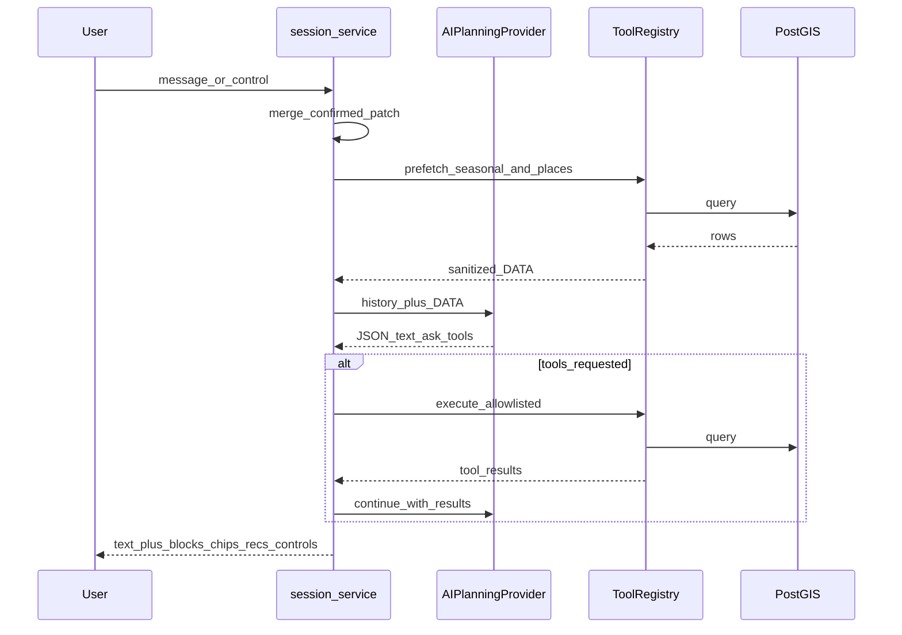

# AI chat: agent loop, recommendations, richer controls

Статус: **продуктовый backlog + as-built Phase 8B slice**.
Канон оркестрации — [ai-route-planning-architecture.md](ai-route-planning-architecture.md)
§12 (ToolRegistry). Прямой SQL/ORM из LLM **запрещён**.

Связанные: [ai-route-chat-product-contract.md](ai-route-chat-product-contract.md),
[ADR-006](decisions/ADR-006-ai-assisted-route-planning.md).

## 1. Идея пользователя (зафиксировано 2026-08-21)

1. **Backend ↔ нейронка в процессе работы**, не только «ответ юзеру»:
   модель запрашивает факты у backend; backend ходит в PostGIS и
   возвращает sanitized DATA в тот же ход (tool loop).
2. **Меньше допроса**: не заставлять отвечать на каждый параметр.
   Недостающее закрывать **рекомендациями** и мягкими defaults
   (inferred, не confirmed), с одним тапом «принять».
3. **Сезонные / локальные tips** в духе:
   «Зимой в Крыму рекомендую Ай-Петри»; «Летом — пляжи ЮБК / Форос».
4. **Больше интерактива и визуала**: не только chips — ползунки,
   переключатели, карточки рекомендаций, place chips, proposal card.
5. Точнее подбор маршрута за счёт связи ИИ с каталогом мест backend
   (кандидаты из БД → generate / proposal), а не свободного текста
   itinerary от модели.

## 2. As-built в этом срезе

| Компонент | Поведение |
| --- | --- |
| ToolRegistry | Allowlist tools (4): `search_places`, `seasonal_recommendations`, `get_place_details`, `find_places_near_point` |
| Agent loop | Backend prefetch + до 1 follow-up tool round по запросу модели |
| Recommendation cards | Блок `recommendation_card` в сообщении ассистента |
| Slider / toggle | Блоки `slider` (бюджет) и `toggle` (дети / питомцы) в UI |
| Less quiz | После 1–2 stated fields или сезонной подсказке — `ask_field=ready` |
| Stated vs draft | `confirmed_fields` = только явный ввод в чате; форма = draft |

### Как считается «известно» (без UI-полоски)

1. Сессия стартует с `confirmed_fields = []`, даже если форма уже заполнена.
2. Чип / control / accept tip / явный patch из реплики → ключи в
   `confirmed_fields`, значения в `constraints`.
3. LLM видит `known_constraints` = только ключи из `confirmed_fields`.
4. Остальное из формы → `form_draft_not_facts` (не факты).
5. Первое подтверждение `interests` из чата **заменяет** черновой список
   интересов формы (не склеивает «природа» + «море»).

## 3. Целевой agent loop

Лимиты: max 2 tool rounds / turn, max 8 place candidates, timeout на tool,
только published places, owner BOLA на session.

## 4. Backlog (вернуться позже)

- Полный ToolRegistry: `get_place_details`, `find_places_near_point`,
  `validate_route_constraints`, routing estimates.
- Real embedding model (swap `hash-v1` → LM Studio / sentence-transformers)
  при том же dim=384; Qdrant — только если нужен scale-out вне Postgres.
- NN catalog re-rank (Travel+ path) поверх algorithmic match.
- Список прошлых чатов в UI; accept recommendation → auto-merge season/city.
- Более богатый visual: горизонтальные place carousels, map preview в proposal.
- Eval: tool call success rate, quiz length (turns to generate), hallucination.

## 5. Не делать

- LLM с прямым connection string / raw SQL.
- Free-form HTML / произвольные виджеты от модели.
- Выдавать RAG/tool narrative за факты часов работы, цен, перекрытий дорог.
