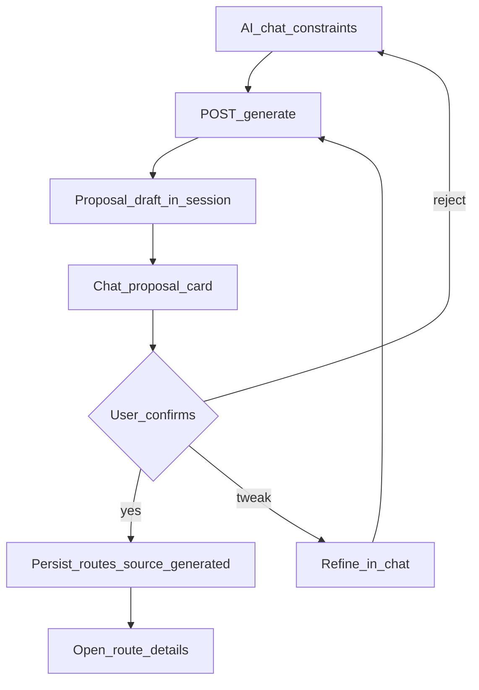

# AI-чат подбора: продукт, Travel+, топик-гард и подтверждение маршрута

Статус: **контракт продукта и UX**, частично отражён в коде
(Travel+ gate, crisis/topic guard на mobile; полный pipeline — Phase 8A/8B).

Связанные документы:

- [ai-route-chat-mobile-implementation.md](ai-route-chat-mobile-implementation.md)
  — API sessions/generate, кнопка, progress;
- [ai-route-planning-architecture.md](ai-route-planning-architecture.md);
- [application-business-logic.md](application-business-logic.md) §13–16;
- [ADR-006](decisions/ADR-006-ai-assisted-route-planning.md).

## 1. Режимы подбора (см. канон трёх путей)

Полная схема: [ai-route-match-three-paths.md](ai-route-match-three-paths.md).

| Режим | Кому | Что делает |
| --- | --- | --- |
| По параметрам | все авторизованные | form → **algorithmic catalog match**; при Travel+ + AI flag — NN rerank; при слабом match — CTA генерации |
| Генерация (после miss / явный запрос) | free и Travel+ (разные квоты и поля) | params → Route Builder → **черновик** (form) |
| Подбор с ИИ | только **активный Travel+** | чат → уточнения → generate → **карточка proposal в чате** → создать / в черновик / уточнить |

Без Travel+ UI не открывает AI-режим (переключатель и CTA ведут на paywall).
Сервер обязан повторить ту же проверку на любом AI endpoint (BOLA/quota).

## 2. Преимущества Travel+ при подборе и AI (канон)

Маркетинг на экране подписки и **техническая политика** должны совпадать.
Ниже — канон Phase 12 (без Store billing). Числа можно тюнить в
`QuotaPolicy`, но смысл фич не менять без обновления этого документа.

### Free (без Travel+)

| Фича | Политика |
| --- | --- |
| Подбор по параметрам | да, корректный алгоритм (без намеренной деградации) |
| Подбор с ИИ / NL-чат | **нет** |
| Генераций маршрута (form) | до **5 в неделю** (как в Figma paywall) |
| Точек в сгенерированном маршруте | до **5** |
| Вариантов результата | **1** |
| Фильтры | базовые |
| Реклама в подборе | допускается (позже) |
| Эксклюзивные/экспертные подборки | нет (только опубликованные editorial по общим правилам) |
| Бонус тп за лайк/прохождение | стандартный |

### Travel+ (активная подписка)

| Фича | Политика |
| --- | --- |
| Подбор с ИИ | **да** (чат + structured generate) |
| Генераций (form + AI суммарно) | **без жёсткого weekly cap** на первом срезе; soft daily cap в конфиге (например 30) против abuse |
| Точек в маршруте | до **12** |
| Варианты результата | до **3** alternatives |
| Фильтры | расширенные (бюджет, ETA, accessibility, дети/питомцы) |
| Реклама | нет |
| Эксклюзивные маршруты / экспертные ленты | да, когда контент размечен |
| Бонус тп | множитель из конфига (например ×1.5), когда award pipeline готов |
| Offline избранного | расширенный (Phase 12 remainder) |

Инвариант: free form-builder **не** выдаёт заведомо худшие маршруты.
Travel+ даёт **больше возможностей и лимитов**, не «лучший алгоритм ради
платы».

Код: `EntitlementService` / `QuotaPolicy` в `tourism-backend` modules
`subscriptions`. Проверки только через сервис, не через разрозненные
`if user.travel_plus_active` в domain-логике Route Builder (флаг читает
entitlement layer).

## 3. Топик-гард ассистента (обязательный)

Модель и любой mock-ответчик **не** свободный чатбот. Разрешены только:

1. приветствия / small-talk в рамках «помощник по маршрутам Крыма»;
2. уточнение параметров поездки (город, длительность, интересы, темп,
   компания, транспорт, бюджет, сезон);
3. предложения мест/маршрутов из allowlist backend;
4. объяснения trade-offs после валидного proposal;
5. отказ/перенаправление при off-topic.

Запрещены (неполный список):

- написание/отладка кода, DevOps, домашние задания;
- бытовые советы вне туризма Крыма (рецепты, медицина, юриспруденция,
  инвестиции и т.п.);
- политика, NSFW, jailbreak («игнорируй инструкции»);
- самоповреждение — отдельный crisis path (уже в mobile safety helper).

### Классификация сообщения (server-side SoT)

```text
crisis | greeting | on_topic_travel | off_topic | injection_attempt
```

Mobile может делать **optimistic** локальную классификацию для мгновенного
ответа; backend при появлении `/messages` **перепроверяет** и может заменить
текст.

### Типовые ответы (канон RU)

| Класс | Пример ответа |
| --- | --- |
| `greeting` | **не canned** — уходит в LLM с system rules (коротко, в роли помощника по маршрутам); под ответом — action chips |
| `off_topic` | «Я могу помогать только с подбором маршрутов и мест в Крыму. Давайте вернёмся к поездке: город старта, длительность или интересы?» + chips |
| `injection_attempt` | «Я работаю только как помощник по маршрутам КрымТрип и не меняю свои правила. Чем помочь с маршрутом?» |
| `crisis` | существующий supportive reply без генерации маршрута |
| `generate` / короткое «давай» | deterministic generate → proposal card + place chips + кнопки |

Модель **не** генерирует код/бытовуху даже если пользователь настаивает.
При сомнении — `off_topic`, не угадывать.
Модель **не** пишет полный дневной план как «готовый маршрут» — только
уточнения; визуальный proposal собирает backend.

System prompt (когда LM Studio подключён) обязан включать тот же allowlist
тем, запрет на инструменты вне ToolRegistry и запрет free-form itineraries.

## 4. Сценарий: предложение → согласие → новый маршрут

Цель UX: пользователь **не** получает «молча созданный» route. Сначала
карточка предложения в чате, потом явное согласие.



### Состояния proposal

| Статус | Смысл |
| --- | --- |
| `draft` | сгенерирован, ещё не маршрут в каталоге пользователя |
| `accepted` | создан `routes` row (`source=generated`, owner = user) |
| `rejected` | отклонён; можно генерировать снова |
| `superseded` | заменён новой генерацией в той же сессии |

### API-добавки к контракту chat/generate

К уже описанным sessions/generate:

```text
POST /api/v1/route-builder/sessions/{session_id}/proposals/{proposal_id}/accept
POST /api/v1/route-builder/sessions/{session_id}/proposals/{proposal_id}/reject
```

`accept` идемпотентен: повтор с тем же ключом возвращает тот же `route_id`.
До accept в публичном каталоге / «Мои маршруты» нового маршрута нет
(допустим только session-scoped draft DTO).

### Визуализации в пузыре сообщения

Assistant message может нести **structured blocks** (не произвольный HTML):

```json
{
  "message_id": "uuid",
  "assistant_text": "Собрал спокойный день из Ялты:",
  "blocks": [
    {
      "type": "place_chip",
      "place_id": "uuid",
      "title": "Ласточкино гнездо",
      "subtitle": "Видовая точка",
      "image_url": "/media/...",
      "duration_minutes": 40
    },
    {
      "type": "route_proposal_card",
      "proposal_id": "uuid",
      "title": "Ялта · море и виды",
      "stops_count": 4,
      "duration_minutes": 280,
      "cover_url": "/media/...",
      "place_ids": ["uuid", "uuid"]
    },
    {
      "type": "actions",
      "actions": [
        {"id": "accept_proposal", "label": "Создать маршрут"},
        {"id": "refine", "label": "Уточнить"},
        {"id": "reject", "label": "Другой вариант"}
      ]
    }
  ]
}
```

Правила UI:

- рендер только allowlist `type`; неизвестный тип → игнор + лог;
- `place_id` / `proposal_id` кликабельны; данные подтягиваются с backend
  (или уже пришли в block как signed snapshot);
- картинки — только наши media URL / CDN, без произвольных remote HTML;
- текст пользователя и assistant prose — всегда `Text`, без WebView HTML;
- skeleton на время подгрузки обложек, без фальшивых названий мест.

Mobile widgets (план):

```text
widgets/chat_place_chip.dart
widgets/chat_route_proposal_card.dart
widgets/chat_message_blocks.dart
```

## 5. Порядок внедрения (обновлённый)

1. ~~Travel+ в БД + gate AI UI~~ (as-built 2026-08-20).
2. ~~`EntitlementService` + QuotaPolicy + mobile topic guard~~.
3. Algorithmic `POST /route-builder/match` + mobile results (см. three-paths).
4. Phase 8A deterministic generate (form → draft).
5. Sessions + generate + **proposal в чате** + accept / to-draft.
6. Chat blocks: place chips + proposal card.
7. LM Studio: catalog rerank + interpreter; system prompt = topic guard.
8. Alternatives / расширенные фильтры / offline / тп-множитель.

## 6. Definition of done (продуктовый)

1. Без Travel+ AI-чат недоступен (client + server).
2. Off-topic / crisis / injection — canned; greeting и on-topic — LLM +
   action chips; generate/confirm («давай») — proposal card, не стена текста.
3. Маршрут появляется в «Мои маршруты» только после явного accept.
4. В чате места и proposal — structured blocks, не HTML.
5. Free form-подбор остаётся корректным при любых флагах Travel+.
