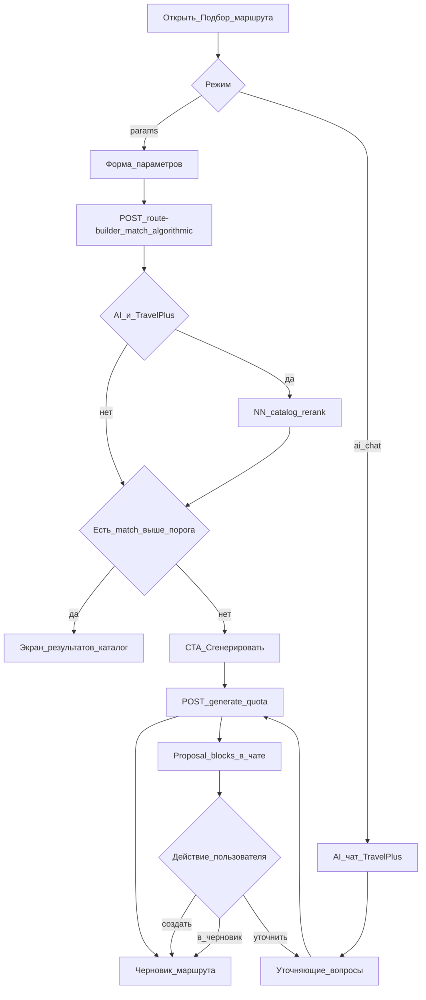

# Три пути подбора и генерации маршрута

Статус: **канон продукта** (2026-08-20). As-built: Travel+ gate, топик-гард,
entitlements, algorithmic match, generate→draft с квотами, chat proposal
accept/reject. NN-ранжирование каталога — после home lab / LM Studio.

Связанные документы:

- [ai-route-chat-product-contract.md](ai-route-chat-product-contract.md)
- [ai-route-planning-architecture.md](ai-route-planning-architecture.md)
- [ai-route-system-end-to-end.md](ai-route-system-end-to-end.md)
- [ai-route-chat-mobile-implementation.md](ai-route-chat-mobile-implementation.md)
- [application-business-logic.md](application-business-logic.md) §13–16

## 1. Продуктовое правило (коротко)

| Вход | Без Travel+ | С активным Travel+ |
| --- | --- | --- |
| **Подбор по параметрам** | только **алгоритм** на backend (каталог) | алгоритм + **NN-ранжирование** готовых маршрутов (когда AI provider включён); до включения AI — тот же алгоритм |
| **Нет подходящего в каталоге** | предложить **сгенерировать** (квоты free) | предложить **сгенерировать** (квоты Travel+, больше параметров) |
| **Генерация** | params → pipeline → **черновик** `routes(source=generated)` | то же, шире лимиты |
| **Подбор с ИИ (чат)** | недоступен (paywall) | диалог → уточнения → **карточка proposal в чате** → доработать / в черновик / создать |

Инвариант: free form-подбор **не** деградирует намеренно. Travel+ даёт больше
полей, лимитов и AI-режимы, не «худший алгоритм бесплатным».

## 2. Диаграмма потоков



## 3. Путь A — алгоритмический подбор по параметрам

**Кто:** все авторизованные (free и Travel+).

**API (as-built срез):**

```text
POST /api/v1/route-builder/match
```

Тело — нормализованные параметры формы (+ опциональные advanced-поля).
Ответ:

- `strategy`: `algorithmic` | `ai_catalog_rank`
- `ideal` / `close` — ranked hits с `score` и `reasons`
- `offer_generate`: bool — нет достаточно хорошего match
- `quota` snapshot (generation remaining) — когда UsageCounter готов

Скоринг (детерминированный, без LLM):

1. город старта ↔ locality / названия мест / текст маршрута;
2. длительность ↔ `estimated_duration_minutes`;
3. интересы / тип поездки ↔ текст + seasonality + difficulty;
4. темп ↔ difficulty / distance;
5. later: сезон, выходные, бюджет, транспорт, дети/питомцы, closures.

Порог match — конфиг (`EDITORIAL_MATCH_THRESHOLD`, default ~0.55 ideal /
0.35 close). Heuristic можно тюнить без смены контракта API.

## 4. Путь B — NN-ранжирование каталога (Travel+, params)

После алгоритмического shortlist (или полного публичного пула с cap)
`AIPlanningProvider` получает **только allowlisted** карточки маршрутов
(id, title, tags, duration, transport) и возвращает порядок + краткие
`reasons`. Backend:

- валидирует, что все id из allowlist;
- не принимает координаты/ETA от модели как SoT;
- при ошибке/timeout — fallback на алгоритмический порядок.

Пока `AI_PLANNING_ENABLED=false` или нет Travel+: `strategy=algorithmic`.

## 5. Путь C — генерация (free и Travel+)

Когда каталог не подошёл **или** пользователь явно просит сгенерировать:

1. собрать полный `NormalizedRouteRequest` (см. §7);
2. `EntitlementService` / `QuotaPolicy` — лимиты точек, daily/weekly,
   advanced filters;
3. Route Builder pipeline (Phase 8A deterministic; 8B AI propose IDs);
4. результат для **form-flow** — **черновик** (уже есть UX публикации);
5. результат для **chat-flow** — сначала proposal в чате (§6), не сразу row.

## 6. Путь D — чат «Подбор с ИИ»

Только Travel+. Модель сама ведёт уточнения (сколько людей, транспорт,
бюджет…), но hard constraints пишет только через validated DTO.

Исход генерации в чате:

1. assistant message со **structured blocks** (place chips + proposal card);
2. действия: «Создать», «В черновик», «Уточнить», «Другой вариант»;
3. `accept` → `routes(source=generated)`; «в черновик» → тот же draft pipeline,
   что у form.

См. блоки в [ai-route-chat-product-contract.md](ai-route-chat-product-contract.md).

## 7. Параметры, которые должны учитываться (канон)

Минимум формы (уже в UI params): город, тип поездки, длительность, люди,
интересы, темп.

Расширенный набор (Travel+ advanced + chat interpreter; постепенно в форму):

| Группа | Поля |
| --- | --- |
| Когда | дата/диапазон, сезон, будни/выходные, must_finish_by |
| Где | locality старта/финиша, return-to-start |
| Как | transport_mode, готовность к платным дорогам/парковкам |
| Нагрузка | ожидаемая загруженность точек, «избегать толпы» |
| Деньги | budget_amount, paid_ok |
| Компания | party_size, children, pets, accessibility |
| Дороги | closures / restricted segments через RoutingProvider (не LLM) |
| Сокращения | разрешить выкидывать optional stops под ETA транспорта |

Нейросеть **не invent** closures и ETA: их даёт PostGIS + RoutingProvider.
LLM только помогает выбрать/упорядочить allowlisted place/route IDs и текст.

## 8. Порядок внедрения

1. ~~Travel+ БД + gate AI-чата + QuotaPolicy + topic guard~~
2. ~~Algorithmic `POST /route-builder/match` + mobile results~~
3. ~~`POST /route-builder/generate` → draft + quotas; chat proposal accept/reject~~
4. ~~Расширенные поля формы + proposal card в AI-чате~~
5. LM Studio: catalog rerank + interpreter за flag (после home lab)
6. Closures / congestion / pricing signals в scoring
7. Alternatives / offline / тп-множитель

## 9. Definition of done (этот срез)

1. Params «Подобрать» бьёт в backend match, а не в сырой каталог без score.
2. Ответ разделяет ideal / close и ставит `offer_generate` при слабом match.
3. Free и Travel+ без AI получают одинаковый algorithmic quality.
4. Документы и код используют одну терминологию трёх путей + chat proposal.
