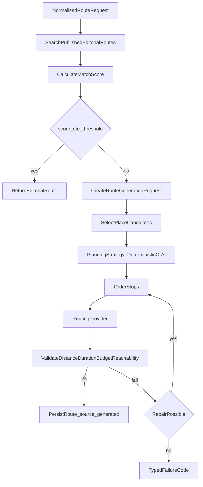
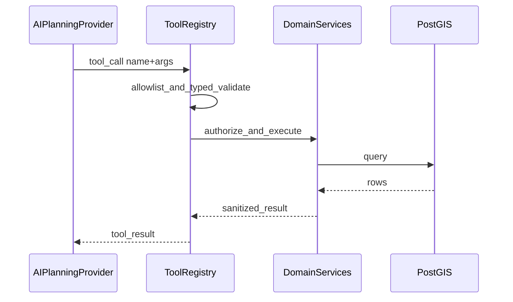
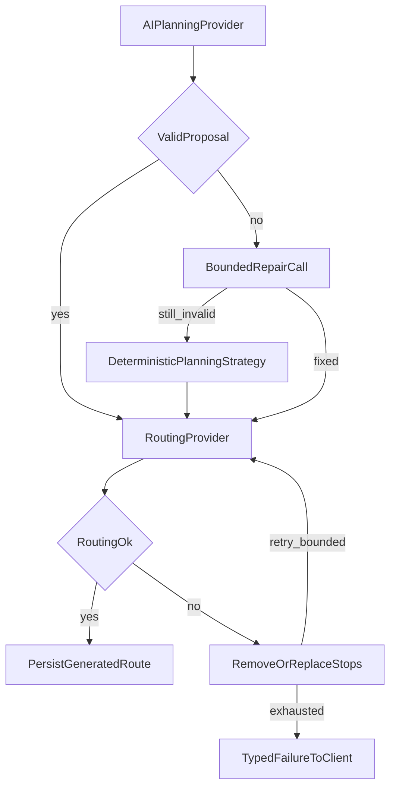
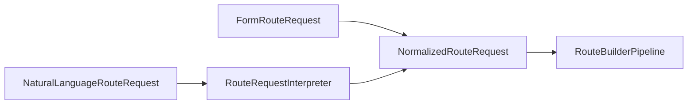
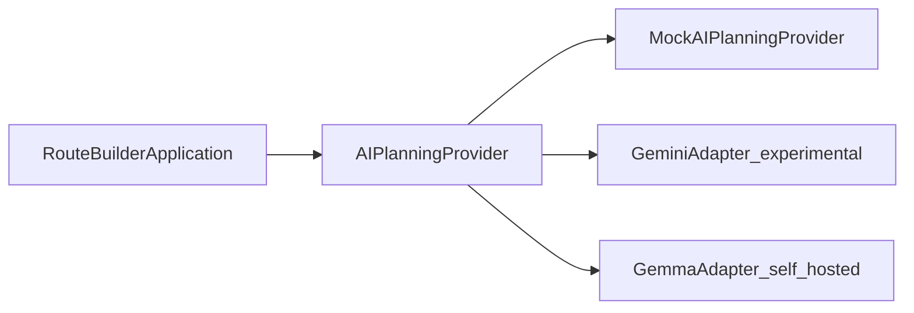

# AI-assisted route planning architecture

Архитектурный документ будущего AI-assisted Route Builder.  
**Статус:** documented, not implemented.  
Связанные решения: [ADR-006](decisions/ADR-006-ai-assisted-route-planning.md),
[ADR-004](decisions/ADR-004-routing-provider-abstraction.md),
[implementation-plan.md](implementation-plan.md) (Phase 8A/8B),
[application-business-logic.md](application-business-logic.md),
сквозной поток запрос→маршрут→данные:
[ai-route-system-end-to-end.md](ai-route-system-end-to-end.md),
home lab: [ai-self-hosted-home-lab.md](ai-self-hosted-home-lab.md).

## 1. Purpose

Описать, как платформа будет:

- сначала искать подходящий editorial route;
- при отсутствии match генерировать private `Route(source=generated)`;
- опционально использовать LLM как planner/interpreter;
- сохранять PostgreSQL/PostGIS и `RoutingProvider` как источники истины.

## 2. Non-goals

Сейчас и до Phase 8B **не** делаем:

- вызовы Gemini/Gemma из production endpoints;
- conversational Travel+ chat API;
- MCP server;
- vector DB / GPU infra;
- billing;
- хранение raw chain-of-thought;
- принятие AI-output без deterministic validation;
- деградацию качества free-маршрутов относительно Travel+.

Phase 4 (editorial routes catalog) реализуется отдельно и не зависит от AI.

## 3. Form-based flow

```text
FormRouteRequest
  -> validate
  -> NormalizedRouteRequest
  -> RouteBuilderPipeline
```

Параметры формы (нормализуются в один DTO): регион, locality, start (и
опционально end), дата, время начала, доступная продолжительность, max
distance, бюджет, число человек, transport mode, интересы/категории,
сложность, пешая нагрузка, дети/животные, accessibility, paid/free,
обязательные/исключённые места, return-to-start.

## 4. Travel+ conversational flow

Пользователь пишет запрос на естественном языке. Пример:

> Завтра хочу выехать из Ялты в 10 утра. Нас двое, мы на машине, бюджет
> примерно 6000 рублей. Хотим дворец, природу и обед. Много ходить не хотим,
> вернуться до 20:00.

```text
NaturalLanguageRouteRequest
  -> RouteRequestInterpreter (AI)
  -> clarification if required
  -> NormalizedRouteRequest
  -> тот же RouteBuilderPipeline
```

Отдельного «chat engine» для генерации маршрута нет.

## 5. Editorial-first strategy



Порог match — конфигурация (`EDITORIAL_MATCH_THRESHOLD`); heuristic scoring —
задача Phase 8A (TBD).

## 6. Deterministic and AI-assisted planning

| Режим | Когда | Кто выбирает stops |
| --- | --- | --- |
| DeterministicPlanningStrategy | default; AI disabled/timeout/invalid | scoring + constraints |
| AIPlanningProvider | feature flag + entitlement | LLM proposal из candidate set |
| Fallback | после bounded retry/repair | DeterministicPlanningStrategy |

AI **не** заменяет validation и `RoutingProvider`.

## 7. Provider-neutral architecture

Application ports (имена адаптируются к conventions модуля `route_builder`):

- `AIPlanningProvider` — `create_plan(context) -> AIRoutePlanProposal`
- `RouteRequestInterpreter` — NL → `InterpretedRouteRequest`
- `RoutePlanningStrategy` — выбор стратегии
- `RoutePlanValidator` / `RoutePlanRepairService`
- `RoutePlanningTool` + `RoutePlanningToolRegistry`
- `TourismKnowledgeRetriever`
- `PromptTemplateRepository`
- `AIUsageRecorder`
- `AIProviderErrorMapper`

Domain/application **не импортируют** Google GenAI SDK, vLLM, Ollama, MCP SDK.

Реализации (будущее): `MockAIPlanningProvider`, `GeminiAIPlanningProvider`,
`GemmaAIPlanningProvider`.

## 8. Gemini experimental stage (Phase 8B)

- Hosted provider через adapter.
- Model ID только из config/env (не hardcoded в business logic).
- Structured outputs; опционально function calling → ToolRegistry.
- Mock provider для тестов.
- Feature flag, без production SLA.
- Candidate model ids в env — placeholders, не утверждение доступности.

## 9. Gemma self-hosted stage (Future)

Кратко здесь; **практический план home lab** (Compose, Ollama, Qdrant,
VRAM, ingest, TTL, чеклисты):
[ai-self-hosted-home-lab.md](ai-self-hosted-home-lab.md).

- Inference: Ollama (lab) или OpenAI-compatible HTTP; adapter
  `GemmaAIPlanningProvider` / `OllamaAIPlanningProvider` за тем же port.
- Модели: **Gemma 4**; на ~12 GB VRAM default **`gemma4:12b`** (не откат на
  Gemma 2/3). `26b` — probe; `31b` — не default. См. home-lab §5.
- RAG: Qdrant + embed model; long-form only. PostGIS остаётся SoT для фактов.
- Оркестратор — FastAPI modular monolith (не отдельный Laravel/AI backend).
- Сначала Docker Compose на одной машине; Kubernetes — только при SLA/ops need.
- Optional LoRA для planning behaviour позже.
- Canary Gemini↔Gemma: valid JSON rate, hard-constraint compliance, latency,
  cost, fallback rate.

## 10. Why RAG is required

Длинные описания, история, культурный контекст меняются реже координат, но
объёмны и не должны «зашиваться» в веса. Retrieval даёт актуальные chunks с
citation metadata без переобучения на каждый edit.

## 11. Why facts are not primarily stored through fine-tuning

| Класс знаний | Хранение |
| --- | --- |
| Mutable facts (coords, schedules, prices, closures, entrances, duration, safety) | PostgreSQL/PostGIS |
| Long-form (history, culture, tips) | Documents + RAG |
| Behaviour (intent, tool use, coherent plans, clarifications) | Prompts / eval / later LoRA |

Fine-tune не заменяет операционные данные Крыма.

## 12. Tool / function calling architecture

LLM **никогда** не исполняет tools напрямую.



Потенциальные tools: `search_places`, `get_place_details`,
`get_place_schedule`, `get_place_entrances`, `find_places_near_point`,
`calculate_candidate_scores`, `estimate_visit_cost`, `estimate_visit_duration`,
`build_route_geometry`, `validate_route_constraints`, `calculate_route_summary`.

Лимиты: max tool calls, max candidates, max output size.

## 13. MCP decision and future criteria

**Сейчас MCP не создаём.** Сначала internal ToolRegistry.

MCP — будущий transport/adapter тех же tools для:

- отдельного AI service;
- Trip Planner agents;
- admin agents;
- нескольких model providers;
- external approved clients.

Критерии revisit MCP: ≥2 независимых consumers одних tools; потребность в
стандартном tool protocol вне monolith; команда готова к authZ/audit на
transport. Domain services не зависят от MCP types.

См. [ADR-006](decisions/ADR-006-ai-assisted-route-planning.md).

## 14. Structured schemas

### InterpretedRouteRequest

- `extracted_constraints`
- `inferred_constraints` (только safe defaults)
- `missing_required_fields`
- `ambiguities`
- `clarification_question`
- `confidence`

### AIRoutePlanProposal

- `proposed_title` / `proposed_summary`
- `selected_place_ids` (только из backend candidate set)
- `requested_visit_minutes_per_stop`
- `optimization_goal`
- `reasoning_summary` (user-visible, concise)
- `user_visible_warnings`
- `assumptions`

Hidden chain-of-thought не храним и не отдаём клиенту.

## 15. Route validation

Обязательные checks после AI (и после deterministic):

- каждый place ID ∈ candidate set;
- нет excluded; required сохранены;
- stops within entitlement;
- visit duration valid; no duplicates;
- transport mode supported; enums known;
- финальный route проходит distance/duration/budget/reachability/schedule.

## 16. RoutingProvider responsibilities

LLM не invent coordinates, road geometry, authoritative hours/prices, places,
real-time road status.

`RoutingProvider` (ADR-004): geometry, distance, travel duration, segments,
supported modes.

PostGIS/domain: coordinates, candidates, boundaries, geo filters, place
metadata.

## 17. Failure and fallback



| Условие | Поведение |
| --- | --- |
| AI disabled | DeterministicPlanningStrategy |
| Timeout | bounded retry → fallback |
| Invalid AI output | one repair → fallback |
| Routing rejects | replace/remove stops, re-validate |
| Impossible constraints | typed failure + suggested relaxations |

Коды (расширяют Phase 8A): `no_editorial_match`, `no_place_candidates`,
`constraints_too_strict`, `ai_provider_unavailable`, `ai_provider_timeout`,
`invalid_ai_output`, `unknown_ai_place`, `routing_provider_error`,
`route_too_long`, `budget_exceeded`, `schedule_conflict`, `quota_exceeded`.

Raw provider errors и prompts клиенту не отдаём.

## 18. Security and privacy

Защиты:

- prompt injection в описаниях мест → sanitize / treat as untrusted data;
- model selecting arbitrary IDs → candidate allowlist;
- tool argument abuse → typed args + authZ;
- tool loops / token burn → hard caps;
- timeout / unbounded retries → policy;
- malicious chat → input size limits, no prompt leak;
- logging: no API keys, tokens, full private chat without retention policy,
  hidden CoT, unnecessary PII / precise location history.

## 19. Observability

Provider-neutral metadata (`AIUsageRecorder`):

`generation_request_id`, `provider`, `model`, `prompt_template_version`,
`strategy`, `latency_ms`, token counts, `tool_call_count`, `repair_count`,
`fallback_used`, `validation_failures`, `resulting_route_id`, optional user
feedback.

Связь с будущим `UsageCounter` / entitlements — Phase 12.

## 20. Prompt versioning

Промпты не размазываются multiline-строками по services.

- versioned templates: system, interpretation, planning, repair, explanation;
- version в AI usage metadata;
- fixtures для contract tests;
- сначала local files / Python templates; remote prompt CMS — не сейчас.

Locale: prompts и clarification — преимущественно `ru` для Crimea product;
locale в request metadata.

## 21. Evaluation strategy

Gold set (представительные кейсы): семья с детьми; limited mobility; low
budget; car / walking; history / nature / mixed; strict time window; required /
excluded place; impossible; ambiguous conversational.

Метрики: valid JSON; known-place rate; hard-constraint compliance;
reachability; schedule; budget; duration error; duplicate-stop rate; fallback
rate; clarification correctness; user acceptance; edit-after-generation;
cost; latency.

Не оценивать только субъективную «красоту» маршрута.

## 22. Cost and quota considerations

- Free: корректные маршруты через form + deterministic (и editorial).
- Travel+: больше generations, stops, alternatives, conversational planning,
  explanations, iterative refine.
- AI calls считаются в entitlements (`max_daily_generations`, advanced
  features); cost caps на provider side.

## 23. Travel+ integration

Phase 12 добавляет policy для AI features без billing. Conversational planner —
Future после 8B + entitlements. Free form builder не деградирует намеренно.

## 24. Rollout plan

1. Phase 4 — editorial routes (без AI).
2. Phase 8A — deterministic pipeline + failure codes + mock RoutingProvider.
3. Phase 8B — interfaces, mock AI, Gemini adapter behind flag, validation/repair.
4. Phase 12 — quotas / Travel+ flag для AI limits.
5. Future — conversational interpreter; Gemma + RAG (см.
   [ai-self-hosted-home-lab.md](ai-self-hosted-home-lab.md)); optional MCP;
   canary migration.

## 25. Mermaid diagrams (summary)

### Form / chat convergence



### Gemini to Gemma migration



### Validation and repair loop

См. §17.

---

## Configuration foundation (documented)

Будущие переменные (без реальных секретов; wiring Settings — Phase 8B):

```bash
# AI planning (Phase 8B+). Disabled by default.
# AI_PLANNING_ENABLED=false
# AI_PROVIDER=mock          # mock | gemini | ollama
# AI_MODEL=
# AI_REQUEST_TIMEOUT_SECONDS=30
# AI_MAX_REPAIR_ATTEMPTS=1
# AI_PROMPT_VERSION=v1
# GEMINI_API_KEY=
# GEMINI_MODEL=

# Home lab / Future self-host (see ai-self-hosted-home-lab.md)
# OLLAMA_BASE_URL=http://127.0.0.1:11434
# OLLAMA_CHAT_MODEL=gemma4:12b
# OLLAMA_EMBED_MODEL=nomic-embed-text
# QDRANT_URL=http://127.0.0.1:6333
# QDRANT_COLLECTION=crimea_tourism
# RAG_ENABLED=false
# RAG_TOP_K=5
```

`GEMINI_MODEL` / `OLLAMA_*` — configurable placeholders, не hardcoded
business constants. Полный контракт env и чеклисты —
[ai-self-hosted-home-lab.md](ai-self-hosted-home-lab.md).

## Extension points already implied by Phase 3/4

Place уже несёт `seasonality`, `accessibility`, `is_suitable_for_children`,
`is_paid`, `price_notes`. Для feasibility в 8A рассмотреть (отдельной
миграцией, не в этом документе как code):

- `recommended_visit_minutes`
- `is_suitable_for_pets`

Route / RouteStop (Phase 4): `source` ∈ {editorial, generated, user_created};
stable place_id references; provider-neutral geometry и stop order.
