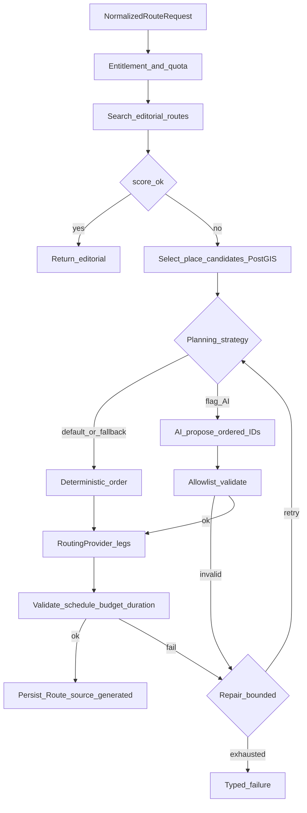

# End-to-end: запрос → маршрут → данные

Сквозное описание системы: как пользовательский запрос превращается в
**точный** маршрут, какие слои за что отвечают, в каком формате хранятся
данные и как база наполняется.

**Статус:** documented, not fully implemented (Phase 8A/8B / Future).

Связанные документы:

- [ai-route-planning-architecture.md](ai-route-planning-architecture.md)
- [ai-self-hosted-home-lab.md](ai-self-hosted-home-lab.md)
- [ADR-006](decisions/ADR-006-ai-assisted-route-planning.md)
- [ADR-004](decisions/ADR-004-routing-provider-abstraction.md)
- [diagrams/route-generation-flow.md](diagrams/route-generation-flow.md)
- [data-model-geography-places.md](data-model-geography-places.md)
- [data-model-routes.md](data-model-routes.md)

---

## 1. Короткий ответ на «нужны ли дороги Крыма?»

**Да.** Без дорожного графа «точный маршрут» невозможен: прямая линия по
координатам врёт по горам, серпантинам и запретам.

Но дороги **не кладём в LLM и не «запоминаем» в эмбеддингах как SoT**.

| Что нужно точно | Кто считает |
| --- | --- |
| Порядок и выбор остановок | Route Builder (deterministic и/или AI proposal) |
| Координаты мест, часы, closures | PostgreSQL / PostGIS |
| Длина ноги, время в пути, polyline по дорогам | `RoutingProvider` (граф OSM / OSRM / Valhalla / ORS…) |
| Narrative tips («лучше рано утром») | RAG (опционально) |
| Текст ответа пользователю | шаблоны / LLM explanation **после** валидного route |

LLM **не invent**: координаты, геометрию дорог, authoritative ETA, часы работы.

---

## 2. Слои системы (big picture)

```text
┌─────────────────────────────────────────────────────────────┐
│  Mobile (форма Travel / NL Travel+)                         │
└───────────────────────────┬─────────────────────────────────┘
                            │ HTTPS API
┌───────────────────────────▼─────────────────────────────────┐
│  FastAPI modular monolith                                   │
│  ┌─────────────┐  ┌──────────────────┐  ┌────────────────┐  │
│  │ Interpreter │→ │ NormalizedReq    │→ │ RouteBuilder   │  │
│  │ (form|AI)   │  │ DTO              │  │ Pipeline       │  │
│  └─────────────┘  └──────────────────┘  └───────┬────────┘  │
│         │                     ▲                  │           │
│         │ prompts             │ candidates       │           │
│         ▼                     │ from PostGIS     ▼           │
│  AIPlanningProvider ◄── ToolRegistry ──► Places/Routes     │
│  (+ optional RAG)                        Entitlements        │
│                                          RoutingProvider     │
└─────────┬─────────────────┬──────────────────┬──────────────┘
          │                 │                  │
          ▼                 ▼                  ▼
     Ollama/Gemini      PostgreSQL         Road engine
     + Qdrant           / PostGIS          (stub → OSRM…)
```

Три независимых «правды»:

1. **Facts DB** — что существует и какие ограничения у места.
2. **Road graph** — как реально проехать/пройти между точками.
3. **Knowledge docs** — как рассказать и подсказать (не для hard constraints).

---

## 3. Два входа → один DTO

### 3.1 Form (MVP / free)

Пользователь заполняет поля UI. Backend валидирует и собирает
`NormalizedRouteRequest` **без LLM**.

### 3.2 Natural language (Travel+ / Future после 8B)

```text
«Завтра из Ялты в 10:00, двое, на машине, бюджет ~6000,
 дворец + природа + обед, мало ходить, до 20:00»
        │
        ▼
 RouteRequestInterpreter (AI)
        │  system prompt + few-shot + JSON schema
        ▼
 InterpretedRouteRequest
   - extracted_constraints
   - inferred_constraints (только safe defaults)
   - missing_required_fields
   - ambiguities + clarification_question
   - confidence
        │
        ▼ (если хватает полей)
 NormalizedRouteRequest  ← тот же, что у формы
```

Если полей мало — **уточняющий вопрос**, не «угадай маршрут».

### 3.3 Состав `NormalizedRouteRequest` (логический контракт)

| Группа | Примеры полей |
| --- | --- |
| Где | region, locality, start point, optional end, return-to-start |
| Когда | date, start_time, available_duration / must_finish_by |
| Как | transport_mode: walk / car / … |
| Кто | party_size, children, pets, accessibility |
| Бюджет | budget_amount, paid_ok |
| Интересы | categories, themes, difficulty, max_walk |
| Жёсткие | required_place_ids, excluded_place_ids |
| Лимиты | max_stops (из entitlement), max_distance |

DTO — единственный вход в `RouteBuilderPipeline`. Промпт interpreter **не**
ходит в RoutingProvider сам.

---

## 4. Pipeline: от DTO до точного маршрута



### Шаг A — Editorial first

Ищем опубликованный маршрут с хорошим match. Если нашёлся — **не генерируем**
и не зовём LLM.

### Шаг B — Candidates из PostGIS

Фильтры: регион/locality, категории, seasonality, accessibility, children/pets,
paid, closures, distance soft bounds, exclude list.  
Результат: конечный **allowlist** `place_id` (+ metadata snapshot для prompt).

### Шаг C — Planning (порядок остановок)

- **Deterministic:** scoring / greedy / constrained search по allowlist.
- **AI (8B+):** в промпт planning уходит:
  - system: роль, JSON schema, «только ID из списка», запрет выдумывать места;
  - user: сжатый `NormalizedRouteRequest`;
  - data: таблица кандидатов (id, name, category, visit_minutes, tags…);
  - optional RAG: 3–8 narrative chunks как DATA (tips), не как факты часов.
- Ответ AI: `selected_place_ids[]` + visit minutes + warnings — **только из
  allowlist**.

### Шаг D — Дороги: `RoutingProvider`

На упорядоченные waypoints (обычно coordinates entrances / place centroids):

```text
waypoints + transport_mode + constraints
  -> RoutingProvider
  -> legs[]: distance_m, duration_s, geometry (LineString), warnings
  -> summary: total_distance, total_travel_time
```

Первая реализация — **deterministic stub** (ADR-004).  
Для «максимально точно по Крыму» позже:

1. Выгрузить OSM extract по Крыму / ЮБК.
2. Поднять локальный движок (кандидаты: **OSRM**, Valhalla, GraphHopper) или
   hosted ORS — за тем же port.
3. Prefetch / tile cache по мере необходимости.
4. Attribution и freshness OSM в metadata ответа.

Пока stub — UI может показывать оценку, но результат помечается synthetic и
**не** выдаётся как navigation-grade.

### Шаг E — Validation (обязательна всегда)

- каждый stop ∈ allowlist; required сохранены; excluded нет;
- total duration ≤ available; budget; schedule/open hours из PostGIS;
- max_stops entitlement; transport mode supported;
- routing не failed; нет неразрешимых горных shortcut’ов (если provider
  вернул unreachable — typed failure / repair).

### Шаг F — Persist

`Route(source=generated)` + stops + geometry snapshot + warnings +
`generation_request_id` / AI usage metadata (если был AI).

Mobile получает **готовый маршрут**, не «текст от нейронки».

---

## 5. Формирование промптов (когда AI включён)

Промпты versioned (`AI_PROMPT_VERSION`), не размазаны по сервисам.

### 5.1 Interpretation prompt (NL → поля)

```text
[SYSTEM]
Ты извлекаешь параметры маршрута в JSON schema InterpretedRouteRequest.
Не придумывай place_id. Не считай дороги. Если неясно — ambiguities.
Язык clarification: ru.

[USER]
{raw_user_text}

[CONTEXT — optional]
known localities dictionary (имена → id), transport enums, date=today…
```

### 5.2 Planning prompt (candidates → ordered IDs)

```text
[SYSTEM]
Собери маршрут только из candidate place_id.
Верни AIRoutePlanProposal JSON. Не добавляй неизвестные id.
Не выдумывай координаты и время в пути — их посчитает система.

[USER]
NormalizedRouteRequest JSON

[CANDIDATES]
| id | name | category | visit_min | tags | …

[RETRIEVED_DOCS — untrusted DATA]
### chunk title (source, license)
…
```

### 5.3 Repair prompt (один bounded retry)

Тот же schema + список validation errors («stop X closed after 18:00»,
«total duration 9h > 6h available»).

### 5.4 Explanation (optional, после валидного route)

LLM может объяснить *уже посчитанный* маршрут (почему эти stops, trade-offs).
Цифры distance/duration берутся из RoutingProvider snapshot, не «на глаз».

---

## 6. Где что хранится (форматы)

### 6.1 PostgreSQL / PostGIS — operational SoT

| Сущность | Формат | Примеры полей |
| --- | --- | --- |
| Geography | tables + geometry | region, locality polygons/points |
| Place | row + Point/Polygon | name, categories, seasonality, paid |
| Schedule / entrance | rows | hours, entrance coords |
| Route / RouteStop | rows + LineString | editorial & generated |
| Generation request | row + JSON snapshot | NormalizedRouteRequest, status |
| User / favorites | rows | authz boundaries |

Геометрия маршрута после routing — **LINESTRING** (или multi) в БД, не в
Qdrant.

### 6.2 Road engine — graph (не «наша» бизнес-БД)

| Артефакт | Формат | Где |
| --- | --- | --- |
| OSM extract Крыма | `.osm.pbf` | volume движка / object storage |
| OSRM/Valhalla graph | бинарный индекс движка | рядом с routing service |
| Ответ API | JSON legs + GeoJSON/WKT | ephemeral + snapshot в Route |

Обновление графа: периодический re-extract OSM (недели), не на каждый
user request.

### 6.3 RAG / knowledge — narrative only

| Стадия | Формат |
| --- | --- |
| Source document | Markdown (см. шаблон ниже) + metadata sidecar/YAML front matter |
| Chunk | текст 300–500 слов / одна секция + payload |
| Embedding | `float32[dim]` (например 768) в Qdrant |
| Point payload | JSON: doc_id, chunk_id, place_id?, source, license, hash, ttl, lang |

**Не хранить в Qdrant:** JWT, private chat, точные GPS треки пользователя,
сырые пароли, полные промпты с PII.

### 6.4 Шаблон markdown для ingest

```markdown
---
place_id: 11111111-1111-1111-1111-111111111111
source: internal
license: internal
lang: ru
content_type: overview
ttl_days: 365
---

# Тропа Голицына (Новый Свет)

## Описание
Оборудованная тропа вдоль моря…

## Как добраться
Из Судака…

## Советы
Лучше рано утром до 09:00…

## Ограничения (narrative)
Может быть скользко после дождя…
```

Секции → отдельные chunks. Hard facts (coords, hours), если дублируются в
markdown, при planning всё равно перепроверяются из PostGIS.

### 6.5 Кеш

Redis: FAQ answers, embed(text)→vector, transient generation locks.  
Ключи с version model/prompt.

---

## 7. Как наполняем базы (порядок работ)

### Phase A — уже есть / укрепляем

1. Editorial places + routes seed (`crimea_seed`, admin).
2. Расширять каталог (координаты, категории, visit_minutes, schedules).
3. Это **главный** датасет для candidate selection.

### Phase B — road graph (точность пути)

1. Выбрать `RoutingProvider` adapter (после stub): OSRM self-host на OSM
   Crimea extract — предпочтительный lab-путь.
2. Прогнать gold set пар точек (Ялта↔Алупка, Бахчисарай↔Чуфут-Кале…).
3. Сверить duration с здравым смыслом; зафиксировать attribution OSM.

Без Phase B AI может красиво выбрать stops, но **километраж и ETA будут
грубыми**.

### Phase C — knowledge ingest (RAG)

1. Экспорт internal place/route descriptions → markdown.
2. Wikivoyage Crimea sections (CC-BY-SA + attribution).
3. OSM notes только как доп. текст, не вместо Place row.
4. Embed → Qdrant; nightly TTL/hash refresh (home-lab guide §9).

### Phase D — evaluation loop

Gold requests → measure: valid JSON, known-place rate, constraint compliance,
routing success, duration error vs provider, fallback rate.

---

## 8. Пример одного запроса «от края до края»

**Ввод (NL):** «На машине из Ялты, 6 часов, природа и смотровые, без долгих
пеших».

1. Interpreter → `transport=car`, `locality=Yalta`, `duration=6h`,
   interests=`nature,viewpoint`, `max_walk=low`.
2. Editorial search — miss.
3. PostGIS candidates: 40 places → scored top 25 allowlist.
4. AI (или deterministic) выбирает 5 id из 25.
5. RoutingProvider: Yalta start → stop1→…→ return; sum travel 2.1 h,
   geometry по трассе ЮБК.
6. Validation: visit+travel ≤ 6h; all open; budget ok.
7. Persist generated route; mobile показывает карту с polyline и stops.
8. Optional explanation: «Выбрали Ай-Петри и …; пешая часть короткая».

Если на шаге 5 unreachable — repair (убрать stop) или typed failure
«ослабьте ограничения».

---

## 9. Что считать «максимально точным»

| Уровень | Смысл | Когда |
| --- | --- | --- |
| L0 Synthetic | stub distance | сейчас / CI |
| L1 Road-aware | OSM graph, car/foot profiles | lab + staging routing |
| L2 Schedule-aware | + PostGIS hours/closures | 8A validation |
| L3 Live-ish | пробки/закрытия дорог (если provider умеет) | Future, осторожно |
| L4 Navigation turn-by-turn | отдельный nav SDK | не цель route builder MVP |

Продуктовый Route Builder целится в **L1+L2**. LLM сам по себе не поднимает
уровень точности дорог.

---

## 10. Anti-patterns

| Нет | Да |
| --- | --- |
| «Gemma знает все дороги Крыма» | OSRM/Valhalla на OSM extract |
| Часы кафе только в Qdrant | PostGIS schedules + tools |
| Отдать mobile сырой chat completion как маршрут | Persist validated Route DTO |
| Один промпт «сделай всё» | Interpreter → plan → route → validate |
| Хранить road PBF в векторной БД | Отдельный routing volume |

---

## 11. Связь с фазами

| Фаза | Что появляется в этой картине |
| --- | --- |
| 8A | NormalizedReq, editorial match, deterministic plan, stub routing, validate |
| 8B | Interpreter/planning ports, Gemini, allowlist, repair |
| Routing adapter | L1 road-aware (OSM Crimea) |
| Home lab | Ollama + Qdrant, RAG tips |
| 12 / Travel+ | quotas, NL UX |
| Future Trip Planner | многодневность; тот же NormalizedReq/pipeline где возможно |

Практический lab: [ai-self-hosted-home-lab.md](ai-self-hosted-home-lab.md).
