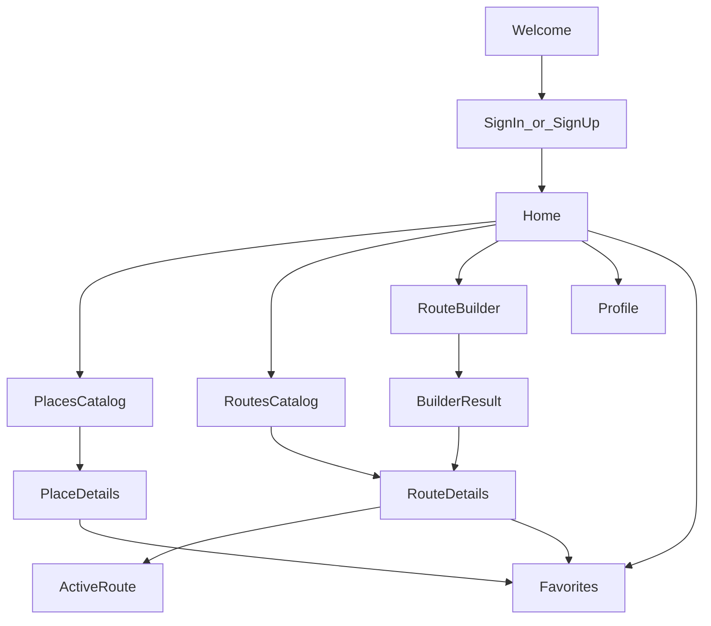
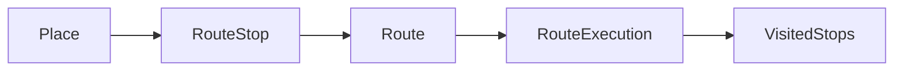
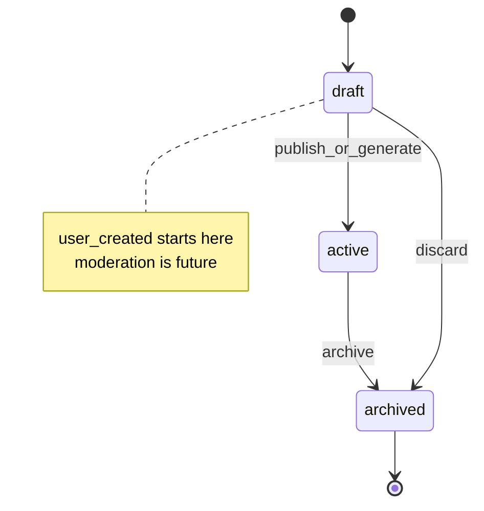
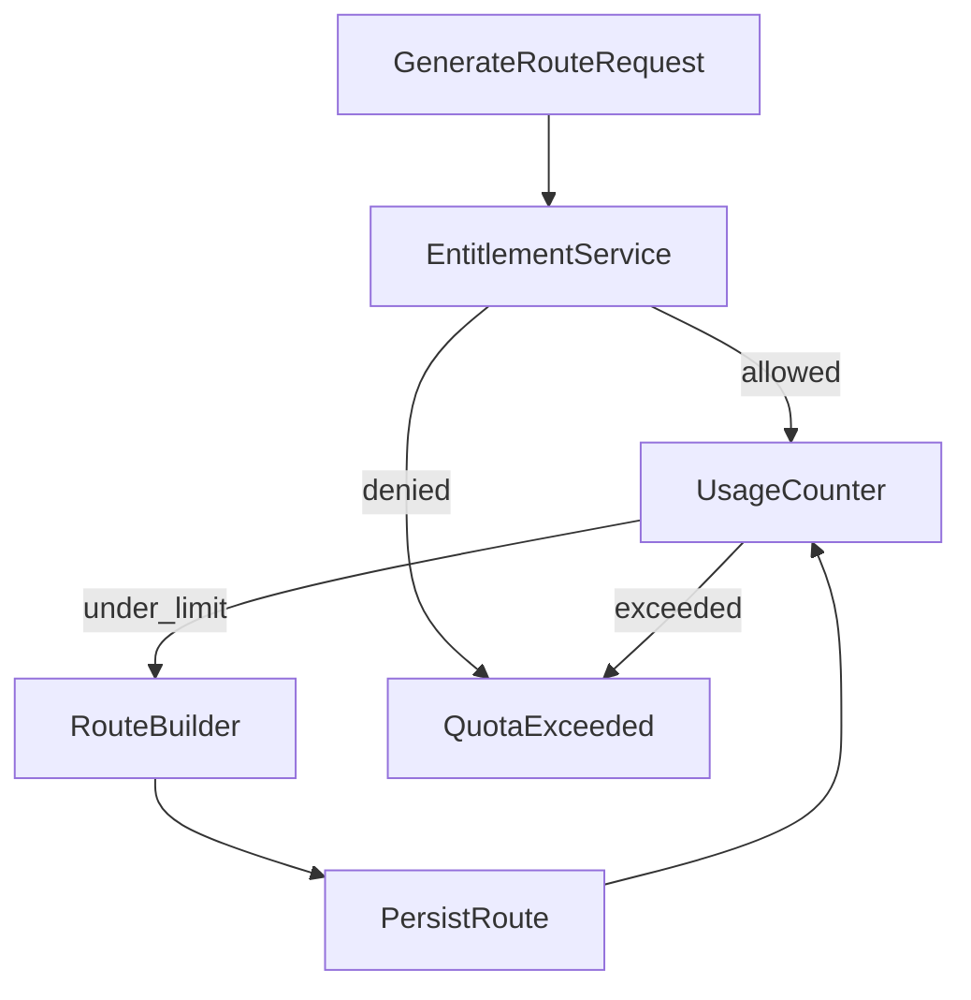
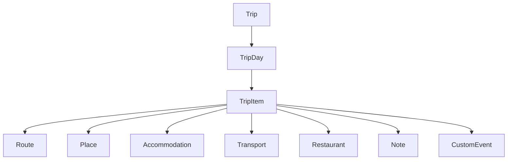

# Бизнес-логика приложения

Документ описывает продуктовую логику Crimea Travel Platform. Технические
детали реализации см. в [domain-model.md](domain-model.md) и
[implementation-plan.md](implementation-plan.md).

Лимиты Travel+ в этом документе — **предварительные** и не являются
окончательно утверждённой продуктовой политикой.

## 1. Цель приложения

Платформа помогает путешественнику изучать туристические места Республики Крым,
выбирать готовые маршруты, генерировать персональный маршрут и проходить его по
точкам. Продукт не является официальным государственным приложением.

Первый контентный контур — Крым; доменная модель поддерживает подключение других
регионов через `Country -> Region -> Locality -> Place`.

## 2. Целевая аудитория

- самостоятельные путешественники по Крыму;
- семьи с детьми;
- пешие и автомобильные маршруты;
- пользователи с потребностями доступности;
- в будущем — редакторы контента и путешественники других регионов.

## 3. Основные пользовательские сценарии

1. Регистрация и вход.
2. Просмотр главной: подбор маршрута, категории, каталог, поиск.
3. Каталог мест и карточка места.
4. Каталог маршрутов, фильтры, карточка маршрута.
5. Сохранение места или маршрута.
6. Генерация персонального маршрута.
7. Запуск прохождения, отметка посещённых точек, история.
8. Профиль пользователя.
9. В будущем: собственные маршруты с модерацией, Trip Planner, Travel+.

## 4. Сущности Place, Route, RouteExecution и Trip

| Сущность | Назначение |
| --- | --- |
| `Place` | Туристический объект или достопримечательность |
| `Route` | Упорядоченный набор точек и геометрия перемещения |
| `RouteExecution` | Конкретное прохождение маршрута пользователем |
| `Trip` | Многодневная поездка (будущий модуль) |

`Route` и `Trip` не смешиваются: маршрут — один день/одна цепочка точек;
поездка — контейнер дней и элементов плана.

## 5. Готовый, сгенерированный и пользовательский маршрут

Источники (`RouteSource`):

- `editorial` — редакционный (prepared) контент;
- `generated` — результат route builder;
- `user_created` — создан пользователем.

В MVP:

- editorial могут быть `public`;
- generated — `private`;
- user_created по умолчанию `private`; ранний seed-driven срез допускает
  `public` + `active` в каталоге ленты (без UI создания и без модерации UGC);
- публичная модерация user_created не реализуется.

## 6. Жизненный цикл маршрута

Видимость (`RouteVisibility`): `private`, `unlisted`, `public`.

Жизненный цикл (`RouteLifecycleStatus`): `draft`, `active`, `archived`.

Модерация (`ModerationStatus`, будущее): `not_submitted`, `pending`,
`approved`, `rejected`, `changes_requested`.

Прогресс прохождения **не** меняет lifecycle самого `Route`.

## 7. Прохождение маршрута

`RouteExecution` хранит:

- `user_id`, ссылку на `route_id` или snapshot маршрута;
- `started_at`, `completed_at`, `status`;
- `current_stop_index`, `visited_stops`, `skipped_stops`;
- `progress_percent`;
- опционально `last_known_position`;
- timestamps.

Статусы: `planned`, `in_progress`, `paused`, `completed`, `cancelled`.

## 8. Избранное

Пользователь сохраняет:

- места (`FavoritePlace`);
- маршруты (`SavedRoute` / favorite route) со snapshot ключевых полей.

Доступ только у владельца. Архивные объекты остаются в истории с пометкой.

## 9. Профиль

Профиль содержит display name, locale, домашний регион, предпочтения и
accessibility needs. Credentials живут только в module `identity`.

## 10. Рейтинг и отзывы

В MVP не реализуются. В будущем: рейтинг маршрута/места, отзывы, модерация
UGC. Не путать с «рейтингом путешественников» (геймификация) — тоже Future.

## 11. Публикация и модерация

Полная пользовательская публикация с модерацией — Future. Ранний seed-driven
срез: `user_created` может быть `public` + `active` и попадать в каталог (см.
§5). Editorial публикует редакция без пользовательской модерации.

## 12. Достижения и прогресс путешественника

Бейджи, звания и очки **тп** (travel points) — продуктовая геймификация
профиля. UI-мок уже есть в Phase 5; durable реализация — **Phase 14**.

Не путать с рейтингом маршрута/места (отзывы, §10) и с leaderboard как
социальной сетью.

Минимальный контур Phase 14:

- каталог достижений (seed);
- `user_progress` (тп, текущее звание, порог следующего);
- `user_achievements` (unlock + timestamp);
- начисление только на сервере по событиям `route_executions` (Phase 9);
- mobile Profile читает API; mock — только local/demo.

Сложные стрики, магазин за тп и публичный соревновательный топ — Future после
Phase 14.

## 13. Бизнес-логика Travel+

Travel+ — платная подписка будущего. Проверки идут через entitlement-сервис,
а не через `user.is_premium` по коду.

Концепты: `Plan`, `Subscription`, `Entitlement`, `UsageCounter`, `QuotaPolicy`.

Примеры проверок:

- `can_generate_route`;
- `max_route_points`;
- `max_daily_generations`;
- `max_saved_routes`;
- `alternatives_count`;
- `advanced_filters_enabled`;
- `offline_routes_enabled`;
- `trip_planner_enabled`;
- `collaborative_trips_enabled`.

Оплата, App Store / Google Play и платёжный шлюз на текущем этапе не
интегрируются. Допускаются: документация, интерфейс `EntitlementService`,
config-реализация, бесплатный план по умолчанию, feature flags для разработки.

Бесплатный маршрут всегда должен быть корректным; отдельный «плохой» алгоритм
для free-пользователей запрещён.

## 14. Quotas и Entitlements

Все лимиты хранятся в конфигурации / `QuotaPolicy`, без magic numbers в
бизнес-коде. Счётчики usage обновляются после успешной генерации (и при
необходимости при сохранении).

## 15. Границы бесплатной версии (preliminary)

Предварительная политика free-плана (не финальное решение):

- 3 генерации маршрута в сутки;
- до 5 точек в сгенерированном маршруте;
- один вариант результата;
- базовые фильтры;
- ограниченное число приватных сохранённых маршрутов;
- свободный доступ к редакционным публичным маршрутам.

## 16. Возможности Travel+ (preliminary)

Предварительная политика Travel+:

- увеличенный лимит генераций;
- до 10–15 точек;
- несколько вариантов;
- расширенные параметры и оптимизация (время, расстояние, бюджет);
- conversational route planner (NL → тот же pipeline; Future после Phase 8B);
- объяснения trade-offs и iterative refine (Future);
- Trip Planner;
- расширенный офлайн-режим;
- экспорт и совместное планирование (позже).

Бесплатный form-based builder должен оставаться корректным; намеренная
деградация качества free-маршрутов запрещена.
См. [ai-route-planning-architecture.md](ai-route-planning-architecture.md).

## 17. Будущий модуль поездок

В текущей реализации:

- не создаём полноценные API и таблицы Trip, пока они не нужны коду;
- архитектурно `Route` должен быть пригоден как ссылка из будущего `TripItem`.

## 18. Что входит в MVP

1. Базовая регистрация и авторизация.
2. Профиль пользователя.
3. Географическая структура.
4. Категории.
5. Каталог мест и карточка места.
6. Каталог подготовленных маршрутов и фильтрация.
7. Карточка маршрута.
8. Сохранение места или маршрута.
9. Простая генерация маршрута.
10. Запуск прохождения, отметка точек, история.
11. Минимальный Flutter UI без финального дизайна.

## 19. Что не входит в MVP

- многодневные поездки;
- оплата подписки;
- публичная публикация пользовательских маршрутов;
- рейтинг путешественников;
- сложные достижения;
- социальная лента;
- видео;
- совместные поездки;
- бронирование гостиниц и билетов;
- полноценные офлайн-карты;
- production AI Route Builder / conversational planner в MVP (архитектура
  задокументирована; реализация — Phase 8B+ / Future, см. ADR-006);
- ML-рекомендации ленты и AI-генерация маркетингового текста;
- рекламная система.

## 20. Основные продуктовые риски

- устаревание данных о местах (часы, закрытия, безопасность);
- слишком строгие фильтры генерации → пустые результаты;
- зависимость от внешнего routing provider;
- недооценка объёма редакционного контента для Крыма;
- scope creep в сторону Trip/Travel+ до стабилизации core;
- санкционные/региональные ограничения на хостинг и магазины приложений.

## 21. Предполагаемые метрики

- activation: регистрация → первый просмотр маршрута;
- catalog engagement: просмотры place/route cards;
- generation success rate и доля `failure_code`;
- execution start / completion rate;
- retained D7/D30;
- доля пользователей, упёршихся в free quota (сигнал для Travel+).

## 22. Предварительная последовательность релизов

1. Foundation (local infra, health, docs) — текущий этап.
2. Content MVP: geography, places, editorial routes.
3. Auth + favorites + profile.
4. Route builder deterministic (Phase 8A); AI-assisted experimental — позже
   (8B).
5. Soft launch / staging с редакционным контентом Крыма.
6. User-created private routes.
7. Travel+ foundations (без оплаты), включая AI quotas policy.
8. Trip Planner, conversational planner, self-hosted AI — отдельные релизы.
