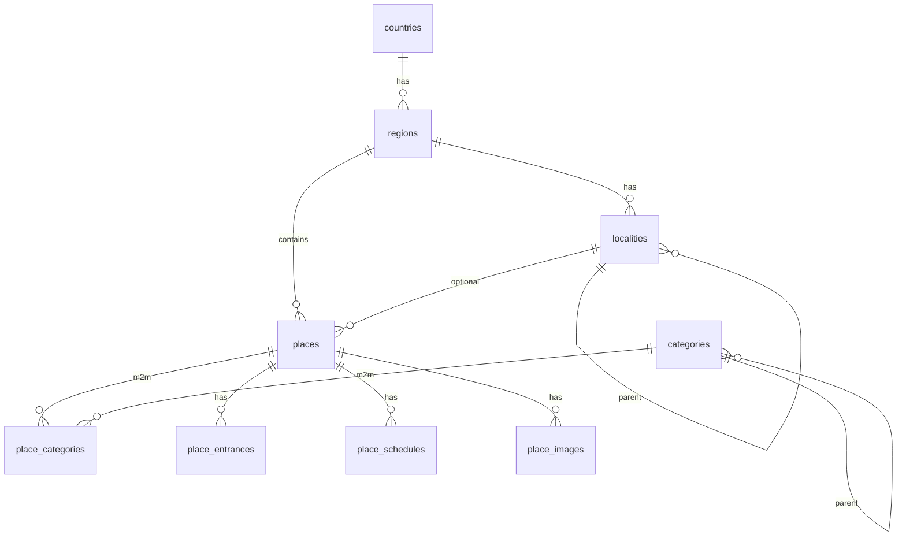

# Geography and places data model

Схема Phase 3. Рассчитана на сотни/тысячи мест: нормализованные FK,
PostGIS geography, btree + GIST индексы. Seed сейчас репрезентативный
(~20 мест Крыма); bulk через `scripts/seed_crimea.py --file ...`.

## ER



## Индексы (ключевые)

- unique: `countries.code/slug`, `(regions.country_id, slug)`,
  `(localities.region_id, slug)`, `(places.region_id, slug)`,
  `categories.code/slug`
- GIST: `regions.center/boundary`, `localities.center`, `places.location`,
  `place_entrances.location`
- btree: `places(publication_status, region_id)`, `places.name`
- partial unique: один active primary entrance; один active cover image

## Импорт

```bash
# из tourism-backend, при поднятом Compose
uv run alembic upgrade head
uv run python scripts/seed_crimea.py
uv run python scripts/seed_crimea.py --file data/extra_places.json --places-only
```

Формат `extra_places.json`: либо полный seed-объект как `crimea_seed.json`,
либо массив place-объектов при `--places-only` (нужны существующие
`region=crimea`, localities и categories).

`media_asset_id` в `place_images` — UUID без FK на media module (пока).

## Feasibility fields (уже есть / планируется)

Уже в Phase 3: `seasonality`, `accessibility`, `is_suitable_for_children`,
`is_paid`, `price_notes`, `difficulty`, schedules, entrances.

Планируется отдельной миграцией ближе к Phase 8A (не в AI-docs сессии):

- `recommended_visit_minutes` — оценка длительности визита для builder;
- `is_suitable_for_pets` — фильтр «с животными».

Route / RouteStop (Phase 4): `source` ∈ {editorial, generated, user_created};
stable `place_id`; provider-neutral geometry и порядок stops.
