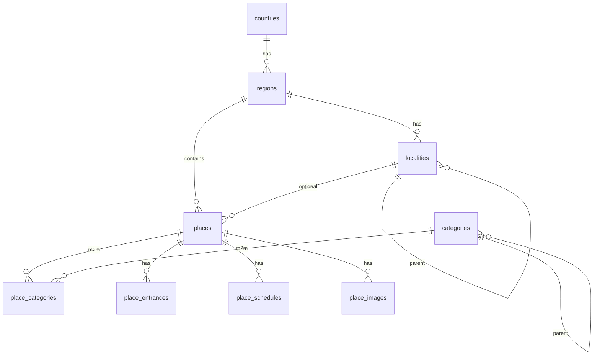

# Geography and places data model

Схема Phase 3. Рассчитана на сотни/тысячи мест: нормализованные FK,
PostGIS geography, btree + GIST индексы. Seed сейчас репрезентативный
(~20 мест Крыма); редакционный bulk через `scripts/seed_crimea.py --file ...`.
OSM import и quality gate 1000+ мест:
[crimea-places-bulk-import-plan.md](crimea-places-bulk-import-plan.md).
Локальная БД 2026-08-19: 20 published editorial places + 1000 unique OSM
`draft/auto_validated`; OSM drafts ещё не являются публичным каталогом.

## ER



## Индексы (ключевые)

- unique: `countries.code/slug`, `(regions.country_id, slug)`,
  `(localities.region_id, slug)`, `(places.region_id, slug)`,
  `categories.code/slug`
- GIST: `regions.center/boundary`, `localities.center`, `places.location`,
  `place_entrances.location`
- btree: `places(publication_status, region_id)`, `places.name`
- btree: `places.payment_status`, `places.difficulty`
- partial unique: один active primary entrance; один active cover image;
  `(source_name, source_external_id)` для внешнего импорта

## Импорт

```bash
# из tourism-backend, при поднятом Compose
uv run alembic upgrade head
uv run python scripts/seed_crimea.py
uv run python scripts/seed_crimea.py --file data/extra_places.json --places-only
```

Формат `extra_places.json`: либо полный seed-объект как `crimea_seed.json`,
либо массив place-объектов при `--places-only` (нужны существующие
`region=crimea`, localities и categories).

`media_asset_id` в `place_images` — UUID без FK на media module (пока).

## Feasibility fields (уже есть / планируется)

Уже в Phase 3: `seasonality`, `accessibility`, `is_suitable_for_children`,
`is_paid`, `price_notes`, `difficulty`, schedules, entrances.

Добавлено фундаментом массового импорта:

- `payment_status` — `unknown|free|paid`; `is_paid` временно остаётся для
  обратной совместимости;
- `source_external_id`, `source_license`, `source_payload`;
- `data_quality_status` — автоматическая проверка не равна публикации;
- `recommended_visit_minutes`, `is_suitable_for_pets`.

OSM-объекты импортируются как `draft`; реальный entrance не заменяется
центроидом way/relation.

Route / RouteStop (Phase 4): `source` ∈ {editorial, generated, user_created};
stable `place_id`; provider-neutral geometry и порядок stops.
