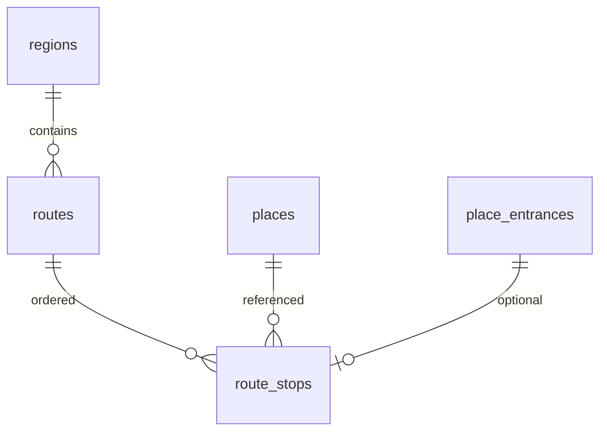

# Routes data model (Phase 4)

Единый `Route` с дискриминатором `source`. Phase 4 реализует только
публичные `source=editorial`.

## ER

## Public catalog invariant

API отдаёт маршрут только если одновременно:

- `source = editorial`
- `visibility = public`
- `lifecycle_status = active`
- минимум 2 stops (seed / editorial content rule)

## Tables

### routes

Ключевые поля: `region_id`, `owner_user_id` (null для editorial), `name`,
`slug`, `source`, `visibility`, `lifecycle_status`, duration/distance,
`difficulty`, `transport_mode`, `seasonality`, `geometry` (LINESTRING),
editorial source/freshness, timestamps.

### route_stops

`route_id`, `place_id`, optional `place_entrance_id`, `position` (≥1, unique
per route), `visit_duration_minutes`, `note`, `is_optional`.

## API

- `GET /api/v1/routes` — filters: `region_slug`, `transport_mode`,
  `difficulty`, `q`; pagination `limit`/`offset`
- `GET /api/v1/routes/{id}` — detail + ordered stops with place snapshot

## Seed

`data/crimea_seed.json` → `routes[]` (3 editorial routes). Idempotent via
`scripts/seed_crimea.py`.
