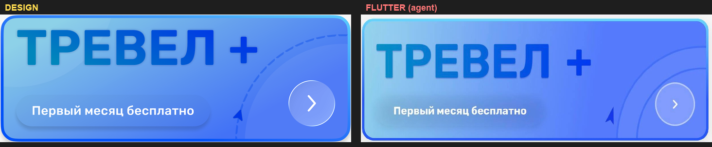
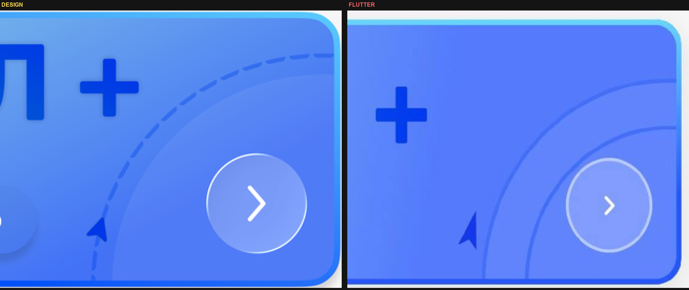
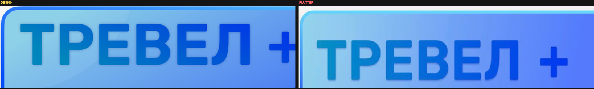
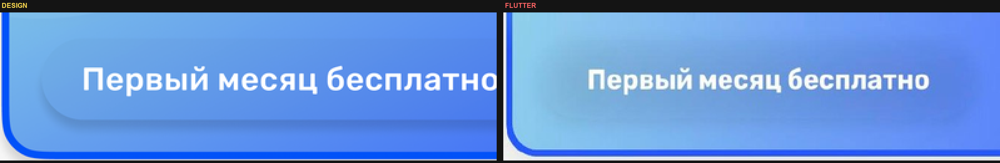
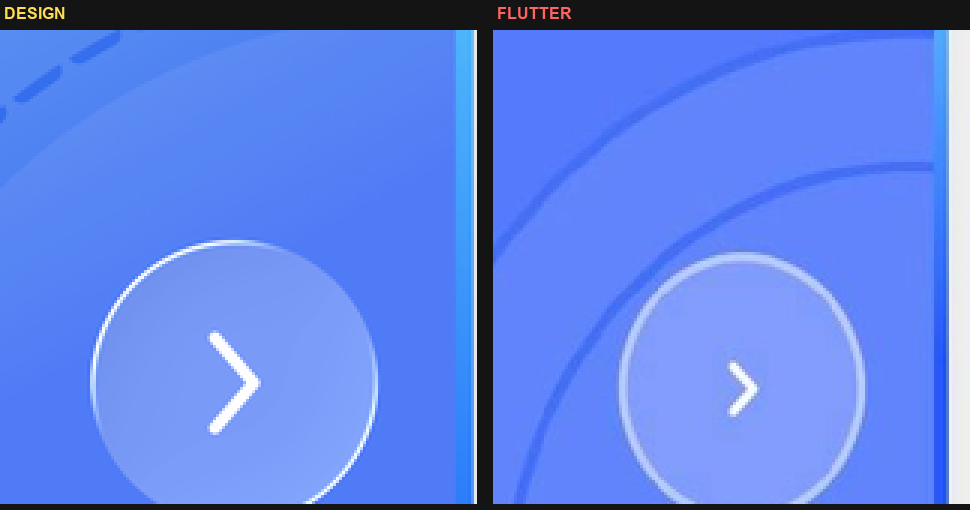

# Баннер «ТРЕВЕЛ +» — разбор ошибок реализации vs дизайн

**Задание агенту:** поправь `TravelPlusBanner` в
`tourism-mobile/lib/features/settings/presentation/settings_widgets.dart`
так, чтобы он совпал с дизайном. Ниже — что именно не так в текущем Flutter
рендере. Смотри картинки рядом: слева всегда DESIGN, справа — твой текущий
результат.

Каноническая спека: `tourism-platform/docs/design/figma-spec-settings-support-v2.md` §3.
Эта заметка **приоритетнее** там, где текущий код отошёл от дизайна
(особенно про «solid rings» — их в дизайне нет).



| Файл | Что |
|---|---|
| `screens-figma/banner-design-ref.png` | эталон из Figma |
| `screens-figma/banner-flutter-current.png` | твой текущий рендер |
| `screens-figma/banner-diff-side-by-side.png` | рядом |
| `screens-figma/banner-diff-title.png` | заголовок крупно |
| `screens-figma/banner-diff-chip.png` | чип крупно |
| `screens-figma/banner-diff-right.png` | правая графика |
| `screens-figma/banner-diff-btn.png` | кнопка |

---

## 0. Главное: что ломает баннер сильнее всего

В `_TravelBannerDecorPainter` ты рисуешь **лишние сплошные концентрические
кольца** (`outerRingRadius` / `innerRingRadius` / `ringStroke` / белый knob
на 3 часах). В дизайне их **нет**.

В дизайне справа только:
1. мягкий светлый диск (белый 7 %),
2. **одна** пунктирная дуга,
3. маркер-курсор на этой дуге,
4. стеклянная кнопка поверх.

У тебя справа — «радар»: два сплошных круга + knob + дуга. Это сразу читается
как другой продукт. **Удали solid rings и knob полностью.**



---

## 1. Декор справа — конкретные правки в коде

### 1.1 Удалить

Из `TravelBannerGeometry` и `_TravelBannerDecorPainter` убрать:

- `outerRingRadius`, `innerRingRadius`, `ringStrokeWidth`, `ringKnobRadius`
- `SettingsColors.ringStroke`
- весь блок «Circle-in-circle solid rings»
- белый knob на 3 o'clock

После удаления справа должны остаться только: glow (§3.4), disk (§3.5),
dashed arc (§3.6), nav cursor (§3.7).

### 1.2 Упростить пунктир

Сейчас `_drawAsymmetricDashes` рисует толстые «сегменты кольца» с закруглением
с внутренней стороны. В дизайне штрихи — **обычная тонкая линия**:

| Параметр | Нужно |
|---|---|
| Толщина | **2.0 pt** (сейчас 2.4 — чуть толще) |
| Dash / gap | **9 / 2.6** (это ок) |
| Стиль | `PaintingStyle.stroke`, `strokeCap: StrokeCap.butt` |
| Цвет | `#1537E7`, без альфы |

Замени асимметричные annular-секторы на простой `PathMetric.extractPath` +
`canvas.drawPath(..., Paint()..style=stroke..strokeWidth=2..strokeCap=butt)`.
Штрихи должны выглядеть как тонкие «стежки», почти сплошная дуга с едва
заметными разрывами — не как жирные дуговые плитки.

### 1.3 Маркер-курсор

В дизайне курсор маленький, сидит **точно на дуге**, нос вверх по касательной,
цвет `#1537E7`. Сейчас он визуально тяжелее и «плавает». Проверь:

- габарит **10 × 19 pt**,
- полярный угол **−166°**,
- центр маркера = точка на окружности `R = 110.4`,
- форма Lucide `navigation` (вытянутый треугольник с V-выемкой в основании),
  не толстая стрелка.

---

## 2. Градиент фона — слишком светлый слева, слишком «циановый»

Замер углов (inset 4%):

| Точка | DESIGN | FLUTTER (сейчас) |
|---|---|---|
| TL | `#8DD1E7` | `#94D0EC` |
| TR | `#5589F2` | `#517DF8` |
| BL | `#68A4ED` | `#87C7EB` ← слишком светлый |
| BR | `#507BF6` | `#6383FE` |
| Center | `#5F96F0` | `#6490F9` |

Проблемы в коде:

```dart
bannerGradientStart = Color(0xFF90D3EB);  // слишком светлый/циановый
bannerGradientEnd   = Color(0xFF547BFC);
bannerGradientStops = [0.0, 0.68];        // градиент «схлопывается» рано
```

**Поставить:**

```dart
static const Color bannerGradientStart = Color(0xFFA5D4EA);
static const Color bannerGradientEnd = Color(0xFF6580F5);
static const Alignment bannerGradientEndAlign = Alignment(1.0, 0.18);
// stops убрать, либо [0.0, 1.0] — без раннего 0.68
```

Ось `Alignment(1.0, 0.18)` оставь — она верная. Меняй цвета и **убери stop 0.68**:
из-за него левая половина остаётся слишком светлой, а правая «прыгает» в синий.

Свечение слева (§3.4) оставь, но не усиливай — после смены градиента TL
станет ближе к дизайну сам.

---

## 3. Обводка баннера — слишком толстая и слишком циановая

Сейчас:

```dart
bannerBorderWidth = 3;
bannerBorderTop = Color(0xFF67D6FF);   // неон-циан
bannerBorderBottom = Color(0xFF2558FF);
```

В дизайне обводка **2 pt**, цвета спокойнее:

```dart
static const double bannerBorderWidth = 2;
static const Color bannerBorderTop = Color(0xFF67A7F8);
static const Color bannerBorderBottom = Color(0xFF3357F6);
```

Stops `[0.0, 0.66]` можно оставить или упростить до равномерного
`topCenter → bottomCenter` без stops.

На скрине Flutter обводка читается как яркий «неоновый» контур — в дизайне
она едва отделяет баннер от фона `#F7F7F7`.

---

## 4. Заголовок «ТРЕВЕЛ +»



### 4.1 Вес шрифта

Сейчас `FontWeight.w600` (SemiBold) + `fontSize: 52` + `FittedBox`.
В дизайне буквы **ExtraBold / 800**, cap-height ≈ 36.5 pt.

```dart
fontWeight: FontWeight.w800,  // было w600
fontSize: 48,                 // ближе к cap 36.5; FittedBox не сжимай агрессивно
```

`FittedBox(fit: BoxFit.contain)` сейчас может плющить/ужимать глифы.
Лучше зафиксировать размер без FittedBox, либо `BoxFit.scaleDown` только
если реально не влезает.

### 4.2 Градиент текста

Сейчас `#0090C6 → #0038F0` — старт слишком циановый, конец слишком индиго.

По замеру дизайна (вся связка включая «+»):

```dart
static const Color titleGradientStart = Color(0xFF3D89C3); // было 0090C6
static const Color titleGradientEnd   = Color(0xFF183DE5); // было 0038F0
```

Градиент **горизонтальный** на весь Row «ТРЕВЕЛ» + «+» — это у тебя уже так,
оставь.

### 4.3 Тень текста

`titleShadow = Color(0x40000681)` + отдельный слой под ShaderMask даёт
грязноватый ореол. В дизайне тень едва заметна или отсутствует.
**Убери теневой слой целиком** (и `_shadowStyle`, и нижний `IgnorePointer` Row).
Оставь один `ShaderMask`.

### 4.4 Зазор до «+»

`SizedBox(width: 18)` между «ТРЕВЕЛ» и «+» — в дизайне зазор ≈ 14–16 pt
визуально туже. Поставь **14**. Плюс: квадрат 28×28, штрих 6.4 — это ок.

---

## 5. Чип «Первый месяц бесплатно»



Сейчас: `BackdropFilter` + прозрачный fill + тень.
На скрине чип выглядит как **размытое пятно без чёткой капсулы** — края
не читаются, текст «плавает» в свечении.

В дизайне чип — **чёткая capsule** с читаемой кромкой.

Сделай так:

```dart
height: 33,
width: 199, // или hug по тексту + padding 16h
borderRadius: capsule,
color: Colors.white.withValues(alpha: 0.18), // лёгкая заливка, НЕ transparent
// BackdropFilter можно оставить ПОД заливкой, sigma 8
boxShadow: [
  BoxShadow(
    color: Color(0x1A000000), // 10%
    blurRadius: 6,
    offset: Offset(0, 2),
  ),
],
```

Если после `alpha: 0.18` всё ещё бледно — подними до `0.22`.
Не делай чип тёмным/чёрным. Текст: белый, 12, w700, по центру.

Позиция: `left: 16`, `bottom: 16` — это ок.

---

## 6. Круглая кнопка справа



Сейчас через `SettingsCircleIconButton`: fill white 20%, border white 45%,
size 47 — близко, но на скрине:

1. кнопка выглядит **площе и белее**, чем стеклянная в дизайне;
2. шеврон тоньше/мельче.

Правки:

- `size: 48` (Ø 48 pt),
- fill `Colors.white.withValues(alpha: 0.20)` — ок,
- border `1.5` pt, `Colors.white.withValues(alpha: 0.55)` (чуть ярче 0.45),
- иконка: `Icons.chevron_right_rounded`, `iconSize: 22`, `FontWeight` через
  более жирный glyph или CustomPaint шеврон толщиной **2.5 pt**,
- позиция: `right: 16`, `bottom: 16` (край круга в 16 pt от кромок) — ок.

Не используй серый шеврон. Только белый.

---

## 7. Чек-лист перед сдачей

Открой `banner-design-ref.png` и свой новый скрин рядом:

- [ ] Справа **нет** сплошных концентрических колец и белой точки-knob
- [ ] Одна пунктирная дуга, тонкие штрихи 9/2.6, цвет `#1537E7`
- [ ] Маркер маленький, на дуге, не «плавает» отдельно
- [ ] Фон: левый нижний угол уже синее (`~#68A4ED`), не бледно-голубой
- [ ] Нет `stops: [0.0, 0.68]` у градиента фона
- [ ] Обводка 2 pt, не 3; верх `#67A7F8`, не циан `#67D6FF`
- [ ] «ТРЕВЕЛ» ExtraBold (w800), без теневого дубля
- [ ] Градиент текста `#3D89C3 → #183DE5`
- [ ] Чип — чёткая капсула с лёгкой белой заливкой ~18%, не размытое пятно
- [ ] Кнопка стеклянная, шеврон белый и заметный

Контрольные точки цвета фона (от TL баннера, допуск ±6 на канал) — §3.12
в `figma-spec-settings-support-v2.md`.

---

## 8. Порядок правок (чтобы не плыть)

1. Удалить solid rings + knob.
2. Упростить dashed arc до stroke butt.
3. Поправить градиент фона (цвета + убрать stop 0.68).
4. Поправить обводку (2 pt, цвета).
5. Поправить title (w800, градиент, убрать тень).
6. Поправить chip (лёгкая заливка + чёткие края).
7. Подкрутить кнопку/шеврон.
8. Снять скрин и сверить с `banner-design-ref.png`.
