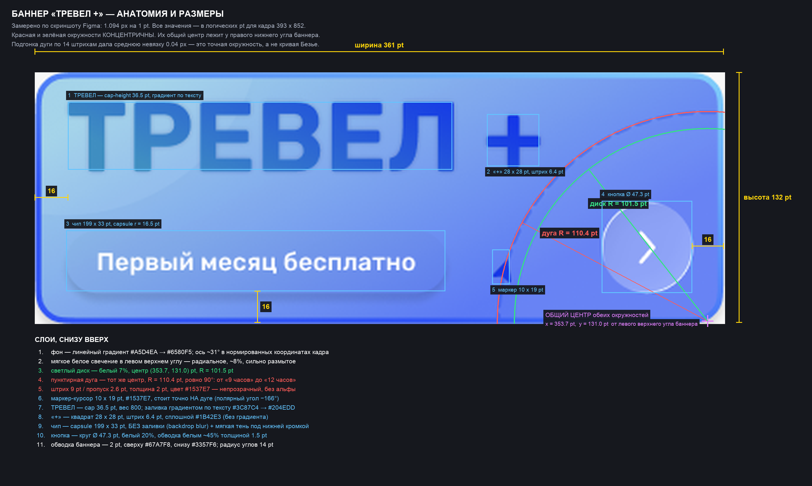
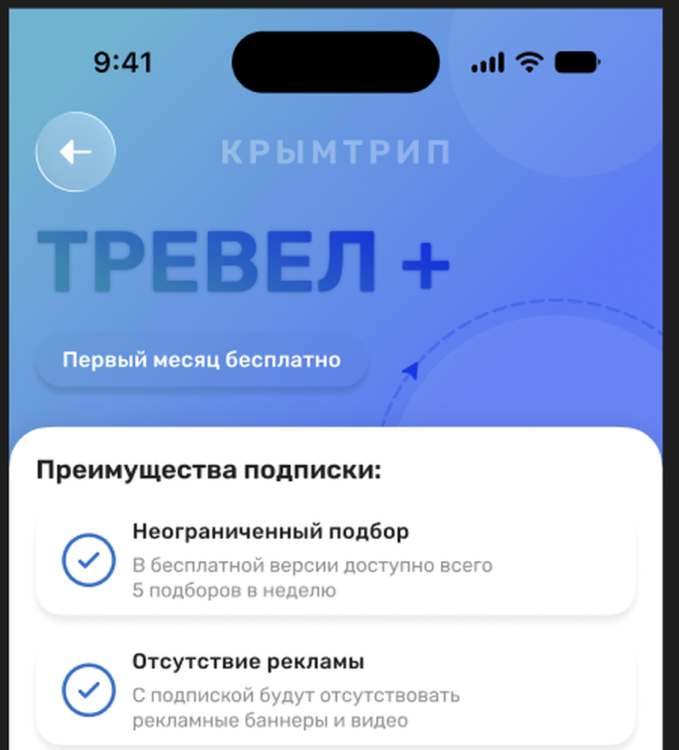
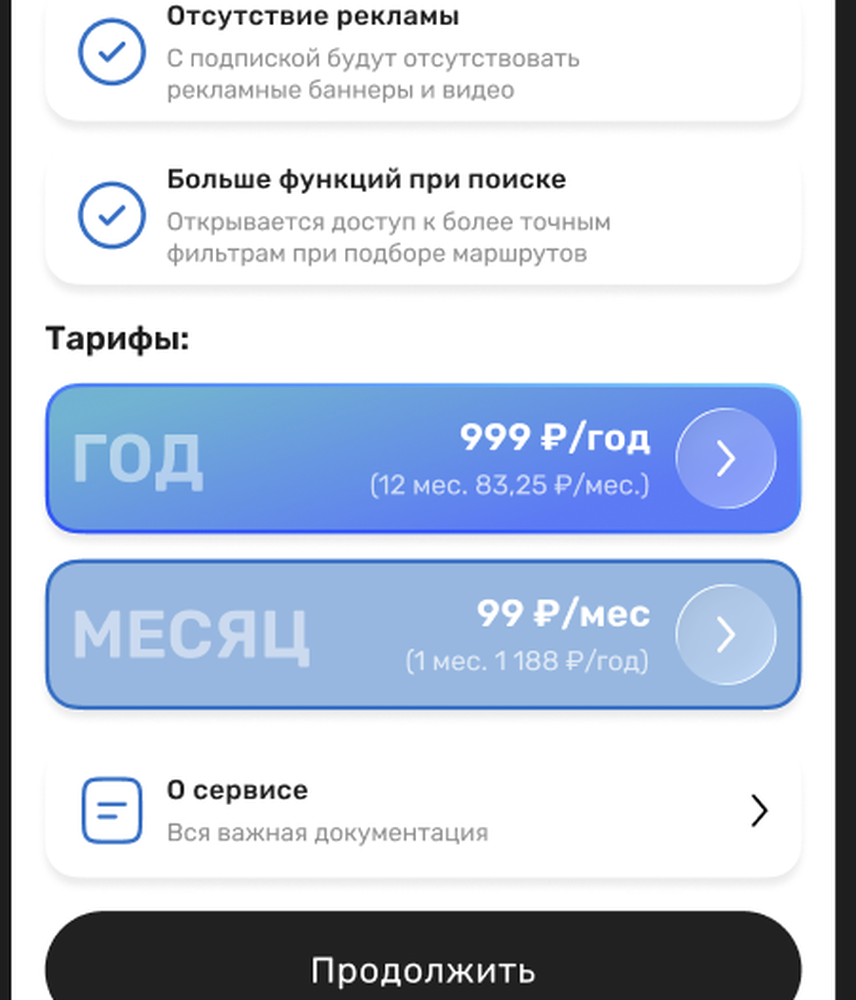

# КрымТрип — пиксельная спецификация экранов: Настройки, Профиль, Поддержка, Тревел +

**Это промпт-задание для агента-исполнителя.** Ниже — полное описание 17 экранов
из Figma. Все размеры, цвета и отступы **измерены пиксельно по скриншотам**
(увеличение до 6×, замер цвета пикселя, замер cap-height глифов), а не оценены
на глаз. Погрешность измерений ±0.5 pt по геометрии и ±1 px по кеглю шрифта.

Источник скриншотов: `tourism-platform/docs/design/screens-figma/`.
Открывай их рядом со спекой — на каждом кадре может быть несколько экранов,
имя экрана подписано серым сверху над рамкой телефона.

> **Важно про приоритет.** Если спека и текущий код расходятся — прав скриншот.
> Текущая реализация профиля/настроек не совпадает с макетом: другой акцентный
> цвет, другие радиусы, другие кегли и полностью отсутствует баннер «ТРЕВЕЛ +».
> Не «подгоняй примерно», а выставляй ровно те числа, что ниже.
>
> **Редакция 2.** Раздел §3 (баннер «ТРЕВЕЛ +») и размеры пейвола §4.19
> перемерены заново: дуга подогнана по методу наименьших квадратов, декоративный
> диск найден по радиальному профилю, чип и кнопка измерены с вычитанием
> локальной модели фона. Полный список того, что изменилось относительно первой
> редакции, — в **§3.14**. Если баннер уже собран по первой редакции, его нужно
> переделать: там неверны радиус дуги, её центр, шаг пунктира, цвет, размер
> маркера, заливка чипа и трактовка знака «+».

---

## 0. Файлы-референсы и что на них

| Файл | Экраны на кадре (слева → направо) |
|---|---|
| `01-settings-sub-active_notifications_offline.png` | Настройки (подписка активна) · Настройки «Уведомления» · Настройки «Оффлайн» |
| `02-settings-sub-inactive.png` | Настройки (подписка не активна) — **эталон для замеров, самый крупный кадр** |
| `03-report-error_app_route_thanks.png` | Сообщить об ошибке · Ошибка в приложении · Ошибка в маршруте · Спасибо за помощь |
| `04-route-error-form_dropdown.png` | Ошибка в маршруте (маршрут не выбран) · Ошибка в маршруте (открыт выбор маршрута) |
| `05-support-chat_change-name.png` | Чат с поддержкой · Сменить имя |
| `06-support_profile-settings_travelplus.png` | Настройки «Поддержка» · Настройки «Профиль» · Тревел + (активна, состояние загрузки) |
| `07-faq_change-phone_travelplus-paywall.png` | Поддержка → Вопрос 1 · Сменить номер · **Тревел + (пейвол, полный)** |
| `08-faq-answer_confirm-phone.png` | Поддержка → Вопрос 1 (раскрыт ответ) · Подтвердить смену номера |
| `09-change-photo.png` | Профиль → Сменить фото |
| **`zoom-banner-anatomy.png`** | **Баннер «ТРЕВЕЛ +»: размеры, построение окружностей, все слои — главная схема, см. §3** |
| `zoom-banner-full-x8.png` | Баннер целиком, 8×, без разметки |
| `zoom-banner-title.png` | Баннер, левая половина, 4× |
| `zoom-banner-arc.png` | Баннер, правая половина, 6× (пунктирная дуга, маркер, кнопка) |
| `zoom-banner-layers-residual.png` | Баннер: карта остатка после вычитания градиента — видно декоративные слои по отдельности |
| `zoom-profile-rows.png` | Строки настроек профиля, 2.6× (эталон иконок и типографики строки) |
| `zoom-chat-bubbles.png` | Бабблы чата поддержки, 2.2× |
| `zoom-paywall-top.png` / `zoom-paywall-bottom.png` | Пейвол Тревел +, 1.9× |

---

## 1. Базовая система

### 1.1 Канва и сетка

- Логический кадр: **393 × 852 pt** (iPhone 16 / 15 Pro, Dynamic Island).
- Горизонтальные поля контента: **16 pt** слева и справа. Ширина контента — **361 pt**.
- Фон страницы: `#F7F7F7`. Карточки и поверхности: `#FFFFFF`.
- Никаких боковых разделителей на всю ширину: контент всегда внутри 16 pt-полей.

### 1.2 Цвета (замерено по пикселям)

| Роль | HEX | Где используется |
|---|---|---|
| Фон страницы | `#F7F7F7` | скролл-фон всех экранов |
| Поверхность карточки | `#FFFFFF` | строки настроек, блоки формы, бабблы бота |
| Основной текст | `#212121` | заголовки секций, тайтлы строк |
| Вторичный текст | `#909090` | подписи под тайтлами, плейсхолдеры |
| Бренд-надпись в хедере | `#8C8C8C` | «КРЫМТРИП» |
| **Акцентный синий** | **`#386FC4`** | иконки-контуры, тумблер ON, активная строка «Чат с поддержкой», галочки, чек-иконка хедера, синие бабблы чата |
| Синий текст-ссылка | `#2F6FD0` | «Асистент поддержки», подчёркнутые ссылки согласий |
| Чёрная CTA | `#212121` | «Продолжить», «Сохранить…», «Вернуться на главную» |
| Заливка контрола/поля | `#E7E7E7` | инпуты «Введите новое имя», поля кода, поле поиска маршрута |
| Тумблер OFF | `#E5E5E5` трек / `#FFFFFF` бегунок | выключенные переключатели |
| Хайрлайн-разделитель | `#E3E3E3` | тонкие линии внутри карточки и между группами |

**Замена в коде:** сейчас акцент берётся из `AppColors.focus = #1B6B93`. По макету
акцент — `#386FC4`. Добавь токен `AppColors.accentBlue = Color(0xFF386FC4)` и
используй его во всех экранах этой спеки. `AppColors.pageSurface` (`#F7F7F7`) и
`elevatedSurface` (`#FFFFFF`) совпадают с макетом — их не трогай.

### 1.3 Типографика

Гарнитура — системный гротеск (Roboto на Android / SF Pro на iOS, в макете
нарисовано Roboto-подобным). Кегли выведены из cap-height:

| Стиль | Кегль | Вес | Цвет | Прочее |
|---|---|---|---|---|
| Бренд «КРЫМТРИП» | **20 px** | 600 | `#8C8C8C` | UPPERCASE, letter-spacing **+4 px**, по центру хедера |
| Заголовок секции («Настройки уведомлений:») | **22 px** | 700 | `#212121` | всегда заканчивается двоеточием, выключка влево, line-height 1.2 |
| Тайтл строки («Сменить имя») | **13 px** | 700 | `#212121` | line-height 1.25 |
| Подпись строки («Никита Можаров») | **12 px** | 400 | `#909090` | line-height 1.3, ровно 1 строка (кроме пейвола — там до 2 строк) |
| Лейбл поля («Тип проблемы:») | **12 px** | 700 | `#212121` | с двоеточием |
| Плейсхолдер поля | **12 px** | 400 | `#909090` | — |
| Заголовок баннера «ТРЕВЕЛ» | **48 px** | 800 | градиент, см. §3 | UPPERCASE, letter-spacing 0 |
| Пилюля баннера | **12 px** | 700 | `#FFFFFF` | — |
| Текст баббла чата | **15 px** | 400 | белый / `#212121` | line-height 1.3 |
| Время в баббле | **11 px** | 400 | 70 % белого / `#909090` | — |
| Текст CTA-кнопки | **16 px** | 600 | `#FFFFFF` | — |
| Цена тарифа | **18 px** | 700 | `#FFFFFF` | — |
| Подпись цены («(12 мес. 83,25 ₽/мес.)») | **12 px** | 400 | 85 % белого | — |
| Водяной лейбл тарифа («ГОД») | **28 px** | 800 | белый **32 % opacity** | UPPERCASE |

### 1.4 Радиусы

| Элемент | Радиус |
|---|---|
| Строка настроек, блок формы, баббл бота | **14 pt** |
| Баннер «ТРЕВЕЛ +» | **14 pt** |
| Карточка тарифа, карточка преимущества на пейволе | **12 pt** |
| Пилюля, тумблер, CTA-кнопка, нижняя навигация | **capsule** (= половина высоты) |
| Круглая кнопка (назад / чек / стрелка в баннере) | **круг** |
| Поле ввода / поиска | **capsule** |
| Textarea «Описание» | **10 pt** |
| Дропзона «Добавить скриншот» | **10 pt** |
| Обложка профиля | **14 pt** |

**Замена в коде:** `AppRadii.card` сейчас 22 — для этих экранов нужен **14**.
Введи `AppRadii.settingsTile = 14` и применяй его, не меняя глобальный `card`.

### 1.5 Тени

Одна мягкая тень на всех белых карточках:

```text
color: rgba(0,0,0,0.06)
offset: (0, 2)
blur: 8
spread: 0
```

Баннер и активная синяя строка получают чуть заметнее:
`rgba(0,0,0,0.10)`, offset `(0, 4)`, blur `12`.

---

## 2. Общие компоненты

### 2.1 Хедер (есть на всех экранах, кроме пейвола)

Высота области — **от y = 105 до y = 150 pt** от верха экрана (под статус-баром).

- **Кнопка «Назад»**: круг **46 × 46 pt**, левый край на **16 pt**, заливка `#1C1C1E`,
  внутри белая стрелка `arrow-left`, толщина линии 2.2 pt, размер глифа 20 pt.
- **Бренд «КРЫМТРИП»**: строго по центру экрана, вертикально центрирован с кнопкой.
- **Кнопка «Подтвердить»** (только на экранах-формах: «Уведомления», «Оффлайн»,
  «Сообщить об ошибке», «Ошибка в приложении/маршруте», «Спасибо за помощь»):
  круг **46 × 46 pt** у правого края с отступом **16 pt**, заливка `#1C1C1E`,
  внутри белая галочка `check`, толщина 2.4 pt.
  На экранах «Настройки», «Профиль», «Поддержка», «Сменить имя/номер/фото» —
  **правой кнопки нет**.

### 2.2 Заголовок секции

Отступ **16 pt** слева, **12 pt** сверху от низа хедера, **12 pt** снизу до
первого элемента списка.

### 2.3 Строка настроек `SettingsRow` — базовый кирпич всех экранов

Смотри `zoom-profile-rows.png` — это эталон.

```text
┌─ 361 × 64 pt, radius 14, fill #FFFFFF, shadow 0/2/8 rgba(0,0,0,.06) ─┐
│  [16] [icon 32×32] [12] ┌ Тайтл 13/700 #212121        ┐ [flex] [chev] [16] │
│                          └ Подпись 12/400 #909090     ┘                    │
└────────────────────────────────────────────────────────────────────────────┘
```

- Высота строки: **64 pt** (замерено 63.1–64.0).
- Вертикальный зазор между строками: **14 pt**.
- Иконка: контейнер **32 × 32 pt**, глиф вписан в 28 pt, **только контур**
  (outline), толщина обводки **2 pt**, цвет `#2F6FD0`, скругления концов — round.
  Заливки внутри иконок нет.
- Между иконкой и текстовым блоком — **12 pt**.
- Тайтл и подпись — вертикальный зазор **2 pt**, блок центрирован по высоте строки.
- Шеврон `chevron-right`: **20 × 20 pt**, толщина 2.2 pt, цвет `#000000`,
  правый внутренний отступ **16 pt**.

### 2.4 Активная строка «Чат с поддержкой» `SupportRowActive`

Тот же макет, но:

- Заливка — **сплошной `#386FC4`**, radius 14, тень `rgba(0,0,0,.10) 0/4/12`.
- Иконка (реплика-баббл с двумя линиями внутри) — контур **белый**, 2 pt.
- Тайтл «Чат с поддержкой» — 13/700 **`#FFFFFF`**.
- Подпись «Напишите нам если не нашли ответ» — 12/400 **`#B8CBE6`**
  (= белый 72 % поверх синего).
- Шеврон — **белый**.
- Это всегда **последний** элемент списка на экранах поддержки/профиля/ошибок.

### 2.5 Переключатель `Toggle`

- Трек: **56 × 30 pt**, capsule.
- ON: трек `#386FC4`, бегунок `#FFFFFF` Ø **26 pt**, смещён вправо, отступ 2 pt.
- OFF: трек `#E5E5E5`, бегунок `#FFFFFF` Ø **26 pt**, слева, отступ 2 pt.
- Правый край трека — **16 pt** от правого края карточки (замерено 24.7 pt от
  края экрана при карточке с полем 16 → внутренний отступ ≈ 8–9 pt; ставь **16**
  и сверь визуально с `01-…png`, вторая рамка).
- Бегунок с тенью `rgba(0,0,0,.15) 0/1/3`.

### 2.6 Нижняя навигация `FloatingBottomNav`

- Пилюля **313 × 58 pt**, capsule, по центру, **15 pt** от низа экрана.
- Заливка: очень светлое стекло — `#F7F7F7` при **~92 %** прозрачности поверх
  контента + обводка 1 pt `rgba(0,0,0,.06)`. Внутри контента экрана она
  «просвечивает» (видно на `04-…png`, где список уходит под навигацию).
- 5 иконок, равномерно распределены, **все в контурном стиле**, цвет `#8E8E8E`,
  толщина 2 pt, размер 26 pt:
  1. `home` — домик,
  2. `book/pages` — раскрытая книга-стопка,
  3. `plus-circle` — плюс в круге,
  4. `map` — сложенная карта,
  5. `user` — силуэт человека.
- **Активного состояния на этих экранах нет** — все иконки серые.

### 2.7 Чёрная CTA-кнопка

- Высота **56 pt**, ширина = 361 pt (на всю контентную ширину), capsule.
- Заливка `#212121`, текст 16/600 `#FFFFFF`, по центру.

### 2.8 Поле ввода `TextField`

- Высота **48 pt**, capsule, заливка `#E7E7E7`, без обводки.
- Внутренний горизонтальный отступ **20 pt**, плейсхолдер 12/400 `#909090`.

### 2.9 Чекбокс согласия

- Круг Ø **28 pt**, обводка 1.8 pt `#B9B9B9`, заливка прозрачная (не отмечен).
- Текст справа с отступом **12 pt**, 12/400 `#212121`, две строки:
  строка 1 — «Я соглашаюсь», строка 2 — «с <ссылка>».
  Ссылка (`политикой конфиденциальности`, `обработкой персональных данных`) —
  цвет `#212121`, **подчёркнута** 1 pt.
- Между двумя чекбоксами — **10 pt**.

---

## 3. 🔴 Баннер «ТРЕВЕЛ +» — воспроизвести максимально точно

> **Раздел переписан во второй редакции.** Первая версия описывала баннер
> приблизительно, и агент собрал его неправильно. Здесь всё перемерено по
> пикселям: масштаб скриншота определён как **1.094 px на 1 pt**, дуга подогнана
> методом наименьших квадратов по 14 штрихам (средняя невязка **0.04 px**),
> декоративный диск найден по радиальному профилю остатка после вычитания
> модели градиента. Значения ниже — не оценки на глаз.
>
> Если в реализации расходится хоть одно число из §3.12 — баннер собран неверно.

### 3.0 Главная схема — открой её рядом с кодом



Дополнительные референсы в `screens-figma/`:

| Файл | Что показывает |
|---|---|
| `zoom-banner-anatomy.png` | размеры, построение, слои (главная схема выше) |
| `zoom-banner-full-x8.png` | сам баннер, увеличение 8× без разметки |
| `zoom-banner-title.png` | левая половина 4×: текст и чип |
| `zoom-banner-arc.png` | правая половина 6×: дуга, маркер, кнопка |
| `zoom-banner-layers-residual.png` | карта остатка: видно все декоративные слои отдельно от градиента |

### 3.1 Ключ ко всей композиции

Баннер построен вокруг **одной точки** — центра, лежащего у правого нижнего угла:

```text
центр C = (353.7 pt, 131.0 pt)   от левого верхнего угла баннера
          ≈ 7 pt левее правой кромки и 1.5 pt выше нижней
```

Из этой точки построены **две концентрические окружности**:

| Элемент | Радиус | Роль |
|---|---|---|
| светлый диск | **101.5 pt** | заливка белым 7 %, даёт мягкую «линзу» справа |
| пунктирная дуга | **110.4 pt** | «маршрут», идёт на 9 pt снаружи от кромки диска |

Если построить их из разных центров или перепутать, какая окружность больше, —
баннер сразу читается как чужой. Это самая частая ошибка.

### 3.2 Геометрия рамки

| Параметр | Значение |
|---|---|
| Размер | **361 × 132 pt** |
| Поля от краёв экрана | **16 pt** слева и справа |
| Верх баннера | **126 pt** от верха экрана |
| Радиус углов | **14 pt** (замер подгонкой профиля угла: 14.17) |
| Отступ до первой строки настроек | **14 pt** |

### 3.3 Слой 1 — градиент фона

Линейный градиент. **Важно: ось НЕ идёт из угла в угол.**

- В попиксельных координатах цвет падает примерно вдвое быстрее по вертикали,
  чем по горизонтали (замер: −0.141 ед. яркости на px по X, −0.229 по Y).
- В **нормированных** координатах кадра это даёт ось около **31°** к горизонтали.
- Для Flutter: `begin: Alignment.topLeft, end: Alignment(1.0, 0.18)`.

Цвета концов: **`#A5D4EA`** → **`#6580F5`**.

Диагональ «из угла в угол» (`topLeft → bottomRight`) даст ось ~20° и заметно
другую картинку — цвет придёт в правый край слишком поздно. Не используй её.

### 3.4 Слой 2 — мягкое свечение в левом верхнем углу

Поверх градиента — размытое белое пятно, из-за него левый верхний угол светлее,
чем даёт чистая линейная растяжка (замер: `#A4D3E9` против расчётных `#97CFE1`).

- Радиальный градиент, центр примерно **(45, 25) pt**, радиус **~120 pt**.
- Белый **8 %** в центре → **0 %** к краю. Дополнительное размытие ~20.

### 3.5 Слой 3 — светлый диск

- Круг, центр **C = (353.7, 131.0) pt**, радиус **101.5 pt** (диаметр 203 pt).
- Заливка **`rgba(255, 255, 255, 0.07)`**, без обводки.
- Обрезается рамкой баннера (`ClipRRect` с радиусом 14).
- Замеренный скачок яркости на кромке: **+7 единиц** внутрь.
- **Нет** сплошных концентрических колец и knob на 3 часах — это был ложный
  разбор; см. [banner-flutter-diff-v3.md](banner-flutter-diff-v3.md). Справа
  только диск + пунктирная дуга (§3.6) + маркер (§3.7) + кнопка.

### 3.6 Слой 4 — пунктирная дуга «маршрут»

Самая характерная деталь. Это **дуга точной окружности**, а не кривая Безье.

| Параметр | Значение |
|---|---|
| Центр | **C = (353.7, 131.0) pt** (тот же) |
| Радиус | **110.4 pt** |
| Сектор | ровно **90°**: от «9 часов» до «12 часов» |
| Начало | нижняя кромка баннера, x ≈ 243 pt |
| Конец | верхняя точка окружности, (353.4, 20.6) pt |
| Толщина | **2.4 pt** (визуально «бусина»; ядро ~2 pt) |
| Штрих | **9 pt** |
| Пропуск | **2.6 pt** |
| Период | **11.5 pt** |
| Цвет | **`#1537E7`**, **непрозрачный** |
| Форма штриха | **снаружи плоский** (острые углы на внешней дуге), **внутри округлый** (fillet на внутренней кромке). Не `StrokeCap.round` на всём штрихе. |

Два уточнения, которые чаще всего делают неправильно:

1. Пропуск **очень маленький** — 2.6 pt против 9 pt штриха. Дуга выглядит почти
   сплошной, лишь слегка «прошитой». Классический `dash 6 / gap 4` даст
   в разы более редкий пунктир и сразу выдаст несовпадение.
2. Цвет **сплошной, без альфы**. В первой редакции стояло «60 % прозрачности» —
   это неверно, замер по ядру штриха даёт чистый `#1537E7`.

Во Flutter: `CustomPainter`, annular-sector path на каждый dash
(внешняя дуга + inner fillet), шаг 9 / 2.6. Не `extractPath` + round cap.

### 3.7 Слой 5 — маркер-курсор на дуге

| Параметр | Значение |
|---|---|
| Габарит | **10 × 19 pt** |
| Позиция (bbox) | x **240.4 … 249.7** pt, y **93.2 … 111.5** pt |
| Центр | **(245.0, 102.4) pt** |
| Цвет | **`#1537E7`**, сплошная заливка |
| Полярный угол на дуге | **−166°** |
| Поворот | по касательной: нос вверх, наклон **~15° по часовой** |

Форма — «навигационный курсор» (Lucide `navigation`): вытянутый треугольник с
острым носом вверху и **V-образной выемкой в основании**. Замеренный силуэт:
острие занимает 1–2 px по ширине, книзу расширяется до полных 10 pt, у самого
низа — выемка и короткий «хвост» слева.

Маркер лежит **точно на окружности дуги** (замеренный радиус 121.1 px против
120.8 px у дуги), а не рядом с ней.

### 3.8 Слой 6 — надпись «ТРЕВЕЛ +»

**Это один текстовый блок с одним градиентом на всю связку, включая плюс.**
В первой редакции плюс был описан как отдельный сплошной цвет — это неверно.

Геометрия:

| Параметр | Значение |
|---|---|
| Cap-height букв | **36.5 pt** (⇒ кегль ≈ 51 px при Roboto/Inter) |
| Вес | **800** |
| Левый край краски «Т» | **17.4 pt** (текстовый бокс ставь на **16 pt**) |
| Полоса заглавных | y **15.5 … 51.2 pt** |
| Правый край «+» | **265.0 pt** |
| Межбуквенное | 0 |

Градиент по тексту — горизонтальный, слева направо по всей связке:

| Позиция | Цвет |
|---|---|
| x = 17.4 pt (левый край «Т») | **`#3D89C3`** |
| x = 265.0 pt (правый край «+») | **`#183DE5`** |

Контрольные точки по глифам (по ним можно проверить реализацию):

| Глиф | Центр, pt | Цвет |
|---|---|---|
| Т | 32.0 | `#3B85C5` |
| Р | 66.7 | `#367CC9` |
| Е | 100.1 | `#3273CD` |
| В | 134.4 | `#2D68D2` |
| Е | 169.1 | `#275CD7` |
| Л | 202.9 | `#1F4DDD` |
| + | 251.3 | `#1A41E3` |

Во Flutter: один `ShaderMask` с
`LinearGradient(begin: Alignment.centerLeft, end: Alignment.centerRight)`
поверх `Row`/`RichText` со всей строкой «ТРЕВЕЛ +».

**Drop shadow** (Figma effect на надписи):

```text
color:  #000681 @ 25%  →  Color(0x40000681)
blur:   3
offset: (0, 1)
```

Тень рисуется **под** `ShaderMask` отдельным слоем (иначе `srcIn` перекрасит
тень градиентом).

### 3.9 Слой 7 — знак «+»

Плюс нарисован как **геометрическая фигура**, а не глиф шрифта:

| Параметр | Значение |
|---|---|
| Габарит | **28 × 28 pt**, ровный квадрат |
| Толщина штриха | **6.4 pt** (обе перекладины одинаковые) |
| Левый край | **237.6 pt** от левого края баннера |
| Верх | **21.9 pt** от верха баннера |
| Зазор от «Л» | **18.3 pt** |
| Цвет | берётся из общего градиента текста, в этой точке ≈ `#1A41E3` |

По вертикали центр плюса на **2.3 pt ниже** оптического центра заглавных букв.

### 3.10 Слой 8 — чип статуса

**Главное открытие: у чипа фактически НЕТ заливки.** Замер локальной моделью
фона показал отклонение всего −1…−5 единиц по каналам, то есть чип не осветляет
подложку. Читается он за счёт тени снизу и белого жирного текста. Это поведение
`BackdropFilter` без цветной заливки: на гладком градиенте размытие даёт
почти ту же картинку.

| Параметр | Значение |
|---|---|
| Габарит | **199 × 33 pt** |
| Радиус | **capsule**, 16.5 pt |
| Левый край | **16 pt** от левого края баннера (в колонку с «ТРЕВЕЛ») |
| Верх | **83.2 pt** от верха баннера |
| Низ | **115.2 pt**, то есть **16 pt** до нижней кромки баннера |
| Заливка | прозрачная (максимум `rgba(255,255,255,0.02)`) |
| Размытие подложки | `ImageFilter.blur(sigmaX: 8, sigmaY: 8)` |
| Обводка | нет |

**Тень под чипом** — то, что делает его видимым:

```text
color:  rgba(0, 0, 0, 0.10)
offset: (0, 2)
blur:   6
```

Замер: полоса затемнения начинается сразу под нижней кромкой, пик **−16 единиц
яркости** на 2 px ниже, полностью гаснет через 7 px.

Текст внутри: **12 px / вес 700 / `#FFFFFF`**, внутренние поля **16 pt**
слева и справа (краска текста x 32.9 … 199.3 pt).

Варианты подписи:

- подписки нет → **«Первый месяц бесплатно»**;
- подписка активна → **«Активна до 29.08.26»**.

### 3.11 Слой 9 — круглая кнопка

| Параметр | Значение |
|---|---|
| Диаметр | **47.3 pt** (ставь 48) |
| Центр | **40.2 pt** от правой кромки, **39.8 pt** от нижней |
| То же иначе | край круга отстоит на **16 pt** от правой и нижней кромок |
| Заливка | **`rgba(255,255,255,0.20)`** |
| Обводка | **1.5 pt**, белый **~45 %** |
| Глиф | `chevron-right`, белый, толщина **2.5 pt**, высота 20 pt |

Контроль по цвету: внутри круга пиксель читается как `#8DA2F6` на подложке
`#667FF5`, на самой обводке — `#9BAFF7`.

### 3.12 Контрольная таблица — по ней проверяют реализацию

Сделай скриншот своего баннера в размере 361 × 132 pt и сравни пиксели в этих
точках (координаты — от левого верхнего угла баннера). Допуск ±4 на канал.

| Точка (x, y) в pt | Ожидаемый цвет |
|---|---|
| 10, 10 | `#A5D4EA` |
| 90, 10 | `#9ECBEB` |
| 181, 8 | `#89B5EC` |
| 300, 8 | `#759BEF` |
| 352, 10 | `#6C8EF1` |
| 10, 66 | `#9AC6EB` |
| 120, 72 | `#80A8ED` |
| 181, 80 | `#7297EF` |
| 250, 60 | `#6E91F1` |
| 352, 66 | `#6883F4` |
| 10, 124 | `#82AAEC` |
| 120, 124 | `#6F92F0` |
| 250, 124 | `#5C7AF3` |

Дополнительно проверь кромки обводки: середина верхней — `#67A7F8`,
середина нижней — `#3357F6`, левая — `#3357F6`, правая — `#65A3F8`.
Толщина обводки **2 pt**, внутрь.

### 3.13 Вариант «подписка активна»

`01-…png`, первая рамка. Отличие ровно одно: подпись чипа —
**«Активна до 29.08.26»**. Все декоративные слои сохраняются полностью,
упрощать их нельзя.

### 3.14 Что было неверно в первой редакции — проверь, что это исправлено

| Что | Было (неверно) | Стало (замер) |
|---|---|---|
| Центр дуги | (330, 180), «на глаз» | **(353.7, 131.0)** |
| Радиус дуги | 150 pt | **110.4 pt** |
| Сектор дуги | «уходит за правую кромку» | **ровно 90°, обе точки внутри баннера** |
| Толщина дуги | 1.5 pt | **2 pt** |
| Пунктир | dash 6 / gap 4 | **dash 9 / gap 2.6** |
| Цвет дуги | `#2E4FE8` при 60 % | **`#1537E7`, непрозрачный** |
| Декоративные круги | два разных, Ø 210 и Ø 120 | **один диск R 101.5, концентричный дуге** + мягкое свечение слева |
| Маркер | 12 × 14 pt, поворот −20° | **10 × 19 pt, полярный угол −166°, наклон ~15°** |
| Цвет маркера | `#1E3FD8` | **`#1537E7`** |
| Плюс | отдельный сплошной цвет, кегль 40 | **часть общего градиента, квадрат 28 × 28, штрих 6.4** |
| Заливка чипа | белый 22 % | **прозрачная + тень снизу** |
| Габарит чипа | высота 32, отступы 20 | **199 × 33, отступы 16** |
| Кнопка | центр 28 pt от краёв, белый 28 % | **центр 40 pt от краёв (край 16 pt), белый 20 %** |
| Ось градиента | 135°, из угла в угол | **~31° в нормированных координатах** |

### 3.15 Как собирать во Flutter

Порядок вложенности, снизу вверх:

```text
ClipRRect(borderRadius: 14)
└ Stack
  ├ DecoratedBox  — линейный градиент §3.3
  ├ CustomPaint   — свечение §3.4 + диск §3.5 + дуга §3.6 + маркер §3.7
  ├ Positioned    — ShaderMask("ТРЕВЕЛ +") §3.8–3.9
  ├ Positioned    — чип: BackdropFilter + BoxShadow + Text §3.10
  └ Positioned    — кнопка §3.11
└ обводка 2 pt поверх всего (отдельный Container с Border)
```

Диск, дугу и маркер рисуй **в одном** `CustomPainter` — у них общий центр,
и так его невозможно рассинхронизировать.

---

## 4. Экраны

### 4.1 Настройки (подписка не активна) — `02-settings-sub-inactive.png`

Хедер: назад + «КРЫМТРИП». Правой кнопки нет. Заголовка секции нет — сразу баннер.

1. Баннер «ТРЕВЕЛ +» с чипом **«Первый месяц бесплатно»** (§3), верх на 126 pt.
2. Список из 5 строк `SettingsRow`, зазор 14 pt:

| № | Иконка (outline, `#2F6FD0`) | Тайтл | Подпись |
|---|---|---|---|
| 1 | `user` — силуэт человека в круге-плечах | Настройки профиля | Гибкие настройки для удоства |
| 2 | `bell` — колокольчик | Уведомления | Гибкие настройки для удоства |
| 3 | `download` в рамке — стрелка вниз в квадрате со скруглениями | Оффлайн маршруты | Настройка скачивания маршрутов |
| 4 | `message-square` — баббл с двумя линиями | Поддержка | Поможем с любым вопросом |
| 5 | `file-text` — документ с линиями | О сервисе | Вся важная документация |

3. Дальше — пустой фон `#F7F7F7` до низа.
4. Нижняя навигация.

> Опечатку «удоства» в макете **сохранить как есть** — это текст из дизайна;
> если хочешь исправить, спроси владельца продукта, но не молча.

### 4.2 Настройки (подписка активна) — `01-…png`, рамка 1

Идентичен 4.1, кроме:

- чип баннера → **«Активна до 29.08.26»**;
- строка 4 переименована: тайтл **«Поддержка и обратная связь»**, подпись
  «Поможем с любым вопросом»;
- строка 1 подпись та же, строки 2/3/5 те же.

### 4.3 Настройки «Уведомления» — `01-…png`, рамка 2

Хедер: назад + «КРЫМТРИП» + **круглая чёрная кнопка-галочка справа**.
Заголовок секции: **«Настройки уведомлений:»** (22/700).

Три строки с тумблерами вместо шевронов, зазор 14 pt:

| Иконка | Тайтл | Подпись | Тумблер |
|---|---|---|---|
| `bell` с точкой-«зет» / уведомление | Пуш-уведомления | Уведомления из приложения | **ON** `#386FC4` |
| `smartphone` — телефон вертикальный | СМС | Для оповещения без интернета | **OFF** `#E5E5E5` |
| `vibrate` — телефон с волнами по бокам | Звуки и вибрация | При приближении к точке | **ON** `#386FC4` |

Ниже — пустой фон и нижняя навигация.

### 4.4 Настройки «Оффлайн» — `01-…png`, рамка 3

Хедер: назад + бренд + галочка. Заголовок: **«Оффлайн маршруты:»**.

| Иконка | Тайтл | Подпись | Контрол справа |
|---|---|---|---|
| `download` в рамке | Автоматическое скачивание | При добавлении в избранное | тумблер **ON** |
| `help-circle` — «?» в круге | Спрашивать разрешение | Перед каждым скачиванием | тумблер **OFF** |
| `bell` | Кэш приложения | **689 МБ** | **круглая кнопка Ø 40 pt, заливка `#1C1C1E`, внутри белая иконка `trash` 18 pt** |

### 4.5 Настройки «Профиль» — `06-…png`, рамка 2 (эталон: `zoom-profile-rows.png`)

Хедер: назад + бренд, правой кнопки нет. Заголовок: **«Настройки профиля:»**.

| Иконка (outline `#2F6FD0`, 2 pt) | Тайтл | Подпись |
|---|---|---|
| `contact` — карточка-удостоверение: прямоугольник, внутри слева круг-голова с плечами, справа две горизонтальные линии | Сменить имя | Никита Можаров |
| `camera` — корпус камеры с круглым объективом и выступом-видоискателем сверху | Сменить фото | Профиль и обложка профиля |
| `smartphone` — вертикальный телефон, внутри снизу короткая линия-«динамик» | Сменить номер телефона | Верификация по номеру |
| `message-heart` — баббл с хвостиком внизу-слева, внутри сердце | Сменить предпочтения | Пройти текст по интересам сначала |
| `message-square` (белый) | **Чат с поддержкой** | Напишите нам если не нашли ответ |

Последняя строка — `SupportRowActive` (синяя, §2.4). Затем пустой фон и навигация.

### 4.6 Профиль → Сменить фото — `09-change-photo.png`

Хедер: назад + бренд. Заголовок: **«Сменить фото:»**.

Одна большая белая карточка (361 pt ширина, radius 14, padding **16 pt**):

1. Лейбл **«Фото обложки:»** — 13/700 `#212121`.
2. Через 12 pt — превью обложки: **329 × 176 pt**, radius **14**, фото
   заполняет `cover` (в макете — закатное море с утёсом). Поверх, строго по
   центру, кнопка-камера: круг Ø **48 pt**, заливка `rgba(0,0,0,0.35)`,
   внутри белая иконка `camera` 22 pt, обводки нет.
3. Через 20 pt — хайрлайн `#E3E3E3` на всю внутреннюю ширину, ещё 20 pt.
4. Лейбл **«Фото профиля:»** — 13/700.
5. Через 12 pt — аватар: круг Ø **156 pt**, по центру карточки, фото `cover`
   (в макете ч/б портрет). Поверх по центру та же кнопка-камера Ø 48 pt
   `rgba(0,0,0,0.55)`.
6. Через 16 pt — хайрлайн, затем сноска 11/400 `#909090` в две строки:
   «\* Изменения вступят в силу только после проверки фотографий модерацией».
7. Под карточкой, через **14 pt** — `SupportRowActive` «Чат с поддержкой».
8. Нижняя навигация.

### 4.7 Профиль → Сменить имя — `05-…png`, рамка 2

Хедер: назад + бренд. Заголовок: **«Сменить имя:»**. Клавиатура открыта.

1. Поле ввода (§2.8): 361 × 48 pt, capsule, `#E7E7E7`, плейсхолдер
   **«Введите новое имя»**.
2. Через **16 pt** — два чекбокса согласия (§2.9):
   «Я соглашаюсь / с политикой конфиденциальности»,
   «Я соглашаюсь / с обработкой персональных данных».
3. Через **16 pt** — чёрная CTA **«Сохранить новое имя»** (§2.7).
4. Через **16 pt** — сноска 11/400 `#909090`, две строки:
   «\* Имя будет измененно только после проверки модерацией».
5. Ниже — системная клавиатура iOS (light), нижней навигации **нет**.

### 4.8 Профиль → Сменить номер телефона — `07-…png`, рамка 2

Хедер: назад + бренд. Заголовок: **«Сменить номер телефона:»**.

1. Поле ввода 361 × 48 pt, `#E7E7E7`, плейсхолдер **«Введите новый номер телефона»**.
2. Через **16 pt** — чёрная CTA **«Продолжить»**.
3. Пустой фон, ниже — системная **цифровая** клавиатура iOS. Навигации нет.

### 4.9 Профиль → Подтвердить смену номера — `08-…png`, рамка 2

Хедер: назад + бренд. Заголовок тот же: **«Сменить номер телефона:»**.

1. Ряд из **4 полей кода**: каждое **80 × 56 pt**, radius **10 pt**,
   заливка `#E7E7E7`, обводка 1 pt `#D5D5D5`, зазор между полями **12 pt**,
   ряд занимает всю контентную ширину 361 pt. Поля пустые.
2. Через **16 pt** — два чекбокса согласия (§2.9), те же тексты.
3. Через **16 pt** — чёрная CTA **«Сохранить новое номер»**
   (в макете именно так, с рассогласованием — сохранить дословно).
4. Ниже — цифровая клавиатура. Навигации нет.

### 4.10 Настройки «Поддержка» — `06-…png`, рамка 1

Хедер: назад + бренд. Заголовок: **«Поддерка и обратная связь:»**
(в макете опечатка «Поддерка» — сохранить).

**Группа A — навигация по темам** (4 строки, зазор 14 pt):

| Иконка | Тайтл | Подпись |
|---|---|---|
| `map-pin` — капля с точкой внутри | Маршруты и навигация | — (только тайтл) |
| `clipboard` — планшет с зажимом | Вопросы по приложению | — |
| `crown` — корона | Баллы ТревелПоинт и достижения | — |
| `plus-square` — плюс в скруглённом квадрате | Подписка Тревел + | — |

Эти 4 строки **без подписи** → высота строки **52 pt**, тайтл центрирован
по вертикали, иконка 32 pt, шеврон справа.

**Разделитель:** хайрлайн `#E3E3E3` на всю контентную ширину (361 pt),
отступы **16 pt** сверху и снизу.

**Группа B — действия** (3 строки, зазор 14 pt, высота 64 pt, с подписями):

| Иконка | Тайтл | Подпись |
|---|---|---|
| `alert-circle` — «!» в круге | Сообщить об ошибке | На маршруте или в приложении |
| `star-sparkle` — звезда с маленькой искрой слева-внизу | Оценить приложение | Это поможет нам в развитии |
| `message-square` (белый) | **Чат с поддержкой** | Напишите нам если не нашли ответ |

Последняя — `SupportRowActive`. Затем нижняя навигация.

### 4.11 Поддержка → «Маршруты и навигация» (FAQ-список) — `07-…png`, рамка 1

Хедер: назад + бренд. Заголовок: **«Маршруты и навигация:»**.

**Группа A — вопросы.** 5 строк **без иконок**, высота **64 pt**, зазор 14 pt.
Текстовый блок начинается с внутреннего отступа **16 pt** от левого края карточки:

| Тайтл (13/700) | Подпись (12/400 `#909090`) |
|---|---|
| Уровень сложности | Как понять, справлюсь ли я? |
| Офлайн-прохождение | Можно ли пройти маршрут без интернета? |
| Ошибка на маршруте | Куда сообщить о закрытой тропе или неточности? |
| Порядок точек | Обязательно ли идти строго по очереди? |
| Сезонность | Как узнать, доступен ли маршрут сейчас? |

Шеврон справа у каждой.

**Разделитель:** хайрлайн, отступы 16 pt.

**Группа B:** те же 3 строки, что в §4.10 (Сообщить об ошибке / Оценить
приложение / Чат с поддержкой-синяя). Затем навигация.

### 4.12 Поддержка → раскрытый ответ — `08-…png`, рамка 1

Хедер: назад + бренд. Заголовок: **«Уровень сложности:»**.

1. Карточка-«вопрос»: 361 pt, radius 14, `#FFFFFF`, padding 16/14,
   тайтл **«Уровень сложности»** 13/700, подпись **«Как понять, справлюсь ли я?»**
   12/400 `#909090`. Шеврона **нет**.
2. Через **12 pt** — карточка-«ответ»: 361 pt, radius 14, `#FFFFFF`,
   padding **16 pt**:
   - лейбл **«Асистент поддержки»** — 12/600, цвет `#2F6FD0`
     (опечатку «Асистент» сохранить);
   - через **8 pt** — текст ответа 14/400 `#212121`, line-height **1.35**,
     4 строки:
     «В карточке маршрута указана сложность (лёгкий/средний/сложный) и ключевые
     параметры — расстояние, набор высоты, тип покрытия и ориентировочное время
     прохождения.»
3. Через **20 pt** — группа B (Сообщить об ошибке / Оценить приложение /
   Чат с поддержкой-синяя).
4. Нижняя навигация.

### 4.13 Сообщить об ошибке — `03-…png`, рамка 1

Хедер: назад + бренд + **галочка**. Заголовок: **«Сообщить об ошибке:»**.

| Иконка | Тайтл | Подпись |
|---|---|---|
| `map-pin` | Ошибка на маршруте | — |
| `clipboard` | Ошибка в приложении | — |
| `star-sparkle` | Оценить приложение | Это поможет нам в развитии |
| `message-square` белый | **Чат с поддержкой** | Напишите нам если не нашли ответ |

Первые две — без подписи (52 pt), третья — 64 pt, четвёртая — `SupportRowActive`.
Зазор 14 pt. Затем навигация.

### 4.14 Ошибка в приложении — `03-…png`, рамка 2

Хедер: назад + бренд + галочка. Заголовок: **«Ошибка в приложении:»**.

Форма из отдельных белых блоков (каждый — своя карточка 361 pt, radius 14,
padding **14 pt**, зазор между блоками **12 pt**):

1. **Селект «Тип проблемы»** — высота 64 pt:
   лейбл «Тип проблемы:» 12/700 `#212121`; под ним значение
   «Приложение вылетает / зависает» 12/400 `#909090`;
   справа `chevron-down` 20 pt `#212121`, отступ 14 pt.
2. **Описание** — блок высотой ~120 pt:
   лейбл «Описание:» 12/700; через 8 pt — textarea:
   ширина = внутренняя ширина блока, высота **80 pt**, radius **10 pt**,
   заливка `#FFFFFF`, обводка **1 pt `#E3E3E3`**,
   плейсхолдер «Опишите проблему максимально подробно» 12/400 `#909090`,
   внутренний padding 12 pt.
3. **Скриншот** — блок ~110 pt:
   лейбл «Скриншот проблемы (рекомендуется):» 12/700; через 10 pt — дропзона:
   высота **56 pt**, radius **10 pt**, заливка `#F2F2F2`,
   обводка **1 pt dashed `#C9C9C9`** (dash 5 / gap 4);
   слева внутри — иконка `image-plus` в скруглённом квадрате 32 pt,
   контур `#B0B0B0` 1.8 pt, отступ 12 pt;
   правее через 10 pt — тайтл «Добавить скриншот» 12/700 `#212121` и подпись
   «Это поможет лучше понять проблему» 11/400 `#909090`.
4. **Устройство и версия** — блок 60 pt:
   лейбл «Устройство и версия (автоматически)» 12/700;
   значение «Версия 0.32.1 (Бета). Iphone 16, IOS 27.» 12/400 `#909090`.
5. Через **16 pt** — строка `SettingsRow` «Оценить приложение / Это поможет нам
   в развитии» с иконкой `star-sparkle`.
6. Через **14 pt** — `SupportRowActive` «Чат с поддержкой».
7. Нижняя навигация (контент под неё подскроллен).

### 4.15 Ошибка в маршруте — `03-…png` рамка 3 и `04-…png` рамка 1

Хедер: назад + бренд + галочка. Заголовок: **«Ошибка в маршруте:»**.

Отличается от 4.14 только **первым блоком** — выбор маршрута:

**Состояние «маршрут выбран»** (`03-…png`, рамка 3):

- блок 361 pt, radius 14, padding 14;
- лейбл «Проблемный маршрут:» 12/700;
- через 10 pt — «капсула» выбранного маршрута: высота **56 pt**, radius
  **12 pt**, заливка `#F2F2F2`, внутри:
  - миниатюра **44 × 40 pt**, radius **8 pt**, фото `cover`, отступ 8 pt;
  - через 10 pt — тайтл «Гора Чок-Сары-Кая» 12/700 `#212121` и подпись
    «Опубликован: 12.05.26» 11/400 `#909090`;
  - справа `chevron-down` 20 pt `#212121`, отступ 12 pt.

**Состояние «маршрут не выбран»** (`04-…png`, рамка 1):

- та же капсула, но внутри: иконка `search` 18 pt `#9A9A9A` с отступом 16 pt,
  через 10 pt — плейсхолдер «Искать маршрут» 12/400 `#909090`,
  справа `chevron-down`.
- высота капсулы **48 pt**, заливка `#E7E7E7`, обводка 1 pt `#D8D8D8`.

Далее — селект «Тип проблемы» со значением «Тропа закрыта / перекрыта»,
Описание, Скриншот, Устройство/версия, Оценить приложение,
`SupportRowActive` — как в §4.14.

> На `04-…png` рамка 1 селект «Тип проблемы» продублирован дважды — это
> артефакт макета, **в реализации нужен один**.

### 4.16 Ошибка в маршруте — открыт выбор маршрута — `04-…png`, рамка 2

Дропдаун раскрыт: `chevron-down` повёрнут в `chevron-up`. Под полем поиска
внутри того же белого блока — список из **4 результатов**, каждый:

- высота **56 pt**, без своей заливки (фон блока `#FFFFFF`),
- миниатюра **44 × 40 pt**, radius 8, фото `cover`, отступ слева 14 pt,
- через 10 pt — тайтл «Гора Чок-Сары-Кая» 12/700 и подпись
  «Опубликован: 12.05.26» 11/400 `#909090`,
- между элементами — хайрлайн `#EDEDED` 1 pt (в макете почти не виден),
- шеврона у элементов нет.

Блок растягивается по содержимому, следующие блоки формы съезжают вниз.

### 4.17 Спасибо за помощь — `03-…png`, рамка 4

Хедер: назад + бренд + галочка. Заголовка секции **нет**.

Центрированный по горизонтали блок, начинается на **~200 pt** от верха экрана:

1. Иконка **сердце, только контур**: размер **104 × 96 pt**, толщина обводки
   **3 pt**, цвет `#D8D8D8`, заливки нет.
2. Через **28 pt** — заголовок **«Спасибо за помощь!»** — 22/700 `#212121`,
   по центру.
3. Через **8 pt** — подпись **«Благодаря вашей помощи мы становимся лучше»** —
   12/400 `#909090`, по центру, одна строка.
4. Через **20 pt** — чёрная CTA **«Вернуться на главную»** (361 × 56, capsule,
   `#212121`, текст 16/600 белый).
5. Пустой фон, нижняя навигация.

### 4.18 Чат с поддержкой — `05-…png`, рамка 1 (эталон: `zoom-chat-bubbles.png`)

Хедер: назад + бренд, правой кнопки **нет**. Заголовка секции нет.
Фон `#F7F7F7`. Клавиатура открыта, нижней навигации нет.

1. **Разделитель дня**: текст «Сегодня» 12/400 `#909090`, по центру,
   отступ сверху ~190 pt от верха экрана.
2. **Баббл пользователя** (справа), через 20 pt:
   - максимальная ширина **72 %** контентной ширины (≈ 260 pt),
   - заливка `#386FC4`, radius **18 pt** по всем углам (симметрично, без «хвоста»),
   - padding **12 pt** по горизонтали, **10 pt** по вертикали,
   - текст 15/400 `#FFFFFF`, line-height 1.3, 4 строки:
     «Здравствуйте, не могу опубликовать свой маршрут. Как долго он проходит
     модерацию?»,
   - время **«17:52»** 11/400 `rgba(255,255,255,0.75)` — в правом-нижнем углу
     баббла, на **той же строке**, что последнее слово, с отступом 8 pt справа
     и 2 pt от низа,
   - правый край баббла — 16 pt от края экрана.
3. **Баббл ассистента** (слева), через **12 pt**:
   - заливка `#FFFFFF`, radius 18 pt, тень `rgba(0,0,0,.05) 0/2/6`,
   - max-width 72 %, padding 12/10,
   - первая строка — лейбл **«Асистент поддержки»** 12/600 `#2F6FD0`,
   - через 6 pt — текст 15/400 `#212121`, 3 строки:
     «Здравствуйте! Маршрут проходит модерацию в течение 5-7 рабочих дней.»,
   - время **«17:53»** 11/400 `#909090` в правом-нижнем углу,
   - левый край — 16 pt от края экрана.
4. Ниже — системная клавиатура iOS (light, QWERTY). Поле ввода сообщения в
   макете скрыто клавиатурой — реализуй стандартное: capsule `#E7E7E7`,
   высота 44 pt, плейсхолдер «Сообщение», справа круглая кнопка отправки
   Ø 36 pt `#386FC4` с белой иконкой `send` 18 pt.

#### Рабочее поведение mobile-чата

- Composer закреплён у нижнего края и остаётся над системной клавиатурой;
  лента сообщений прокручивается независимо и при появлении новых сообщений
  переходит к последнему.
- После отправки фокус остаётся в поле ввода, поэтому клавиатура не закрывается
  между последовательными сообщениями. Тап по пустой части ленты снимает фокус
  и скрывает клавиатуру; жест прокрутки делает то же самое.
- Пока экран чата открыт и приложение активно, клиент запрашивает тикет каждые
  3 секунды. Новый ответ оператора появляется без повторного открытия экрана.
  При сворачивании приложения polling останавливается, а при возврате сразу
  выполняется обновление.
- Для маршрута `/profile/settings/support/chat` плавающая нижняя навигация и её
  градиент скрыты; на остальных экранах shell-навигация не меняется.

### 4.19 Тревел + (пейвол) — `07-…png`, рамка 3

Самый сложный экран. Референсы: `zoom-paywall-top.png`, `zoom-paywall-bottom.png`.





**Структура: градиентный герой на всю ширину + белый лист поверх него.**

#### Герой (0 … ~250 pt от верха экрана)

- Занимает **всю ширину экрана 393 pt**, без полей и без радиуса — это
  «развёрнутый на весь экран» баннер из §3.
- **Переиспользуй тот же виджет**, что и в §3, только с другой шириной и без
  скругления. Все слои и их параметры — строго из §3, не пересобирай их заново
  «по мотивам». Ниже только то, что отличается.
- Градиент: те же цвета `#A5D4EA → #6580F5`, ось из §3.3.
- Общий центр декоративных слоёв смещается вместе с рамкой: он по-прежнему
  лежит у правого нижнего угла градиентной области, диск и дуга остаются
  концентричными с радиусами 101.5 и 110.4 pt.
- Дуга и маркер — параметры из §3.6 и §3.7: **2 pt, dash 9 / gap 2.6,
  `#1537E7` без прозрачности**.
- **Статус-бар** поверх градиента: время/сигнал/wifi/батарея — **чёрные**
  (как на светлом фоне), Dynamic Island чёрная.
- **Кнопка «Назад»**: круг Ø 46 pt на 16 pt слева, **стеклянная**:
  заливка `rgba(255,255,255,0.20)`, обводка 1.5 pt белым ~45 %,
  внутри **белая** стрелка `arrow-left` 2.2 pt.
- **Бренд «КРЫМТРИП»** по центру, 20/600, цвет `rgba(255,255,255,0.55)`
  (светлее, чем на белых экранах), letter-spacing +4.
- **«ТРЕВЕЛ +»** — cap-height 36.5 pt, вес 800, единый градиент по тексту
  `#3D89C3 → #183DE5` (§3.8), левый край 16 pt.
- **Чип «Первый месяц бесплатно»** — 199 × 33 pt, capsule, **без заливки**,
  backdrop blur + тень снизу (§3.10), текст 12/700 белый, левый край 16 pt.
- Для варианта «подписка активна» (`06-…png`, рамка 3) чип →
  **«Активна до 29.08.26»**.

#### Белый лист

- Начинается на **~250 pt** от верха, перекрывает низ героя.
- Заливка `#FFFFFF`, **верхние углы radius 14 pt**, нижние — 0 (уходит за экран).
- Лист во **всю ширину экрана 393 pt**, внутренние поля **16 pt**,
  то есть контентная ширина внутри листа — те же **361 pt**, что и везде
  (замер по скриншоту: карточки тарифов 360.4 pt при левом отступе 16.3 pt).

1. Заголовок **«Преимущества подписки:»** — 15/700 `#212121`, отступ сверху 16 pt.
2. Через **12 pt** — 3 карточки преимуществ, зазор **10 pt**. Каждая:
   - ширина **361 pt**, radius **12 pt**, заливка `#FAFAFA`,
     тень `rgba(0,0,0,.04) 0/1/4`, высота **auto** (≈ 68 pt),
     padding 14 pt по вертикали, 14 pt по горизонтали;
   - слева иконка **галочка в круге**: круг Ø **32 pt**, только **обводка 2 pt
     `#2F6FD0`**, заливки нет, внутри галочка `check` 2 pt `#2F6FD0`;
   - через 12 pt — текстовый блок:
     тайтл 13/700 `#212121`, через 3 pt — подпись 12/400 `#909090`, **2 строки**;
   - шеврона нет.

   | Тайтл | Подпись (2 строки) |
   |---|---|
   | Неограниченный подбор | В бесплатной версии доступно всего / 5 подборов в неделю |
   | Отсутствие рекламы | С подпиской будут отсутствовать / рекламные баннеры и видео |
   | Больше функций при поиске | Открывается доступ к более точным / фильтрам при подборе маршрутов |

3. Через **20 pt** — заголовок **«Тарифы:»** 15/700 `#212121`.
4. Через **12 pt** — **карточка тарифа «ГОД»** (выделенная):
   - **361 × 72 pt**, radius **12 pt** (замер: 360.4 × 72.4);
   - **диагональный градиент с той же осью, что у баннера**: подгонка дала
     **35°** в нормированных координатах, во Flutter —
     `begin: Alignment.topLeft, end: Alignment(1.0, 0.40)`;
     цвета `#72B2D2` → `#5C7AF4`
     (контроль по углам: TL `#72B2D2`, TR `#6186ED`, BL `#699BDF`, BR `#5C7AF4`);
   - обводка **2 pt**, градиентная: верх `#7CC4F5`, низ `#3357F6`;
   - слева, с отступом 14 pt — водяной лейбл **«ГОД»**: 28/800 UPPERCASE,
     белый **32 % opacity**, вертикально центрирован;
   - справа, до круглой кнопки — колонка выключкой **вправо**:
     цена **«999 ₽/год»** 18/700 `#FFFFFF`, под ней через 2 pt
     **«(12 мес. 83,25 ₽/мес.)»** 12/400 `rgba(255,255,255,0.85)`;
   - у правого края — круглая кнопка Ø **44 pt**, центр 26 pt от правого края:
     заливка `rgba(255,255,255,0.20)`, обводка 1.5 pt белым ~45 %,
     внутри белый `chevron-right` 2.5 pt — та же кнопка, что в §3.11.
5. Через **12 pt** — **карточка тарифа «МЕСЯЦ»** (невыделенная):
   - те же размеры и радиус;
   - **сплошная заливка `#97B7E0`** (без градиента — это ключевое отличие,
     тариф выглядит «приглушённым»);
   - обводка 2 pt `#7FA5D8`;
   - водяной лейбл **«МЕСЯЦ»** 28/800 белый 32 %;
   - цена **«99 ₽/мес»** 18/700 белый, подпись **«(1 мес. 1 188 ₽/год)»**
     12/400 белый 85 %;
   - круглая кнопка — идентична, но её заливка чуть светлее фона карточки.
6. Через **16 pt** — обычная строка `SettingsRow`:
   иконка `file-text` outline `#2F6FD0`, тайтл **«О сервисе»** 13/700,
   подпись **«Вся важная документация»** 12/400 `#909090`, шеврон `#000000`.
   Карточка белая, radius 14, высота 64 pt, но на белом листе тень мягче:
   `rgba(0,0,0,.04) 0/1/4`.
7. Через **16 pt** — чёрная CTA **«Продолжить»**: **361 × 56 pt**, capsule,
   `#212121`, текст 16/600 `#FFFFFF`.
8. Снизу — безопасная зона 24 pt. Нижней навигации **нет**.

### 4.20 Тревел + (состояние загрузки) — `06-…png`, рамка 3

Тот же герой, но белый лист **пустой** (без содержимого). Это промежуточное
состояние макета — реализуй как skeleton/shimmer белого листа либо просто не
воспроизводи как отдельный экран.

---

## 5. Иконки — полный список и стиль

Все иконки — **только контур (outline), без заливки**, толщина обводки **2 pt**,
скругление концов и стыков — `round`, размер бокса **32 × 32 pt** (глиф 28 pt),
цвет `#2F6FD0` (кроме белых на синей строке и серых в навигации).

Набор соответствует **Lucide**. Соответствия:

| Смысл | Lucide | Где |
|---|---|---|
| Профиль | `user` / `circle-user` | Настройки профиля |
| Удостоверение | `contact` | Сменить имя |
| Камера | `camera` | Сменить фото |
| Телефон | `smartphone` | Сменить номер, СМС |
| Баббл+сердце | `message-circle-heart` | Сменить предпочтения |
| Колокольчик | `bell` | Уведомления, Кэш приложения |
| Скачивание | `download` в рамке (`hard-drive-download`) | Оффлайн маршруты |
| Вибрация | `vibrate` | Звуки и вибрация |
| Вопрос | `circle-help` | Спрашивать разрешение |
| Корзина | `trash-2` (белая, в чёрном круге) | Кэш приложения |
| Баббл-чат | `message-square-text` | Поддержка, Чат с поддержкой |
| Документ | `file-text` | О сервисе |
| Пин на карте | `map-pin` | Маршруты и навигация, Ошибка на маршруте |
| Планшет | `clipboard` | Вопросы по приложению, Ошибка в приложении |
| Корона | `crown` | Баллы ТревелПоинт |
| Плюс в квадрате | `square-plus` | Подписка Тревел + |
| Внимание | `circle-alert` | Сообщить об ошибке |
| Звезда с искрой | `sparkles` / `star` + маленькая искра | Оценить приложение |
| Добавить картинку | `image-plus` | Дропзона скриншота |
| Галочка в круге | `circle-check` (обводка 2 pt) | Преимущества пейвола |
| Сердце (пустое) | `heart` | Экран «Спасибо за помощь» |
| Поиск | `search` | Поле выбора маршрута |
| Шеврон вправо/вниз/вверх | `chevron-right` / `chevron-down` / `chevron-up` | везде |
| Навигация (нижний бар) | `house`, `book-open`, `circle-plus`, `map`, `user` | нижняя навигация |

---

## 6. Что именно надо поправить в текущей реализации

По результату сверки с `tourism-mobile/lib/features/profile/presentation/profile_screen.dart`
и токенами в `lib/core/design/`:

1. **Акцентный цвет.** Добавить `AppColors.accentBlue = Color(0xFF386FC4)` и
   `AppColors.accentBlueIcon = Color(0xFF2F6FD0)`. Сейчас используется
   `AppColors.focus = #1B6B93` — это другой, более бирюзовый оттенок.
2. **Радиусы.** `AppRadii.card = 22` для этих экранов не подходит. Добавить
   `AppRadii.settingsTile = 14` и применить к строкам, баннеру, блокам формы.
3. **Строка настроек.** Вынести один переиспользуемый виджет
   `SettingsRow({icon, title, subtitle, trailing})` с параметрами из §2.3
   (высота 64 / 52 без подписи, зазор 14, иконка 32 outline).
   Сейчас каждый экран верстается по-своему.
4. **Баннер «ТРЕВЕЛ +».** Реализовать как отдельный виджет
   `TravelPlusBanner({required TravelPlusStatus status, required bool fullBleed})`
   со всеми слоями §3 и деревом из §3.15. Тот же виджет переиспользуется как
   герой пейвола (`fullBleed: true`, §4.19) — не пиши второй.
   Диск, дугу и маркер рисуй **одним** `CustomPainter`: у них общий центр
   `(353.7, 131.0) pt`, и так его нельзя рассинхронизировать. Пунктир —
   `PathMetric.extractPath` шагом 9 / 2.6 pt. Градиент текста — один `ShaderMask`
   на всю связку «ТРЕВЕЛ +», включая плюс.
   Готовность сверяй по чек-листу «Отдельная приёмка баннера» в §7 и по
   контрольным точкам цвета §3.12.
5. **Нижняя навигация.** По макету — светлая стеклянная пилюля 313 × 58 с серыми
   контурными иконками **без активного состояния**. Сейчас используется
   `AppColors.activeNavigationFill` (чёрная подсветка активного) — на этих
   экранах её быть не должно.
6. **Типографика.** Тайтлы строк — 13/700, подписи — 12/400, заголовки секций —
   22/700. Проверить `AppTypography` и добавить недостающие стили,
   а не переопределять размеры инлайн.
7. **Тексты.** Все строки скопировать **дословно из макета**, включая опечатки
   («удоства», «Поддерка», «Асистент», «измененно», «Сохранить новое номер»).
   Если решаете исправлять — исправляйте отдельным осознанным коммитом и
   зафиксируйте в `docs/progress.md`, чтобы дизайн и код не разошлись молча.

---

## 7. Приёмка

Перед тем как отметить экран готовым, проверь по скриншоту:

- [ ] Ширина контента ровно 361 pt, поля 16 pt — на всех экранах.
- [ ] Высота строки настроек 64 pt (52 pt без подписи), зазор 14 pt.
- [ ] Радиус карточек 14 pt, не 22.
- [ ] Все иконки контурные, 2 pt, 32 pt бокс, цвет `#2F6FD0`.
- [ ] Синяя строка «Чат с поддержкой» — последняя, `#386FC4`, белый тайтл,
      подпись `#B8CBE6`.
- [ ] Хедер: 46 pt круги, бренд по центру 20/600 `#8C8C8C` с трекингом +4.
- [ ] Кнопка-галочка справа есть **только** на экранах-формах (§2.1).
- [ ] Тариф «ГОД» — градиентный 361 × 72, «МЕСЯЦ» — плоский `#97B7E0`.
- [ ] Нижняя навигация: 313 × 58, 15 pt от низа, все иконки серые.
- [ ] Тексты дословные, включая опечатки макета.

### Отдельная приёмка баннера «ТРЕВЕЛ +»

Баннер проверяется строже остального: именно он разошёлся с макетом сильнее
всего. Прогони весь список, сверяясь с `zoom-banner-anatomy.png`.

- [ ] Габарит 361 × 132 pt, радиус углов 14 pt, обводка 2 pt внутрь.
- [ ] Ось градиента фона — `Alignment.topLeft → Alignment(1.0, 0.18)`,
      **не** «из угла в угол».
- [ ] Светлый диск и пунктирная дуга построены **из одного центра**
      `(353.7, 131.0) pt`, радиусы **101.5** и **110.4** pt.
- [ ] Дуга — ровно 90°, от «9 часов» до «12 часов», оба конца внутри баннера.
- [ ] Пунктир **9 / 2.6 pt**, толщина 2 pt, цвет `#1537E7` **без прозрачности**.
- [ ] Маркер-курсор 10 × 19 pt лежит точно на дуге, полярный угол −166°.
- [ ] «ТРЕВЕЛ +» — **один** градиент на всю связку, `#3D89C3 → #183DE5`;
      плюс не выкрашен отдельным цветом.
- [ ] Плюс — квадрат 28 × 28 pt со штрихом 6.4 pt.
- [ ] Чип 199 × 33 pt **без заливки**, читается за счёт тени снизу.
- [ ] Кнопка Ø 48 pt, край в 16 pt от правой и нижней кромок,
      заливка белый 20 %, обводка белый ~45 %.
- [ ] Прогнаны контрольные точки цвета из §3.12 (допуск ±4 на канал).

### Обязательные проверки перед сдачей

По правилам репозитория, эти экраны — изменение мобильного UI, отображающего
серверный/пользовательский текст. Значит:

- рендерить весь контент через `Text` (никакого HTML/WebView),
- имя пользователя, тексты FAQ и ответы ассистента — **недоверенные данные**:
  ограничить длину, обрезать по `maxLines` с `TextOverflow.ellipsis`,
- ссылки в согласиях открывать только по allowlist доменов,
- запустить и приложить фактический результат:
  - `flutter analyze --fatal-infos`
  - `flutter test test/security`
  - `flutter test` (виджет-тесты затронутых экранов)
