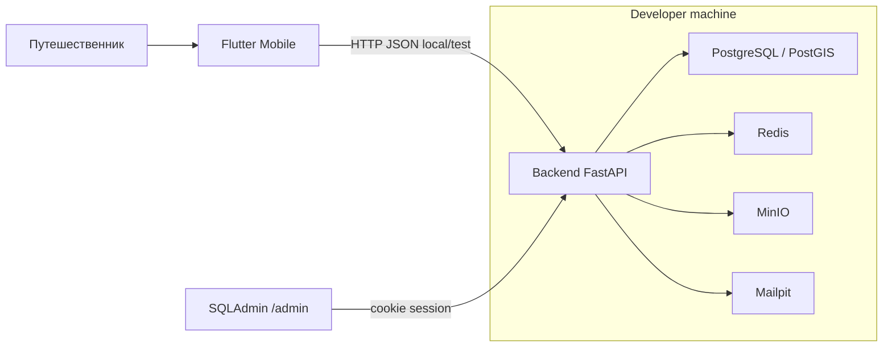
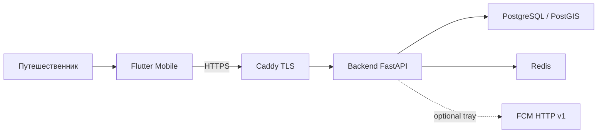
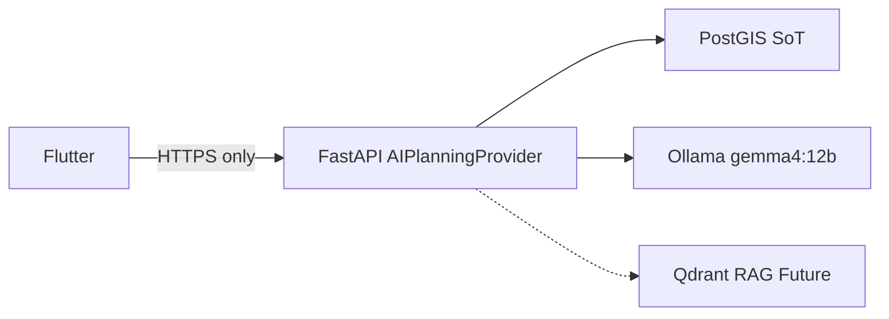

# Container diagram

Два слоя: **as-built** (local DX и test host) и **целевой home lab**
(Gemma 4). Это не одна Compose-файл. Сводка: [stack.md](../stack.md).

Kafka — ADR-005, не включена. Kubernetes Ingress — будущая topology, не local.

## As-built: local DX

`compose.yaml`: PostGIS, Redis, MinIO, Mailpit. Backend и Flutter на хосте.

## As-built: test host

`deploy/test/compose.yaml`. Нет MinIO, Mailpit, Ollama.

## Target: AI home lab (не реализовано в коде)

Отдельная GPU-машина. Bind только `127.0.0.1`. Не ставить на test-VPS.
Фрагмент Compose: [ai-self-hosted-home-lab.md](../ai-self-hosted-home-lab.md).

