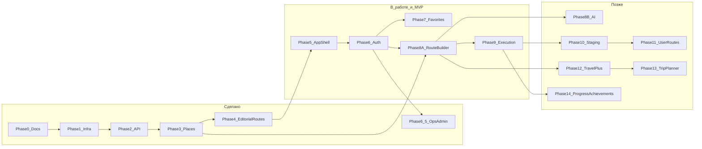
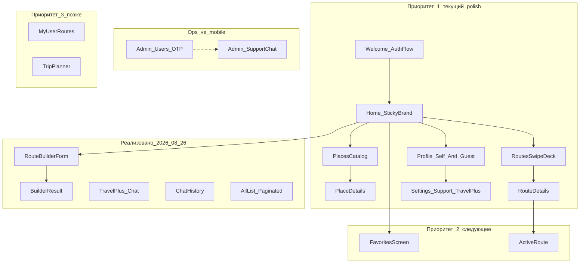
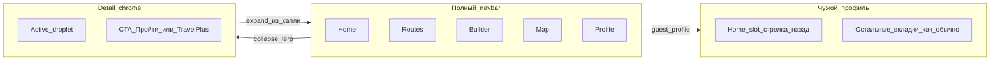
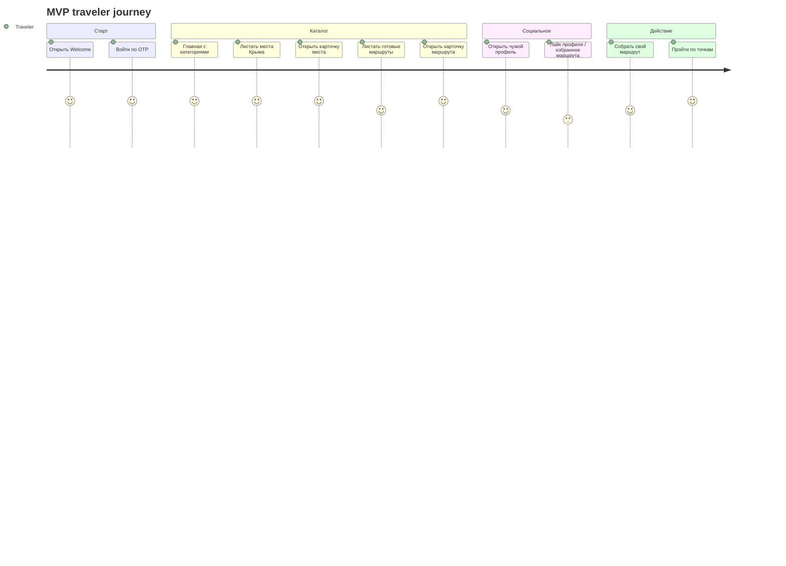
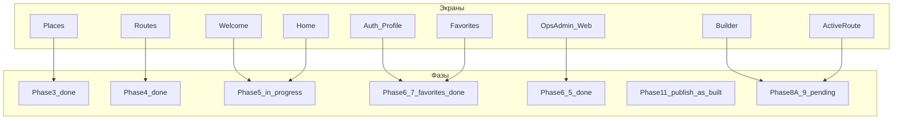
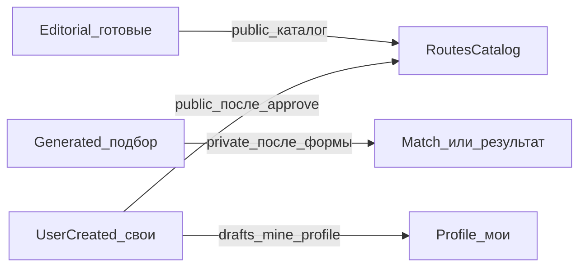

# Карта фаз и экранов (для дизайна)

Документ для синхронизации с дизайном экранов. Технические детали —
в [implementation-plan.md](implementation-plan.md) и [progress.md](progress.md).

**Статус на 2026-08-01:** фазы 0–4 и **6.5 ops admin** — done; Phase 5 / 5.5–5.6 /
6 / 7 — in_progress (реальный OTP+JWT на test contour, favorites, shell polish).  
**Сейчас по продукту:** polish shell/nav и профиля; ops-админка на test; next —
Phase 8A Route Builder.

---

## 1. Roadmap фаз (что уже есть / что дальше)

| Фаза | Для дизайна значит | Статус |
| --- | --- | --- |
| 0–2 | Инфра, не экраны | done |
| **3 Places** | Каталог мест, карточка места | **done** |
| **4 Routes** | Каталог маршрутов, карточка маршрута со stops | **done** |
| 5 Shell | Welcome / Home / навбар / темы | in_progress |
| 6 Auth | Регистрация, вход, профиль (API OTP/JWT на test) | in_progress |
| **6.5 Ops** | Внутренняя админка `/admin` (не mobile UI) | **done** |
| 7 Favorites | Избранное мест и маршрутов; guest profile | in_progress |
| 8A Builder | Форма подбора + результат маршрута | pending |
| 9 Execution | «Пройти маршрут», чеклист точек | pending |
| 8B / 12 / 13 | AI-чат, Travel+, Trip Planner | later |
| **14 Progress** | Звание, тп, достижения на профиле | pending |

---

## 2. Приоритет экранов для дизайна сейчас

### Shell / nav (mobile) — актуальные правила

- Detail/settings: liquid collapse (lerp капли + `translationX` иконок) →
  компактная капля + опциональный CTA.
- Чужой профиль: **не** схлопывать бар; слот Home = history-back (`pop`).
- Scroll вниз на вкладке: иконка активной вкладки → «наверх».

### Рекомендация другу-дизайнеру

1. **Сейчас:** polish Home/Routes/Profile/Settings + consistency жестов.
2. **Следом:** история в «Мои маршруты»; реальный результат подбора (8A);
   Active Route (9); achievements API.
3. **Уже as-built (не блочить):** публикация своих маршрутов + admin
   moderation; тп/звания/leaderboard; inbox.
4. Ops UI живёт только в `/admin` (SQLAdmin) — отдельные макеты mobile не нужны.

---

## 3. Главный пользовательский путь (MVP)

---

## 4. Связь экранов и фаз разработки

*(Публикация user routes / модерация — as-built Phase 11 slice; на схеме
отдельно не вынесена — живёт в Routes + Profile + `/admin`.)*

---

## 5. Типы маршрутов (важно для UI)

В каталоге — редакционные + **published** `user_created`. Сгенерированный —
личный результат builder (**Phase 8A**, пока UI режет каталог). Свои draft /
pending / published — на профиле через `/routes/mine`; таб «Мои маршруты» =
избранное / follows / history placeholder.

---

## 6. Как смотреть диаграммы

- В GitLab / GitHub Markdown mermaid рендерится в preview.
- В VS Code / Cursor — preview Markdown.
- Чтобы перенести в FigJam: скопировать блок mermaid или сказать агенту «положи это на FigJam board».

Живой статус фаз всегда в [progress.md](progress.md).
