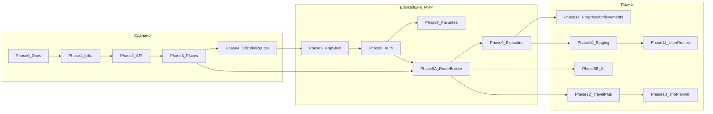
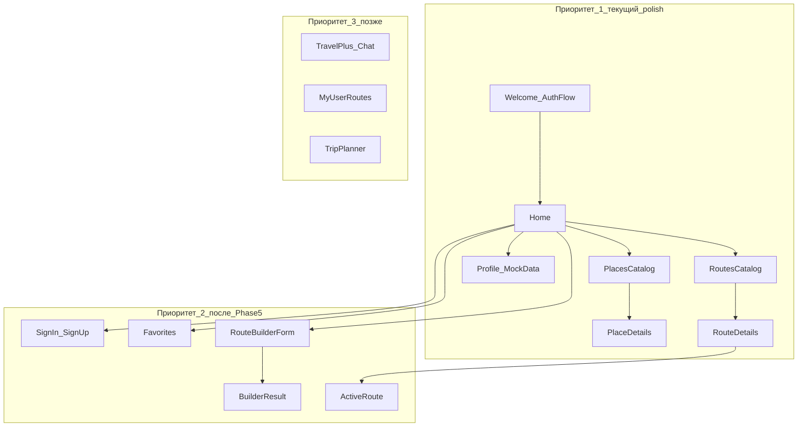
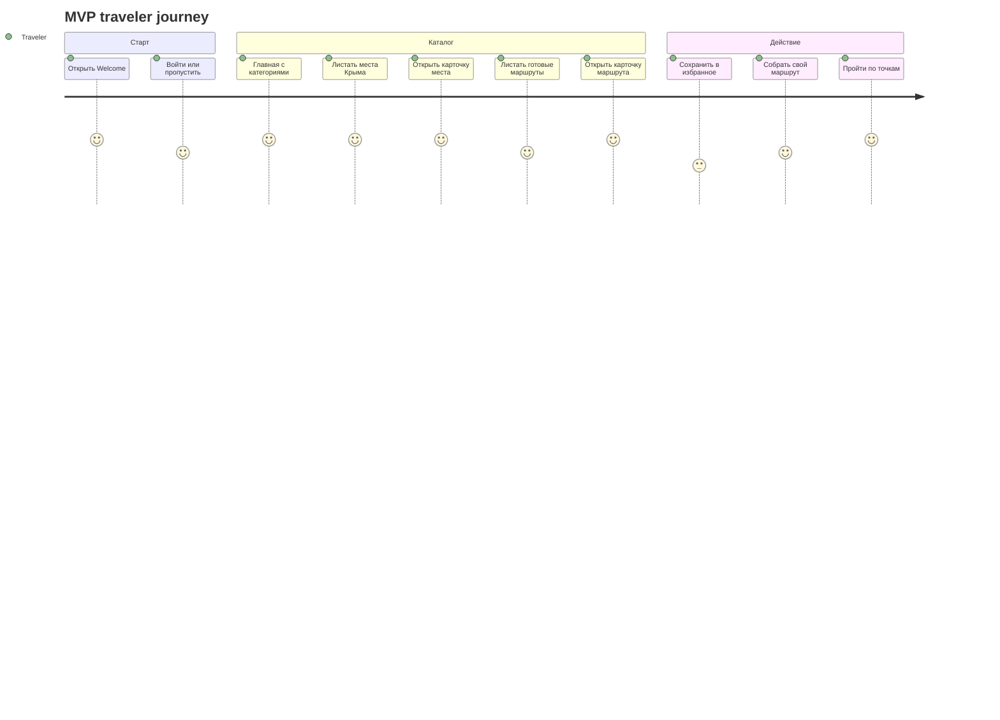
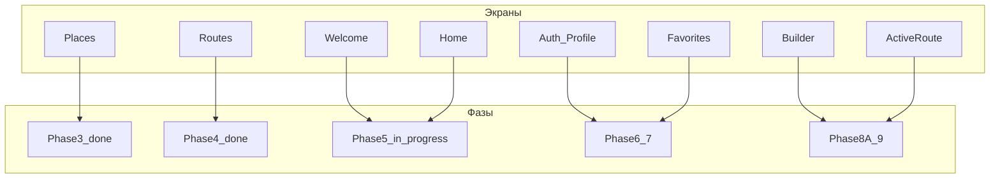
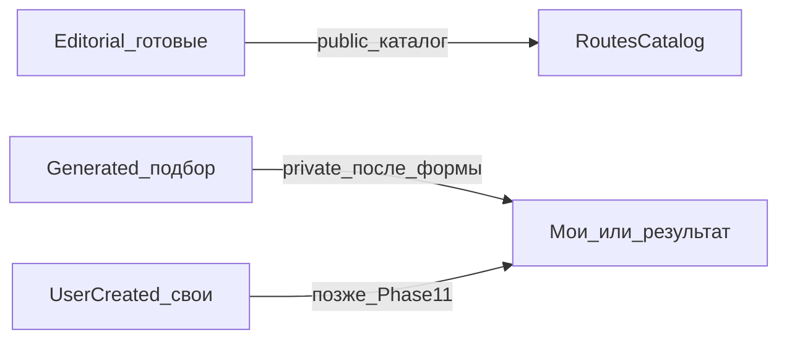

# Карта фаз и экранов (для дизайна)

Документ для синхронизации с дизайном экранов. Технические детали —
в [implementation-plan.md](implementation-plan.md) и [progress.md](progress.md).

**Статус на 2026-07-28:** завершены фазы 0–4; в активной разработке Phase 5 + 5.5/5.6.  
**Сейчас в работе по продукту:** polish Flutter UI/навигации, CI split, подготовка test backend.

---

## 1. Roadmap фаз (что уже есть / что дальше)

| Фаза | Для дизайна значит | Статус |
| --- | --- | --- |
| 0–2 | Инфра, не экраны | done |
| **3 Places** | Каталог мест, карточка места | **done** (в коде есть простой UI) |
| **4 Routes** | Каталог маршрутов, карточка маршрута со stops | **done** |
| 5 Shell | Welcome / Home / навбар / темы | in_progress |
| 6 Auth | Регистрация, вход, профиль | pending |
| 7 Favorites | Избранное мест и маршрутов | pending |
| 8A Builder | Форма подбора + результат маршрута | pending |
| 9 Execution | «Пройти маршрут», чеклист точек | pending |
| 8B / 12 / 13 | AI-чат, Travel+, Trip Planner | later |
| **14 Progress** | Звание, тп, достижения на профиле | pending |

---

## 2. Приоритет экранов для дизайна сейчас

Что имеет смысл рисовать **в первую очередь** (опираясь на уже реализованный shell и текущий scope):

### Рекомендация другу-дизайнеру

1. **Сейчас:** до-polish уже реализованных Welcome/Auth/Home/Places/Routes/Profile flows + UX consistency (gestures/back/search/swipe deck).
2. **Следом:** Favorites, форма подбора маршрута + экран результата, затем real auth data wiring.
3. **Не блокировать MVP:** AI-чат, Trip Planner, публикация своих маршрутов — отдельные волны.

Шаблон Welcome у вас уже есть в Figma — его не ломаем; новые экраны лучше на отдельной странице (как «Cursor — экраны v1»).

---

## 3. Главный пользовательский путь (MVP)

---

## 4. Связь экранов и фаз разработки

---

## 5. Типы маршрутов (важно для UI)

В MVP в публичном каталоге — **редакционные** маршруты. Сгенерированный — личный результат builder. Свои маршруты пользователя — позже.

---

## 6. Как смотреть диаграммы

- В GitLab / GitHub Markdown mermaid рендерится в preview.
- В VS Code / Cursor — preview Markdown.
- Чтобы перенести в FigJam: скопировать блок mermaid или сказать агенту «положи это на FigJam board».

Живой статус фаз всегда в [progress.md](progress.md).
