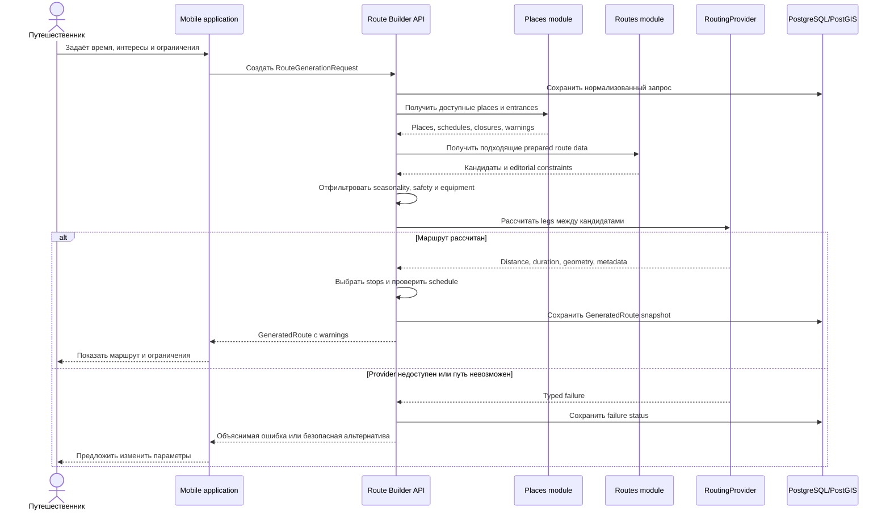

# Поток генерации маршрута

На первом этапе `RoutingProvider` реализован deterministic stub. Даже после
подключения реального provider финальная проверка closure, schedule, safety,
equipment и freshness остаётся ответственностью платформы.

AI-assisted planning (Phase 8B+) подключается как опциональная
`PlanningStrategy` после editorial miss и выбора candidates: LLM предлагает
ordered place IDs из allowlist, затем снова `RoutingProvider` + deterministic
validation. См. [ai-route-planning-architecture.md](../ai-route-planning-architecture.md)
и [ADR-006](../decisions/ADR-006-ai-assisted-route-planning.md).
