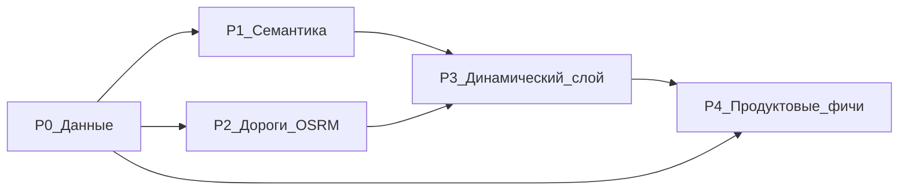

# Route intelligence — план по фазам

Статус: **план** (2026-08-23). Решение и обоснование —
[ADR-009](decisions/ADR-009-data-first-route-intelligence.md).

Связанные документы:

- [ai-route-match-three-paths.md](ai-route-match-three-paths.md)
- [ai-route-planning-architecture.md](ai-route-planning-architecture.md)
- [routing-provider-osrm-crimea.md](routing-provider-osrm-crimea.md)
- [ai-route-chat-mobile-implementation.md](ai-route-chat-mobile-implementation.md)

## Принцип приоритизации

Фазы отсортированы по **эффекту на единицу усилий**, а не по
привлекательности. P0 разблокирует всё остальное: пока колонки пустые,
любой новый параметр в чате упирается в нейтральный дефолт скоринга.



---

## P0 — Данные (фундамент) — **выполнено 2026-08-23**

Цель: перевести уже имеющиеся сигналы в типизированные колонки и
сделать сигналы, которые есть на 100%, основным входом подбора.

| # | Задача | Статус | Результат |
| --- | --- | --- | --- |
| 0.1 | Бэкфилл `locality_id` через PostGIS | ✅ | `backfill_place_localities.py`, **1.7% → 86.1%** |
| 0.2 | Досеять `localities` до набора UI | ✅ | +Саки, +Керчь (8 → 10), `seed_crimea.py --localities-only` |
| 0.3 | Промоут тегов OSM из `source_payload` | ✅ | миграция `0033` + `promote_osm_fields.py`; `description` 0.1% → 15.7%, `elevation_meters` 15.4%, `opening_hours_raw` 2.3% |
| 0.4 | **Категории в скоринг** | ✅ | `INTEREST_CATEGORIES` / `TRIP_TYPE_CATEGORIES` в `scoring.py`, проброшены в `RouteMatchCandidate` и `place_picker` |
| 0.5 | `recommended_visit_minutes` по категории | ✅ | 0% → 99.6%; `_estimate_duration` больше не применяет плоские 45 мин ко всем точкам |
| 0.6 | Golden-тесты подбора | ✅ | 3 теста скоринга + 23 теста промоута полей |

### Review-gate публикации мест (2026-08-24)

Механический гейт `places/application/publication_readiness.py` —
**не** редакционное одобрение, а нижний порог. Публикация всё равно
требует действия админа в `/admin` и пишется в audit-лог.

| Блокеры (карточка непригодна) | Предупреждения (не блокируют) |
| --- | --- |
| нет пригодного названия | нет своей фотографии — подставится общая через `generic_fallback_cover` |
| не привязано к городу | частичные ограничения доступа |
| нет категории | проверено редактором, но нет полного описания |
| нет содержательного описания | |
| место закрыто | |

Машинный текст (`content_enrichment_status = generated_draft`)
**не** считается содержанием: `heuristic_content_draft` выдаёт
«<название> — <категории> в <городе>.», и его зачёт превратил бы гейт в
декорацию.

`PlaceAdmin` (раньше вьюхи для `Place` не было вообще) даёт действия
«Опубликовать» / «Отклонить» / «Вернуть в черновики».
`publication_status` намеренно вне `form_columns` — статус меняется
только через эти действия. Публикация перепроверяет гейт и **fails
closed**: пропущенное место пишет `admin.place_publish_blocked` с
причинами.

`scripts/place_publication_report.py` — read-only триаж (что готово, где
и что блокирует остальных); публиковать не умеет, это требует
admin-принципала в audit-логе.

Название тоже проверяется на пригодность, а не только на непустоту: OSM
подписывает безымянные объекты скобочными ремарками, и родник с именем
«(плохая вода)» — это заметка туриста о воде, а не заголовок карточки.
Отсеиваются полностью скобочные имена, имена без букв и односимвольные.

**Замер 2026-08-24:** готовы **141** место, заблокированы 4824 из-за
отсутствия содержательного текста, 700 без привязки к городу и 13 с
непригодным названием. Медиана длины OSM-описания — 9 символов
(геодезические маркеры «МК-29»), поэтому 786 мест с непустым
`description` дают лишь 141 пригодное.

**Вывод:** гейт работает и показывает, что настоящий блокер — контент,
а не гейт. Путь к росту — описания (`enrich_places_content --llm` с
редакционной проверкой), а не ослабление порога.

**Порядок шагов пайплайна** (каждый идемпотентен, читает `source_payload`):

```text
import_osm_crimea.py --apply       # места + source_payload
promote_osm_fields.py --apply      # теги → типизированные колонки
backfill_place_localities.py --apply  # привязка к локальностям (PostGIS)
import_place_photos.py --apply     # фото (Commons + Wikidata P18)
enrich_places_content.py --apply    # narrative-тексты
```

---

## P0-bis — Найдено при проверке публикации (2026-08-24)

Проверка карточки «Ханский дворец» в приложении вскрыла три проблемы,
которые нужно закрыть до массовой публикации. Порядок — по блокирующей
силе.

### 0b.1 Дубликаты seed ↔ OSM (блокер публикации)

Карточка «Ханский дворец» показывается без фото, хотя фото импортировано.
Причина — в базе **три** разных места с этим именем:

| Запись | Источник | Статус | Фото |
| --- | --- | --- | --- |
| «Ханский дворец» | seed | published | нет |
| «Ханский дворец в Бахчисарае» | OSM | draft | нет |
| «Ханский дворец» | OSM | draft | **есть** (Wikimedia) |

Приложение показывает seed-копию (она published), а фото досталось
OSM-копии. Миниатюра в карточке маршрута ниже — это обложка самого
маршрута, не места.

**Масштаб: у 16 из 20 seed-мест есть OSM-двойник в радиусе 400 м**
(у Херсонеса — 52 объекта рядом, но там часть это под-объекты городища,
а не дубликаты).

Следствие: публикация OSM-мест **как есть** создаст видимые дубли в
каталоге. Нужна дедупликация до публикации:

1. Кандидаты в дубли: `ST_DWithin` ~200–400 м + похожесть имени
   (нормализация + расстояние Левенштейна / триграммы `pg_trgm`).
2. Правило слияния: seed-запись — победитель (у неё редакционный текст и
   она уже в маршрутах через `route_stops`), OSM-копия отдаёт ей фото,
   `wikidata`/`wikipedia`, `ele`, `opening_hours`, `website`, затем
   помечается `publication_status='archived'` со ссылкой на победителя.
3. Ручная проверка спорных: одинаковое имя ≠ дубликат (несколько
   «Генуэзских крепостей» — разные объекты в Судаке и Феодосии).
4. **Нельзя** удалять строки: `route_stops` ссылаются на `place_id`.

### 0b.2 Описания — две разные проблемы

Пользователь видит «супер короткие описания». Замер объясняет почему:

- **Seed-места** (те 20, что реально видны): `description` заполнен у
  **3 из 20**, есть только `short_description` медианой **42 символа**.
  Карточка места показывает одну строку, потому что полного текста нет.
- **OSM-места**: содержательного текста нет почти нигде (медиана
  OSM-`description` — 9 символов).

Источники, по убыванию качества:

| Источник | Объём | Замечания |
| --- | --- | --- |
| **Wikipedia extracts** | **278 мест** (`wikipedia`/`wikidata` есть у 306, без текста — 278) | Лучший вариант: настоящие энциклопедические тексты, CC BY-SA, бесплатно, без токена. Тот же паттерн, что уже отработан в `photo_import.py` (host-allowlist + лицензии). Достаётся через тот же `wikidata` QID, что мы уже используем для фото |
| **Редакционный текст** | 20 seed-мест | Дописать полноценный `description` — их и так видят все |
| **LLM** (`enrich_places_content --llm`) | остальные | Только с review-gate: сейчас гейт машинный текст не засчитывает, и это правильно |

Порядок работ: Wikipedia extracts → редакционные тексты для seed →
LLM для остатка.

### 0b.3 Районы для мест без города

700 мест не привязаны к городу (дальше 25 км от любого центра). По
категориям это памятники (140), достопримечательности (125), храмы (96),
горы (84), природа (70), пляжи (69) — то есть объекты **действительно
вне городов**, и район для них корректнее города.

Схема это уже поддерживает, ничего добавлять не нужно:

- `Locality.boundary` — колонка `Geography(MULTIPOLYGON)`, сейчас пустая;
- `Locality.parent_locality_id` — иерархия;
- `Locality.type` — сейчас `city` / `town`, добавить `district`.

План:

1. Импортировать из OSM границы `admin_level=6` (районы и городские
   округа Крыма) как `Locality(type='district')` с заполненным
   `boundary`.
2. Привязка через **point-in-polygon** (`ST_Within`) вместо ближайшего
   центра — строго точнее нынешней эвристики 25 км, и заодно исправит
   спорные привязки у городов.
3. Порядок разрешения: город (точная привязка) → район (fallback) →
   NULL.
4. В гейте «не привязано к городу» станет «не привязано ни к городу, ни
   к району» — блокер снимется у большинства из 700.

Побочный выигрыш: `place_picker` сможет отбирать по району, что нужно
для запросов вида «Бахчисарайский район», а не только по городу.

## P1 — Семантика вместо подстрок

Цель: снять потолок keyword-матчинга (словарь из 10 интересов).

| # | Задача | Примечание |
| --- | --- | --- |
| 1.1 | Заменить `hash-v1` на семантический эмбеддер | текущий — bag-of-tokens хеш, не семантика; dim фиксируется миграцией |
| 1.2 | Вектора для `places` и `routes`, не только `knowledge_chunks` | пере-ingest после смены модели |
| 1.3 | Гибридный retrieve: вектор + структурный фильтр (категория, локальность, сезон) | вектор один не заменяет жёсткие ограничения |
| 1.4 | `INTEREST_KEYWORDS` → fallback, не основной путь | оставить для offline/деградации |

**Что это даёт:** запросы вида «что-то атмосферное с видом на закат»
перестают отваливаться в ноль.

---

## P2 — Дороги и реализуемая геометрия (2ГИС / OSRM)

Контракт и stub уже as-built (ADR-004,
[routing-provider-osrm-crimea.md](routing-provider-osrm-crimea.md)),
не поднят реальный движок.

| # | Задача |
| --- | --- |
| 2.1 | OSRM extract Крыма (Geofabrik), профили `car` / `foot` |
| 2.2 | `OsrmRoutingProvider` за существующим портом, `synthetic=false` |
| 2.3 | Реальная геометрия ног в `route_stops` / превью карты |
| 2.4 | Высотный профиль (SRTM + `elevation_meters`, заполнен в P0.3 у 15%): набор высоты → честная `difficulty`, время по формуле Нейсмита |
| 2.5 | 2ГИС Routing API как cloud-провайдер для `driving` / `walking`: `output=detailed`, `need_altitudes=true`, road filters и альтернативы; OSRM остаётся self-hosted fallback/вариантом для offline-контуров |

**Почему важно для Крыма:** сейчас маршрут — прямая × 1.35. На
серпантинах (Ай-Петри) расхождение с реальной дорогой кратное.
Для пешего маршрута сложность определяется набором высоты, а не км.
2ГИС возвращает статус построения, geometry, duration, манёвры и данные
высотности; это входные данные, но не автоматическая гарантия безопасности.

### Quality gate: маршрут нельзя выдавать «на глаз»

Перед сохранением или публикацией маршрута backend обязан проверить:

- режим транспорта (`driving`, `walking`, `bicycle`) соответствует типу
  маршрута и возможностям остановок;
- все точки притянуты к допустимому графу; статусы
  `ROUTE_NOT_FOUND`, `ROUTE_DOES_NOT_EXISTS`, `POINT_EXCLUDED` и
  `ATTRACT_FAIL` превращаются в понятную ошибку, а не в прямую линию;
- для автомобиля исключаются пешеходные тропы, лестницы, закрытые и
  непроезжаемые дороги; для пешего режима — автомагистрали, водные
  преграды без перехода и участки с запрещённым доступом;
- учитываются `filters`/`hard_filters`, закрытия и зоны исключения; если
  провайдер сообщает, что фильтр невозможно соблюсти, маршрут не получает
  статус «проверен»;
- для walking/bicycle запрашивается высотный профиль, вычисляются набор и
  потеря высоты, максимальный уклон/угол и понятный уровень сложности;
- время считается по сегментам и режиму движения, а не по haversine × 1.35;
  для закрытых объектов, расписаний и сезонных ограничений используется
  отдельный availability gate;
- при отсутствии подтверждённой дорожной geometry маршрут помечается
  `synthetic=true` и не может быть показан как готовый к прохождению.

Прямое соединение двух координат, которое пересекает реку, обрыв или
вертикальный склон, считается невалидным. Если 2ГИС/OSRM не может
подтвердить проходимый путь, пользователь получает предупреждение или
маршрут не публикуется.

### К чему пришли по «маршрутам с полным учётом дорог» (2026-08-23)

Вопрос был: учитывать дороги, их состояние, состояние локаций и погоду.
Разложилось на два слоя, и это разделение принципиально:

- **Геометрия дорог — детерминированная, P2.** Какая дорога есть и
  сколько по ней ехать, решает OSRM. Это не «когда-нибудь»: контракт
  `RoutingProvider` уже написан, stub уже за портом, замена — это
  поднять extract и написать адаптер. Пока не сделано, любые данные о
  состоянии дорог накладывать не на что.
- **Состояние — динамическое, P3.** Покрытие/проходимость (`surface`,
  `smoothness`, `access`), временные закрытия (`road_events`, таблица
  уже есть с миграции `0029`), погода (Open-Meteo). Всё это входит
  через **отдельный непадающий порт**: если источник недоступен,
  маршрут строится без него с пометкой, а не ломается.

Ключевой вывод: сначала P2, потом P3. Обратный порядок бессмысленен —
нельзя учитывать состояние дороги, которой в модели ещё нет.

Ценность динамического слоя не в том, чтобы *показать* погоду или
покрытие, а в том, чтобы **изменить выдачу**: «завтра в горах дождь →
предлагаю дворцы ЮБК вместо Ай-Петри».

---

## P3 — Динамический слой

Новый порт по образцу `RoutingProvider`: application-порт +
адаптер + кеш + **обязательная деградация** (недоступность источника не
ломает generate).

| # | Источник | Фича | Заметки |
| --- | --- | --- | --- |
| 3.1 | Open-Meteo (без токена) | **Погодное переранжирование**: «завтра в горах дождь → предлагаю дворцы ЮБК» | ценность не в показе погоды, а в смене выдачи; кеш по (округл. координата, дата) |
| 3.2 | OSM `surface` / `smoothness` / `tracktype` / `access` | Состояние и проходимость дорог | `surface` уже в колонке (P0.3) |
| 3.3 | `temporary_closure_status` (колонка есть, пустует) + отзывы + OSM `ruins`/`fixme` | Актуальность состояния локаций | инфраструктура отзывов есть; **таблица `road_events` уже создана** миграцией `0029` и не используется |
| 3.4 | `opening_hours_raw` (заполнено в P0.3) | Валидация на generate: маршрут через музей, закрытый в понедельник, — сломанный маршрут | формат OSM стандартный; сейчас хранится сырым, парсера нет |

**Инвариант:** динамический слой — сигнал ранжирования и предупреждение,
но **не SoT** для закрытий и цен.

---

## P4 — Продуктовые фичи

Дёшево в реализации, дорого выглядит — после того как фундамент есть.

| # | Фича | Стоимость данных |
| --- | --- | --- |
| 4.1 | **Золотой час / закаты**: «Будьте на Фиоленте к 19:42» | ноль — считается из координат и даты |
| 4.2 | **Многодневная структура**: разбивка `d6_7` по дням + ночёвки | сейчас плоский список точек — сценарий 6–7 дней фактически не работает |
| 4.3 | **Карточка «расскажи о месте»** (факты + фото + диплинк) | план — [ai-route-chat-mobile-implementation.md](ai-route-chat-mobile-implementation.md) |
| 4.4 | **Экран истории чатов** (`GET /sessions` готов) + точка входа в настройках | решено 2026-08-23, реализация отложена |
| 4.5 | **Обучение на своих данных**: accept/reject proposal как ground truth для ранжирования | 25 сессий / 140 сообщений уже накоплено, не используется |

---

## Микросервисы — когда и что

Сейчас **рано**: 5020 мест, 32 маршрута, 25 сессий. Распил дал бы
распределённый монолит без выигрыша. Модульный монолит (ADR-001)
остаётся.

Порядок будущего выделения — по профилю ресурсов, не по доменам:

1. **Routing / OSRM** — граф Крыма в памяти, RAM-heavy → уже за портом.
2. **AI inference** — уже физически отдельно (home lab) → уже за портом.
3. **Ingest / enrichment** — батчи вне request-path → уже скрипты,
   выносятся в воркер первыми.

Что соблюдать сейчас, чтобы распил потом был дешёвым:

- модуль владеет своими таблицами; кросс-модульный доступ — через
  application-сервис, а не прямой импорт чужих моделей;
- всякая внешняя интеграция входит через порт (как `RoutingProvider`),
  а не через прямой вызов из сервиса;
- Kafka (ADR-005) не поднимать до первой реальной асинхронной
  потребности — тогда outbox-таблица и один консьюмер.

## Триггеры пересмотра

- Каталог маршрутов > 500 или места > 50k → пересмотреть индексы и
  стратегию ranking.
- Generate p95 > 5 c → выносить routing/AI в отдельный сервис.
- Появление второго региона (не Крым) → пересмотреть bbox-и и
  региональные допущения в `osm_import.py`.
