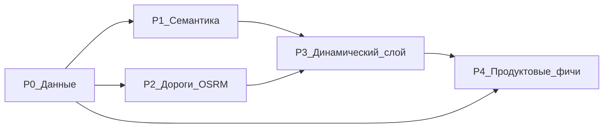

# Route intelligence — план по фазам

Статус: **план** (2026-08-23). Решение и обоснование —
[ADR-009](decisions/ADR-009-data-first-route-intelligence.md).

Связанные документы:

- [ai-route-match-three-paths.md](ai-route-match-three-paths.md)
- [ai-route-planning-architecture.md](ai-route-planning-architecture.md)
- [routing-provider-osrm-crimea.md](routing-provider-osrm-crimea.md)
- [ai-route-chat-mobile-implementation.md](ai-route-chat-mobile-implementation.md)

## Принцип приоритизации

Фазы отсортированы по **эффекту на единицу усилий**, а не по
привлекательности. P0 разблокирует всё остальное: пока колонки пустые,
любой новый параметр в чате упирается в нейтральный дефолт скоринга.

---

## P0 — Данные (фундамент)

Цель: перевести уже имеющиеся сигналы в типизированные колонки и
сделать сигналы, которые есть на 100%, основным входом подбора.

| # | Задача | Почему | Оценка |
| --- | --- | --- | --- |
| 0.1 | Бэкфилл `locality_id` через PostGIS (ближайшая `Locality` в радиусе) | 1.7% → корень бага «218 км»; чинит фильтр по городу | S |
| 0.2 | Досеять `localities` до набора UI (нет «Саки», «Керчь») | city-picker предлагает города, которых нет в БД | XS |
| 0.3 | Промоут тегов OSM из `source_payload` в колонки: `description` (785), `ele` (773), `opening_hours` (114), `website` (156), `phone` (57), `fee` (52), `surface` (107) | данные уже скачаны и выбрасываются | M |
| 0.4 | **Категории в скоринг**: `RouteMatchCandidate` / `PickedPlace` получают категории; `scoring.py` и `place_picker.py` матчат по `place_categories`, текст — вторичен | единственный сигнал со 100% покрытием сейчас игнорируется | M |
| 0.5 | `recommended_visit_minutes` по эвристике категории | без dwell time длительность маршрута считает только дорогу | S |
| 0.6 | Golden-тесты подбора «до/после» | иначе регрессия выдачи незаметна | S |

**Definition of done P0:** запрос «Ялта, история, 1–2 дня» отбирает места
по категориям `museum`/`fortress`/`palace` с корректной привязкой к
локальности, а длительность маршрута включает время осмотра.

---

## P1 — Семантика вместо подстрок

Цель: снять потолок keyword-матчинга (словарь из 10 интересов).

| # | Задача | Примечание |
| --- | --- | --- |
| 1.1 | Заменить `hash-v1` на семантический эмбеддер | текущий — bag-of-tokens хеш, не семантика; dim фиксируется миграцией |
| 1.2 | Вектора для `places` и `routes`, не только `knowledge_chunks` | пере-ingest после смены модели |
| 1.3 | Гибридный retrieve: вектор + структурный фильтр (категория, локальность, сезон) | вектор один не заменяет жёсткие ограничения |
| 1.4 | `INTEREST_KEYWORDS` → fallback, не основной путь | оставить для offline/деградации |

**Что это даёт:** запросы вида «что-то атмосферное с видом на закат»
перестают отваливаться в ноль.

---

## P2 — Дороги (OSRM)

Контракт и stub уже as-built (ADR-004,
[routing-provider-osrm-crimea.md](routing-provider-osrm-crimea.md)),
не поднят реальный движок.

| # | Задача |
| --- | --- |
| 2.1 | OSRM extract Крыма (Geofabrik), профили `car` / `foot` |
| 2.2 | `OsrmRoutingProvider` за существующим портом, `synthetic=false` |
| 2.3 | Реальная геометрия ног в `route_stops` / превью карты |
| 2.4 | Высотный профиль (SRTM + `ele`): набор высоты → честная `difficulty`, время по формуле Нейсмита |

**Почему важно для Крыма:** сейчас маршрут — прямая × 1.35. На
серпантинах (Ай-Петри) расхождение с реальной дорогой кратное.
Для пешего маршрута сложность определяется набором высоты, а не км.

---

## P3 — Динамический слой

Новый порт по образцу `RoutingProvider`: application-порт +
адаптер + кеш + **обязательная деградация** (недоступность источника не
ломает generate).

| # | Источник | Фича | Заметки |
| --- | --- | --- | --- |
| 3.1 | Open-Meteo (без токена) | **Погодное переранжирование**: «завтра в горах дождь → предлагаю дворцы ЮБК» | ценность не в показе погоды, а в смене выдачи; кеш по (округл. координата, дата) |
| 3.2 | OSM `surface` / `smoothness` / `tracktype` / `access` | Состояние и проходимость дорог | часть тегов уже скачана (P0.3) |
| 3.3 | `temporary_closure_status` (колонка есть, пустует) + отзывы + OSM `ruins`/`fixme` | Актуальность состояния локаций | инфраструктура отзывов уже есть |
| 3.4 | `opening_hours` (P0.3) | Валидация на generate: маршрут через музей, закрытый в понедельник, — сломанный маршрут | формат OSM стандартный, парсится |

**Инвариант:** динамический слой — сигнал ранжирования и предупреждение,
но **не SoT** для закрытий и цен.

---

## P4 — Продуктовые фичи

Дёшево в реализации, дорого выглядит — после того как фундамент есть.

| # | Фича | Стоимость данных |
| --- | --- | --- |
| 4.1 | **Золотой час / закаты**: «Будьте на Фиоленте к 19:42» | ноль — считается из координат и даты |
| 4.2 | **Многодневная структура**: разбивка `d6_7` по дням + ночёвки | сейчас плоский список точек — сценарий 6–7 дней фактически не работает |
| 4.3 | **Карточка «расскажи о месте»** (факты + фото + диплинк) | план — [ai-route-chat-mobile-implementation.md](ai-route-chat-mobile-implementation.md) |
| 4.4 | **Экран истории чатов** (`GET /sessions` готов) + точка входа в настройках | решено 2026-08-23, реализация отложена |
| 4.5 | **Обучение на своих данных**: accept/reject proposal как ground truth для ранжирования | 25 сессий / 140 сообщений уже накоплено, не используется |

---

## Микросервисы — когда и что

Сейчас **рано**: 5020 мест, 32 маршрута, 25 сессий. Распил дал бы
распределённый монолит без выигрыша. Модульный монолит (ADR-001)
остаётся.

Порядок будущего выделения — по профилю ресурсов, не по доменам:

1. **Routing / OSRM** — граф Крыма в памяти, RAM-heavy → уже за портом.
2. **AI inference** — уже физически отдельно (home lab) → уже за портом.
3. **Ingest / enrichment** — батчи вне request-path → уже скрипты,
   выносятся в воркер первыми.

Что соблюдать сейчас, чтобы распил потом был дешёвым:

- модуль владеет своими таблицами; кросс-модульный доступ — через
  application-сервис, а не прямой импорт чужих моделей;
- всякая внешняя интеграция входит через порт (как `RoutingProvider`),
  а не через прямой вызов из сервиса;
- Kafka (ADR-005) не поднимать до первой реальной асинхронной
  потребности — тогда outbox-таблица и один консьюмер.

## Триггеры пересмотра

- Каталог маршрутов > 500 или места > 50k → пересмотреть индексы и
  стратегию ranking.
- Generate p95 > 5 c → выносить routing/AI в отдельный сервис.
- Появление второго региона (не Крым) → пересмотреть bbox-и и
  региональные допущения в `osm_import.py`.
