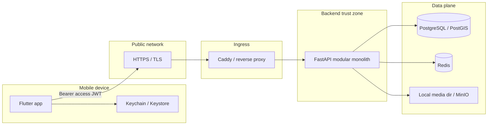

# Security as-built — КрымТрип (2026-07-30)

Практическое описание **как защита устроена сейчас** в коде.
Политика и целевой baseline: [security-baseline.md](security-baseline.md).
Решение по токенам: [ADR-007](../decisions/ADR-007-authentication-and-session-strategy.md).

Это не сертификат соответствия OWASP. Статус контролей ниже — as-built.

## 1. Trust boundaries

Всё внешнее — недоверенное: body, query, path, headers, файлы, deep links,
ответы провайдеров, текст из БД при рендере на клиенте.

## 2. Authentication (как пользователь входит)

### 2.1 Способ входа — phone OTP

Паролей в MVP нет. Вход:

1. `POST /api/v1/auth/otp/request` — `display_name` + `phone` → challenge
2. `POST /api/v1/auth/otp/verify` — `phone` + `code` → access + refresh
3. Далее сессия через `POST /api/v1/auth/refresh` и Bearer на private API

Код:

- OTP в Postgres хранится как **SHA-256 digest**; сравнение — constant-time
- TTL challenge ~10 минут, max attempts ~8
- Rate-limit в Redis по IP и телефону (request / verify)
- Ответ request — `204`, код **никогда** не возвращается API и не логируется
- SMS gateway — TODO. Пока нет провайдера:
  - `AUTH_OTP_ACCEPT_ANY` defaults **on only for `APP_ENV=local`**; test contour
    requires a real code; staging/production **refuse to start** if enabled
  - `AUTH_OTP_STORE_DEBUG_CODE` may keep a cleartext copy in
    `auth_otp_challenges.debug_code` for local/test only
    ([SEC-EX-2026-001](exceptions/SEC-EX-2026-001.md)); refused in staging/prod

Смена телефона: отдельный OTP flow (`/me/phone/request|verify`) с теми же
лимитами; `user_id` только из JWT.

### 2.2 Токены (ADR-007 hybrid — mobile Bearer path)

| Токен | Формат | TTL (default) | Сервер | Клиент |
| --- | --- | --- | --- | --- |
| Access | JWT HS256 | 15 мин | Verify signature + iss/aud/exp/typ | Memory (`session.accessToken`) |
| Refresh | Opaque random | 30 дней | SHA-256 digest в Postgres | Keychain/Keystore |

JWT claims (минимальные): `sub`, `iss`, `aud`, `iat`, `exp`, `jti`,
`typ=access`. Algorithm allowlist — только `HS256` (нет algorithm confusion).
Подпись — `jwt_signing_key` из env, не из Git / APK.

Refresh:

- rotation на каждый refresh (старый revoke, новый issued);
- family id + **reuse detection**: повтор уже заменённого refresh → revoke
  family, `401 refresh_reuse`;
- logout: revoke по digest; клиент чистит secure storage.

Код: `tourism-backend/.../identity/application/tokens.py`, `service.py`,
`crypto.py`. Mobile: `session_provider.dart`, `secure_storage_*`,
`api_client.dart`.

### 2.3 Mobile storage

| Данные | Где | Запрещено |
| --- | --- | --- |
| Refresh | `flutter_secure_storage` → Keychain/Keystore | SharedPreferences, plain files, assets |
| Access | Память Riverpod-сессии | Durable storage без ADR exception |
| Offline catalog | App sandbox | Смешивать с credentials |

Logout: revoke server-side + delete refresh + clear session. Dio single-flight
refresh на 401 (auth-пути исключены, без бесконечного цикла).

## 3. Authorization (права)

**Authn ≠ authZ.** UUID в path — не право доступа.

### Публичное (без Bearer)

- Places / routes catalog: только published / `public` + `active`
- Catalog включает editorial и public `user_created`
- `GET /api/v1/users/{id}` — `id`, `display_name`, `avatar_url`, `cover_url`
  (**без phone**)
- `GET /api/v1/users/{id}/routes` — только public routes владельца

### Приватное (нужен `Authorization: Bearer`)

Зависимость `CurrentUserId` (`api/deps.py`) достаёт `user_id` **только из JWT**,
не из body:

- `/me`, patch профиля, upload avatar/cover
- favorites places/routes
- support tickets

Favorites / tickets всегда фильтруются `WHERE user_id = current_user`.
Чужой UUID в path на mutate своих данных не помогает (BOLA regression в
`tests/security/`).

Mobile view-only профиль — UI-гейт (нет settings/edit). Реальная защита —
backend: чужой профиль нельзя менять через `/me/*`.

Роли editor/moderator/admin в коде MVP почти не разведены (матрица — target).

## 4. API мобилка ↔ сервер

| Контроль | As-built |
| --- | --- |
| Transport | HTTPS stage/prod; `http://localhost` только local |
| Auth header | `Authorization: Bearer <access>`; не в query / deep link |
| CSRF | N/A для native Bearer; cookie CSRF — когда появится web/admin |
| CORS | Не security boundary для native |
| Timeouts | Dio connect 10s / receive 20s |
| Errors | Стабильные `code`/`message`, без stack/SQL/путей клиенту |
| DTO | Pydantic request/response; часто `extra="forbid"` |
| Pagination | `limit` с потолком (типично 1–100) |
| Cert pinning | Не включён |

Клиент может подделать любой запрос — проверки всегда на сервере.

## 5. Инъекции и атаки на ввод

### SQL injection

Только SQLAlchemy ORM/Core + bound parameters. Динамический sort/filter —
server allowlist. Запрещены f-string/format SQL с user input.

### XSS

API отдаёт JSON / plain text. Flutter: `Text` / Image, без raw HTML WebView.
`AppImages.resolveMediaUrl` отсекает `javascript:`, `file:`, `data:` и
недоверенные origin’ы вне API (non-local).

### Command / unsafe deserialize

Запрещены: `eval`/`exec`, `pickle` недоверенных данных, `shell=True` с user
params, небезопасный YAML.

### SSRF

Сервер не fetch’ит произвольные URL от клиента. Profile upload — локальная
обработка файла (Pillow), не URL fetch.

### Abuse / DoS soft limits

- Redis rate-limit на OTP
- Upload: max bytes, max pixels, format allowlist via decode
- Pagination caps, Dio/API timeouts
- AI/generation quotas — Phase 8B+ (ещё не as-built)

## 6. Медиа и uploads

Profile avatar/cover (`/me/avatar`, `/me/cover`):

- ~5 MB limit; decode через Pillow (не доверяем `Content-Type`)
- allowlist JPEG/PNG/WEBP → re-encode WebP, downscale, EXIF strip
- storage key генерирует сервер (`profiles/...`), не имя клиента
- канон ссылок — таблица `media_attachments` (entity_type/entity_id/role)

Places: cover через `media_attachments` (+ legacy `place_images` link).
Public delivery: `/media/...` paths. Клиентский URL не источник истины для
чужих объектов.

## 7. Данные и инфра

| Слой | Политика | As-built |
| --- | --- | --- |
| Postgres | Parameterized SQL; app role без superuser | Local Compose — один user (не prod) |
| Redis | Rate-limit / cache; не plaintext refresh/OTP | Local без пароля — только DX |
| Secrets | Env / CI masked; не в Git/APK | JWT key, DB URL снаружи образа |
| Container | non-root backend | Да |
| Deploy | Pipeline `main` → production contour | Stage/gamma по схеме веток |

Классификация: токены/OTP digests — RESTRICTED; phone/PII — CONFIDENTIAL;
публичный каталог — PUBLIC. См. [data-classification-and-retention.md](data-classification-and-retention.md).

## 8. Тесты и регрессии

Backend: `tourism-backend/tests/security/`

- auth + favorites BOLA
- public API publication filters
- public profile (нет phone)
- media path helpers
- profile/support surfaces

Mobile: `tourism-mobile/test/security/`

- secure storage port
- image URL scheme allowlist / cache wiring

При изменении auth, API input или UI рендера текста/медиа — обязательны
security regression tests + `pytest tests/security` /
`flutter test test/security` (+ analyze).

## 9. Известные gaps (честный статус)

Уже сильно: OTP + JWT + refresh rotation/reuse, Bearer private API, DTO/limits,
SQL ORM, upload re-encode, public profile без PII, secure storage, security
tests, media_attachments.

Ещё впереди / слабо:

- реальная SMS + удаление `debug_code` / SEC-EX-2026-001; accept-any уже
  запрещён вне local на старте процесса
- мгновенный revoke access (сейчас TTL; denylist опционален)
- password / Argon2id (когда понадобится)
- cookie CSRF для web/admin
- prod Redis/Postgres ACL + TLS между сервисами
- certificate pinning (по threat model)
- роли admin/editor + AI/RAG quotas
- часть topic-docs ниже могла отставать — **этот файл** + код + ADR-007
  приоритетнее устаревших «not implemented» абзацев

## 10. Связанные документы

| Документ | Роль |
| --- | --- |
| [security-baseline.md](security-baseline.md) | Целевой baseline + карта docs |
| [threat-model.md](threat-model.md) | STRIDE / assets |
| [authentication-and-token-security.md](authentication-and-token-security.md) | Политика токенов/паролей |
| [backend-api-security.md](backend-api-security.md) | API Top 10 |
| [mobile-security.md](mobile-security.md) | MASVS mobile |
| [file-and-media-security.md](file-and-media-security.md) | Uploads / MinIO |
| [database-cache-storage-security.md](database-cache-storage-security.md) | PG / Redis |
| [secrets-management.md](secrets-management.md) | Secrets / CI |
| [security-testing-guide.md](security-testing-guide.md) | Как тестировать |
| [security-checklist.md](security-checklist.md) | Release / MR |
