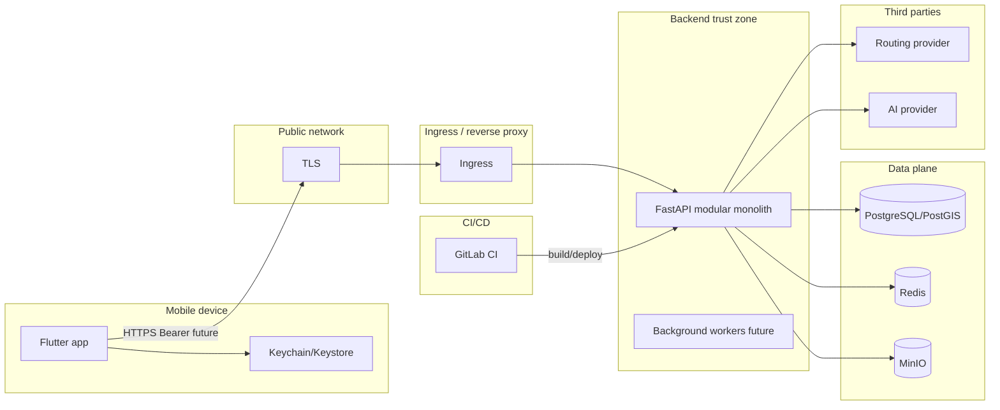

# Threat model — КрымТрип

Метод: **STRIDE** по assets и trust boundaries.

**As-built (2026-08):** OTP/JWT, SQLAdmin, user routes, inbox/FCM. Модель ниже
изначально писалась 2026-07-23 (Phase 3, «auth не реализован») — строки
«Phase 6+» в таблицах assets частично устарели; актуальный стек —
[stack.md](../stack.md), living status — [progress.md](../progress.md).
Полный STRIDE-пересмотр — отдельная задача, не этот sync.

Последнее обновление преамбулы: 2026-08-18. Исторический срез таблиц:
2026-07-23.

## Assets

| Asset | Classification | Notes |
| --- | --- | --- |
| Password hashes | RESTRICTED | Phase 6+ |
| Access / refresh / session tokens | RESTRICTED | Phase 6+ |
| Password-reset / email-verify tokens | RESTRICTED | Phase 6+ |
| User id, email, display name | CONFIDENTIAL | Phase 6–7 |
| Avatar / user media | CONFIDENTIAL | media module |
| Private routes, favorites, trips | CONFIDENTIAL | Phase 7–13 |
| Exact geolocation / location history | RESTRICTED | Phase 9; opt-in |
| Preferences (children, accessibility) | CONFIDENTIAL | users |
| Admin roles / moderation | RESTRICTED | future admin |
| PostgreSQL / Redis / MinIO / backups | varies | infra |
| Routing / AI API keys, prompts | RESTRICTED | Phase 8+ |
| GitLab CI secrets, signing keys | RESTRICTED | CI/CD |
| Audit logs | RESTRICTED | identity |

## Trust boundaries

## Threat actors

- Anonymous attacker
- Malicious authenticated user
- User modifying API requests (proxy)
- Compromised / rooted / jailbroken device
- Malicious dependency
- Compromised third-party provider
- Compromised CI runner
- Insider with excessive privileges
- Leaked API key
- Compromised administrator account

## Threat catalog (selected)

Likelihood/Impact: Low / Medium / High (qualitative for current stage).

### T-01 Spoofing — fake login (Phase 6)

| Field | Value |
| --- | --- |
| Asset | credentials, sessions |
| Entry | `/api/v1/auth/*` (planned) |
| Scenario | Credential stuffing / password spray |
| Likelihood | High (internet-facing) |
| Impact | High (account takeover) |
| Existing | None (auth not implemented) |
| Missing | Argon2id, rate limits, lockout-safe throttling, security logs |
| Mitigation | ADR-007 + Phase 6 controls |
| Verification | Auth security tests |
| Owner | backend identity |
| Target phase | 6 |

### T-02 Tampering — BOLA on private route (Phase 7+)

| Field | Value |
| --- | --- |
| Asset | private routes / favorites |
| Entry | object ID in path |
| Scenario | Substitute UUID of another user |
| Likelihood | High when endpoints exist |
| Impact | High (data disclosure/modification) |
| Existing | N/A (no private APIs yet); public places filter `publication_status` |
| Missing | ownership `WHERE`, negative tests |
| Mitigation | policy service + deny by default |
| Verification | BOLA regression tests |
| Owner | backend modules |
| Target phase | 7+ |

### T-03 Repudiation — missing security audit

| Field | Value |
| --- | --- |
| Asset | audit trail |
| Entry | auth/admin actions |
| Scenario | Attacker denies privilege abuse |
| Likelihood | Medium |
| Impact | Medium |
| Existing | JSON logging foundation; no security event schema |
| Missing | structured security events, retention |
| Mitigation | security event logger (Phase 6) |
| Verification | log fixture asserts no secrets + event codes |
| Owner | backend |
| Target phase | 6 / 10 |

### T-04 Information disclosure — tokens in logs/mobile

| Field | Value |
| --- | --- |
| Asset | tokens |
| Entry | logging, crash, print |
| Scenario | Token copied from device logs |
| Likelihood | Medium |
| Impact | High |
| Existing | Code style forbids secrets in logs; no auth yet |
| Missing | log redaction middleware; mobile log policy tests |
| Mitigation | docs + lint + tests |
| Verification | grep + unit tests |
| Owner | backend + mobile |
| Target phase | 5–6 |

### T-05 Denial of service — unbounded queries / AI

| Field | Value |
| --- | --- |
| Asset | availability, cost |
| Entry | list endpoints, uploads, AI tools |
| Scenario | Huge `limit`/`q`/tool loops |
| Likelihood | Medium |
| Impact | Medium–High |
| Existing | places `limit` 1–100; Redis/DB ready |
| Missing | global body size, rate limits, AI caps, `q` max length |
| Mitigation | validation + quotas |
| Verification | resource consumption tests |
| Owner | backend |
| Target phase | baseline / 8 / 10 |

### T-06 Elevation — client-supplied role/admin

| Field | Value |
| --- | --- |
| Asset | admin roles |
| Entry | registration/profile payload |
| Scenario | mass-assignment `is_admin=true` |
| Likelihood | High if schemas wrong |
| Impact | Critical |
| Existing | No user write APIs yet; response DTOs for places |
| Missing | forbid extra fields, server-side roles |
| Mitigation | Pydantic `extra=forbid`, never take role from client |
| Verification | mass-assignment tests |
| Owner | identity/users |
| Target phase | 6 |

### T-07 SSRF — URL fetch / media import

| Field | Value |
| --- | --- |
| Asset | internal network, cloud metadata |
| Entry | avatar URL, RAG ingest, media proxy |
| Scenario | `http://169.254.169.254/` |
| Likelihood | Medium when URL fetch appears |
| Impact | High |
| Existing | No URL fetch in backend yet |
| Missing | allowlist, block private nets, redirect checks |
| Mitigation | file-and-media + SSRF policy |
| Verification | SSRF unit tests with fake transport |
| Owner | media / AI |
| Target phase | media / 8B |

### T-08 Dependency / CI compromise

| Field | Value |
| --- | --- |
| Asset | supply chain, secrets |
| Entry | PyPI/pub, GitLab runner |
| Scenario | Malicious package or leaked CI variable |
| Likelihood | Medium |
| Impact | Critical |
| Existing | lockfiles (`uv.lock`, `pubspec.lock`); local passwords only in examples |
| Missing | pip-audit/pub audit in CI, secret detection, protected vars |
| Mitigation | security CI foundation |
| Verification | CI jobs + incident playbook |
| Owner | DevSecOps |
| Target phase | Security Baseline / 10 |

### T-09 Local Compose exposure

| Field | Value |
| --- | --- |
| Asset | local DB/Redis/MinIO |
| Entry | host-published ports |
| Scenario | LAN attacker uses known local credentials |
| Likelihood | Medium on shared networks |
| Impact | Medium (dev data) |
| Existing | documented local-only passwords; MinIO bucket anonymous none |
| Missing | Redis AUTH; bind 127.0.0.1; separate prod credentials |
| Mitigation | bind localhost; optional Redis ACL for local |
| Verification | compose config review |
| Owner | platform infra |
| Target phase | Security Baseline |

### T-10 AI prompt injection (Phase 8B+)

| Field | Value |
| --- | --- |
| Asset | private data, tools, cost |
| Entry | chat / RAG docs |
| Scenario | Indirect injection → tool abuse / exfil |
| Likelihood | High when AI enabled |
| Impact | High |
| Existing | ADR-006 controls documented |
| Missing | implementation of allowlisted tools + validation |
| Mitigation | AI security section + Phase 8B |
| Verification | adversarial prompt fixtures |
| Owner | route_builder |
| Target phase | 8B |

## Residual risks (accepted for now)

1. Auth absent — intentional until Phase 6; public catalog only.
2. Local Compose credentials are well-known — acceptable only on developer machines.
3. No production cluster / NetworkPolicy yet — no production deploy.
4. Certificate pinning not required yet — operational cost outweighs benefit pre-prod.

## Verification owners

Security Skill `travel-platform-security-audit` + phase owners in
implementation-plan.
