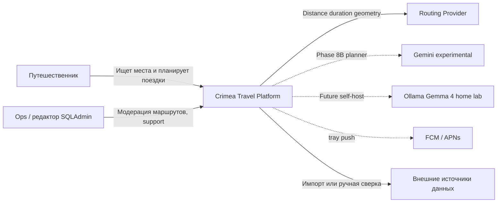

# Системный контекст

Crimea Travel Platform: Flutter-клиент, FastAPI modular monolith, PostGIS,
Redis. Внешний routing — за `RoutingProvider` (Phase 8A). LLM-planner —
за `AIPlanningProvider` (Phase 8B+): сначала mock/Gemini, затем home-lab
**Gemma 4** через Ollama. Mobile никогда не ходит в модель напрямую.

Стек по контурам: [stack.md](stack.md).

Пунктир — не в текущем runtime local/test Compose (кроме FCM, если задан
service account).

## Границы ответственности

Платформа отвечает за:

- учётные записи и пользовательские данные;
- административную географию и каталог мест;
- подготовленные и пользовательские маршруты (модерация);
- происхождение, freshness и публикационный статус контента;
- orchestration построения маршрута и нормализацию ответа provider
  (после Phase 8A);
- validation AI-output до записи маршрута (после Phase 8B).

Платформа не гарантирует безошибочность сторонней маршрутизации и LLM, не
заменяет официальные предупреждения экстренных служб и не является
государственным источником информации. Веса Gemma ≠ база фактов Крыма;
координаты и часы — PostGIS.
